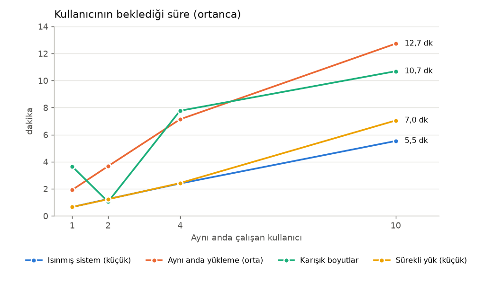
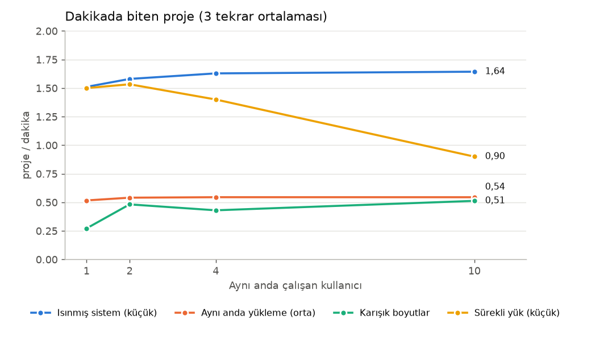
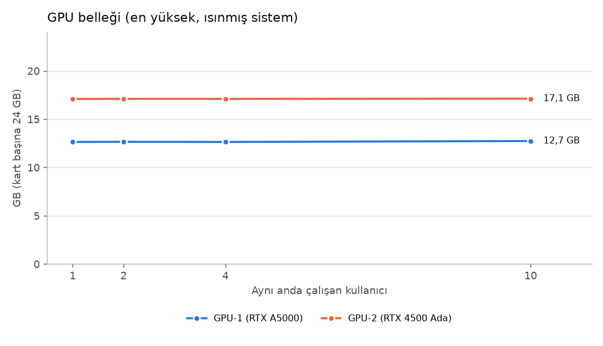
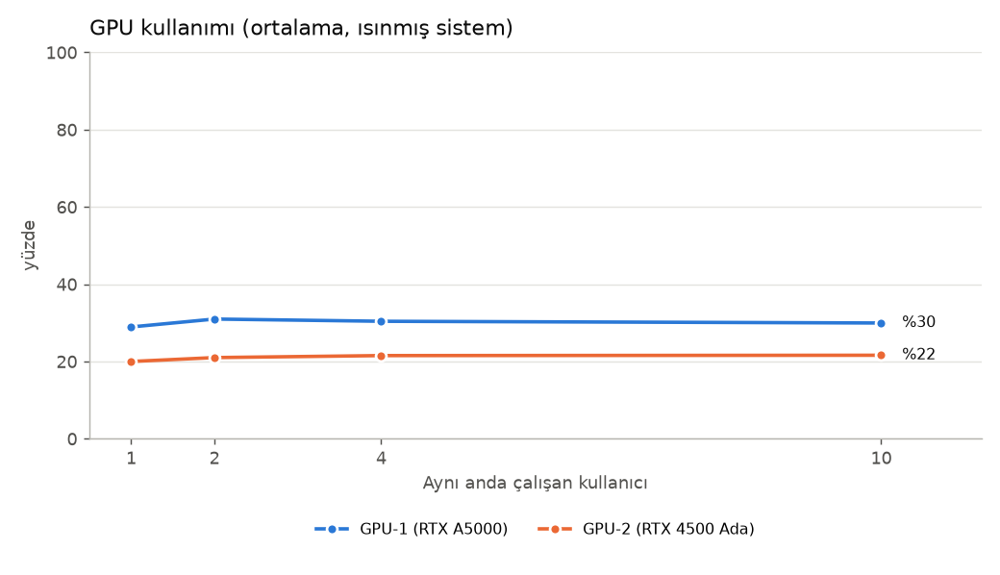
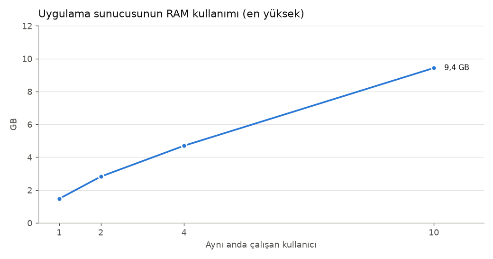

# Maskeleme Sistemi — Yük Testi Raporu

**Tarih:** 6–7 Ekim 2026 · **Ölçüm:** 50 test koşulu × 3 tekrar · **Gönderilen iş:** 795 · **Tamamlanan:** 720 · **Hata ile düşen:** 24 · **10 dk'lık sürekli yük testinde süre dolduğunda yarım kalan:** 51

Sanal kullanıcılar gerçek sisteme proje yükledi, işin bitmesini bekledi ve maskelenmiş çıktıyı indirdi. Her kullanıcı ayrı oturum ve ayrı işlem kaydı kullandı. Güvenlik ve denetim adımlarının hiçbiri kapatılmadı; uygulama ve model ayarları değiştirilmedi.

## 1. Kısa sonuç

| Soru | Cevap |
|---|---|
| Sistem dakikada kaç proje bitirebiliyor? | Küçük projede **~1,6**, orta projede **~0,5**. Kullanıcı sayısı artsa da bu değer artmıyor. |
| Tek kullanıcı ne kadar bekliyor? | Küçük proje **39 sn**, orta proje **1,9 dk**, büyük proje **3,7 dk**. |
| 10 kullanıcı aynı anda çalışınca? | Bekleme yaklaşık 8 katına çıkıyor (küçük projede **5,5 dk**). Ayrıca bazı işler hata verip düşüyor. |
| Yavaşlığın sebebi ne? | Yapay zekâ modeli (LLM) aynı anda yalnızca **1 isteği** işliyor. İşlerin süresinin ~%90'ı bu sırayı beklemekle geçiyor. |
| Ekran kartları (GPU) yetiyor mu? | Evet, fazlasıyla. GPU'lar ortalama yalnızca %20–30 dolu, bellek ve sıcaklık sorun değil. |
| Kullanıcıların verileri karışıyor mu? | **Hayır.** Tüm testlerde her kullanıcının kaydı ve çıktısı ayrı kaldı. |
| Mevcut ayarları değiştirmek gerekir mi? | Hayır. Denenen ayarların hiçbiri anlamlı fark yaratmadı (bkz. bölüm 6). Asıl iyileştirme kod ve model sunucusu tarafında (bkz. bölüm 8). |

## 2. Test edilen sistem ve ayarlar

| Bileşen | Değer |
|---|---|
| Yapay zekâ modeli | `qwen3.6:35b` (Ollama 0.35.1 üzerinde) |
| Ekran kartları | NVIDIA RTX A5000, NVIDIA RTX 4500 Ada Generation (model ikisine bölünmüş durumda) |
| Model sunucusunun aynı anda işlediği istek | **1** (Ollama ayarı 4 olsa da model 1 ile çalışıyor) |
| Uygulamanın modele aynı anda gönderdiği istek (`VLLM_MAX_CONCURRENT_REQUESTS`) | 1 |
| Uygulama sunucusu (backend) süreç sayısı | 1 |
| Bir işte aynı anda işlenen dosya sayısı (`VLLM_FILE_BATCH_SIZE`) | 8 |
| Modele tek seferde gönderilen en fazla metin | 6000 karakter (fazlası parçalara bölünür) |
| Model cevabının en fazla uzunluğu | 2048 token |
| Bir model isteği için zaman aşımı | 200 sn |
| Makine | 64 çekirdek CPU, 63 GB RAM |

**Açıklama:** Bunlar testten önce sistemde bulunan ayarlardır ve test boyunca değiştirilmedi. En önemli satır üçüncüsü: model sunucusu istekleri tek tek, sırayla işliyor.

## 3. Test verileri

| Proje | Dosya sayısı | Boyut | Bir işte modele giden istek | Tek kullanıcıda süre |
|---|---|---|---|---|
| Küçük | 6 | 8 KB | 12 | 39 sn |
| Orta | 10 | 18 KB | 22 | 1,9 dk |
| Büyük | 20 | 53 KB | 49 | 3,7 dk |

**Açıklama:** Projeler bir script ile üretildi; her çalıştırmada birebir aynı dosyalar oluşur. İçlerindeki kişi adları, e-postalar, IP'ler ve şifreler sahtedir. Her dosya modele iki kez gider: önce hassas veriyi bulmak, maskelemeden sonra da kaçan bir şey kalmış mı diye denetlemek için.

## 4. Tüm test sonuçları

| Senaryo | Kullanıcı | Proje | Gönderilen iş | Biten iş | Hata ile düşen | Süre bitince yarım kalan | Bekleme (ortanca) | Bekleme (en kötü %5) | Dakikada biten proje | GPU-1 kullanım / bellek | GPU-2 kullanım / bellek |
|---|---|---|---|---|---|---|---|---|---|---|---|
| Soğuk başlangıç | 1 | küçük | 3 | 3 | 0 | – | 52 sn | 54 sn * | 1,12 | %24 / 12,7 GB | %18 / 17,1 GB |
| Soğuk başlangıç | 4 | küçük | 12 | 12 | 0 | – | 2,7 dk | 2,7 dk * | 1,48 | %30 / 12,8 GB | %20 / 17,1 GB |
| Isınmış sistem | 1 | küçük | 6 | 6 | 0 | – | 39 sn | 40 sn * | 1,51 | %29 / 12,6 GB | %20 / 17,1 GB |
| Isınmış sistem | 2 | küçük | 12 | 12 | 0 | – | 75 sn | 1,5 dk * | 1,58 | %31 / 12,7 GB | %21 / 17,1 GB |
| Isınmış sistem | 4 | küçük | 24 | 24 | 0 | – | 2,4 dk | 3,3 dk | 1,63 | %30 / 12,6 GB | %22 / 17,1 GB |
| Isınmış sistem | 10 | küçük | 60 | 58 | **2** | – | 5,5 dk | 9,2 dk | 1,64 | %30 / 12,7 GB | %22 / 17,1 GB |
| Aynı anda yükleme | 1 | orta | 3 | 3 | 0 | – | 1,9 dk | 1,9 dk * | 0,52 | %31 / 12,6 GB | %22 / 17,1 GB |
| Aynı anda yükleme | 2 | orta | 6 | 6 | 0 | – | 3,7 dk | 3,7 dk * | 0,54 | %31 / 12,6 GB | %22 / 17,1 GB |
| Aynı anda yükleme | 4 | orta | 12 | 12 | 0 | – | 7,1 dk | 7,4 dk * | 0,54 | %32 / 12,6 GB | %23 / 17,1 GB |
| Aynı anda yükleme | 10 | orta | 30 | 21 | **9** | – | 12,7 dk | 12,9 dk | 0,54 | %31 / 12,6 GB | %23 / 17,1 GB |
| Sürekli yük (10 dk) | 1 | küçük | 48 | 45 | 0 | 3 | 40 sn | 41 sn | 1,50 | %28 / 12,6 GB | %20 / 17,1 GB |
| Sürekli yük (10 dk) | 2 | küçük | 52 | 46 | 0 | 6 | 74 sn | 85 sn | 1,53 | %30 / 12,6 GB | %22 / 17,1 GB |
| Sürekli yük (10 dk) | 4 | küçük | 54 | 42 | 0 | 12 | 2,4 dk | 3,3 dk | 1,40 | %30 / 12,6 GB | %22 / 17,1 GB |
| Sürekli yük (10 dk) | 10 | küçük | 62 | 27 | **5** | 30 | 7,0 dk | 9,1 dk | 0,90 | %30 / 12,6 GB | %22 / 17,1 GB |
| Karışık boyutlar | 1 | karışık | 3 | 3 | 0 | – | 3,7 dk | 3,7 dk * | 0,27 | %30 / 12,6 GB | %21 / 17,1 GB |
| Karışık boyutlar | 2 | karışık | 6 | 6 | 0 | – | 63 sn | 4,2 dk * | 0,48 | %31 / 12,6 GB | %22 / 17,1 GB |
| Karışık boyutlar | 4 | karışık | 12 | 12 | 0 | – | 7,8 dk | 9,4 dk * | 0,43 | %31 / 12,6 GB | %22 / 17,1 GB |
| Karışık boyutlar | 10 | karışık | 30 | 22 | **8** | – | 10,7 dk | 16,7 dk | 0,51 | %31 / 12,6 GB | %22 / 17,1 GB |

**Tablo nasıl okunur?**

- **GPU-1** = NVIDIA RTX A5000 (24 GB), **GPU-2** = NVIDIA RTX 4500 Ada (24 GB). Kullanım yüzdesi saniyede bir ölçülen ortalamadır; bellek, test boyunca görülen en yüksek değerdir.
- **Bekleme:** Kullanıcının projeyi yüklemeye başlamasından maskelenmiş dosyayı indirmesine kadar geçen süre. *Ortanca* tipik kullanıcıyı, *en kötü %5* en şanssız kullanıcıları gösterir. Yıldızlı (*) değerler az sayıda örneğe dayanır; kesin kabul edilmemeli.
- **Dakikada biten proje:** Sistemin toplam iş çıkarma hızı.
- **Süre bitince yarım kalan:** Yalnız sürekli yük testinde var; 10 dakika dolduğunda henüz bitmemiş işler başarılı sayılmadı.
- **Senaryolar:** *Soğuk başlangıç* = model bellekte değilken ilk kullanım; *Isınmış sistem* = sistem hazırken, kullanıcılar 1 sn arayla 2'şer iş gönderir; *Aynı anda yükleme* = herkes aynı saniyede gönderir; *Sürekli yük* = kullanıcılar 10 dakika boyunca iş bitince yenisini gönderir; *Karışık* = farklı boyutlu projeler birlikte (kullanıcılar sırayla büyük, küçük, orta proje gönderir).

**Ne görüyoruz?**

- Kullanıcı sayısı 1'den 10'a çıkınca **dakikada biten proje sayısı değişmiyor** (küçük projede 1,51 → 1,64). Sistem tek kuyruk gibi çalışıyor; her yeni kullanıcı sadece sırayı uzatıyor.
- Bu yüzden bekleme süresi kullanıcı sayısıyla doğru orantılı artıyor: küçük projede 1 kullanıcıda 39 sn, 4 kullanıcıda 2,4 dk, 10 kullanıcıda 5,5 dk.
- **10 kullanıcıda işler düşmeye başlıyor:** aynı anda yüklemede 30 işten 9, karışık yükte 30 işten 8 iş hata verdi. 4 kullanıcıya kadar hiç hata yok. Sebebi bölüm 7'de.
- Model bellekte değilken (soğuk başlangıç) ilk kullanıcı yaklaşık 13 sn fazla bekliyor (modelin yüklenmesi ~9 sn).
- Sürekli yükte 10 kullanıcıda dakikada biten proje 0,90'a düşmüş görünüyor. Bunun sebebi kapasitenin azalması değil: işler bu kalabalıkta ~7 dk sürdüğü için 10 dakikalık süre dolduğunda çoğu yarım kalmıştı (yarım kalanlar 'biten' sayılmadı) ve 5 iş hata ile düştü.
- GPU belleği yükten bağımsız sabit (model yüklü olduğu sürece yer kaplar); GPU kullanımı hep %20–30 civarında.

### Grafikler

*Kullanıcı sayısı arttıkça bekleme neredeyse doğru orantılı uzuyor: her yeni kullanıcı sıraya bir iş daha ekliyor. Karışık boyutlarda 1 kullanıcı yalnızca büyük projeyi, 2 kullanıcı büyük ve küçük projeyi çalıştırdığı için o çizgi başta düşüyor.*

*Çizgiler yatay: kullanıcı eklemek sistemin iş çıkarma hızını artırmıyor. Sürekli yükte 10 kullanıcıdaki düşüş, 10 dakikalık süre dolduğunda işlerin çoğunun yarım kalmasından ve 5 işin hata ile düşmesinden kaynaklanıyor.*

*GPU belleği kullanıcı sayısından bağımsız; model bir kez yüklendikten sonra sabit yer kaplıyor.*

*GPU'lar kullanıcı sayısı artsa da %20–30 civarında kalıyor; model istekleri tek tek işlediği için kartların büyük kısmı boşta.*

*Her iş dil modelini (spaCy) yeniden yüklediği için RAM, aynı anda çalışan iş sayısıyla birlikte büyüyor.*

## 5. Bir işin süresi nereye gidiyor?

| Adım | Küçük, 1 kullanıcı | Orta, 1 kullanıcı | Büyük, 1 kullanıcı | Küçük, 10 kullanıcı |
|---|---|---|---|---|
| Dosyaları yükleme | <1 sn | <1 sn | <1 sn | <1 sn |
| İşin başlayabilmesi için bekleme (en uzun) | <1 sn | <1 sn | <1 sn | 31 sn |
| Modelin bu işle meşgul olduğu süre | 35 sn | 1,8 dk | 3,4 dk | 36 sn |
| Modelin sırasını bekleme (istek başına, en kötü %5) | 28 sn | 75 sn | 2,5 dk | 4,2 dk |
| Hassas veri arama (kural + Presidio + model) | 32 sn | 1,8 dk | 3,5 dk | 4,0 dk |
| Maskeleme | <1 sn | <1 sn | <1 sn | <1 sn |
| Maskeleme sonrası model denetimi | 4 sn | 12 sn | 2,9 dk | 87 sn |
| Son kontroller ve dosya yazma | 1 sn | 2 sn | 5 sn | 1 sn |
| Paketleme (export) | <1 sn | <1 sn | <1 sn | <1 sn |
| İndirme | <1 sn | <1 sn | <1 sn | <1 sn |
| **Toplam bekleme** | **39 sn** | **1,9 dk** | **3,7 dk** | **5,5 dk** |

**Açıklama:** Adımlar kısmen aynı anda yürüdüğü için satırlar toplanınca toplam süreyi vermez. Önemli olan şu: tek kullanıcılı küçük işte toplam 39 sn sürenin 35 sn'si modelin cevap üretmesiyle geçiyor. Maskeleme, paketleme, yükleme ve indirme bir saniyenin altında; bunlar sorun değil. 10 kullanıcıda modelin tek bir iş için harcadığı süre aynı kalıyor (36 sn), ama her iş diğer 9 işin isteklerinin bitmesini beklediği için toplam süre uzuyor. 10 kullanıcıda bazı işler başlayabilmek için 31 sn bekledi; 30 sn'yi aşan iş hata verip düşüyor (bkz. bölüm 7).

## 6. Ayar denemeleri (worker ve eşzamanlılık)

Üç ayar tek tek değiştirildi, diğer ikisi sabit tutuldu. Her ayar 1, 2, 4 ve 8 kullanıcıyla, küçük projeyle denendi.

| Denenen ayar | Backend süreci | Aynı anda dosya | Modele aynı anda istek | 8 kullanıcı: dakikada proje | 8 kullanıcı: en kötü %5 bekleme | 1 kullanıcı: bekleme | 8 kullanıcı: backend RAM | Hata |
|---|---|---|---|---|---|---|---|---|
| **Mevcut ayar** | 1 | 8 | 1 | 1,65 | 4,8 dk | 40 sn | 5,6 GB | 0 |
| Backend 2 süreç | 2 | 8 | 1 | 1,69 | 4,7 dk | 39 sn | 5,8 GB | 0 |
| Backend 4 süreç | 4 | 8 | 1 | 1,69 | 4,7 dk | 39 sn | 6,3 GB | 0 |
| Modele 2 istek | 1 | 8 | 2 | 1,67 | 4,8 dk | 38 sn | 5,6 GB | 0 |
| Modele 4 istek | 1 | 8 | 4 | 1,69 | 4,8 dk | 38 sn | 5,6 GB | 0 |
| 1 dosya | 1 | 1 | 1 | 1,63 | 5,0 dk | 43 sn | 5,4 GB | 0 |
| 2 dosya | 1 | 2 | 1 | 1,63 | 4,9 dk | 41 sn | 5,4 GB | 0 |
| 4 dosya | 1 | 4 | 1 | 1,65 | 4,8 dk | 40 sn | 5,5 GB | 0 |

**Açıklama:**

- **Backend süreci artırmak** neredeyse fark yaratmadı (dakikada 1,65 → 1,69 proje). Çünkü bütün süreçler aynı tek modeli bekliyor. Buna karşılık daha fazla RAM harcıyor: 4 süreç boşta bile ~2,5 GB fazla.
- **Modele aynı anda daha çok istek göndermek** de hızlandırmadı; model zaten tek tek çalıştığı için istekler bu kez modelin kendi sırasında bekledi. Tek bir isteğin süresi en kötü durumda 12 sn'den 29 sn'ye çıktı; bu, daha fazla kullanıcıda zaman aşımı riskini artırır.
- **Aynı anda işlenen dosya sayısını düşürmek** tek kullanıcıyı yavaşlattı (40 sn → 43 sn); çok kullanıcıda fark yok.
- 1–8 kullanıcı arasında hiçbir ayarda hata, bellek taşması veya çökme olmadı.
- **Sonuç: mevcut ayar (1 süreç, 8 dosya, modele 1 istek) en dengeli seçenek.** Diğerleri ya fark yaratmıyor ya da RAM veya zaman aşımı riski ekliyor.

## 7. Bulunan sorunlar

| # | Sorun | Ne zaman oluyor | Kullanıcıya etkisi | Kanıt |
|---|---|---|---|---|
| 1 | Model istekleri tek sıra halinde işleniyor | Her zaman | Kullanıcı sayısı kadar bekleme artıyor; sistem dakikada ~1,6 küçük proje bitirebiliyor | Modelin dolu olduğu süre oranı: %96; aynı anda en fazla 1 istek işlendi; GPU ise ~%30 kullanımda |
| 2 | Çok iş aynı anda başlayınca veritabanı kilitleniyor | ~10 iş aynı anda başladığında | İş başlamadan düşüyor, kullanıcı "Sistemle bağlantı kurulamadı" görüyor | Toplam 24 iş düştü; hepsinde hata `database is locked`; iş başlatma beklemesi 30 sn sınırına ulaştı |
| 3 | Her iş dil modelini (spaCy) yeniden yüklüyor | Her iş başında | İş başına ~1–2 sn gecikme ve ~0,5–1 GB RAM | 10 eşzamanlı işte backend 9,4 GB RAM kullandı |
| 4 | Kişisel verisi çok yoğun dosya taranamıyor | Örnek: 2,4 KB'lık, 15 kişinin TC kimlik, IBAN, telefon ve e-postasını içeren SQL dosyası | Dosya güvenlik için çıktıya konmuyor ("teknik blok") | Model cevabı 2048 token sınırına takılıyor; parçalara bölünse de sığmıyor. Yükten bağımsız, tek kullanıcıda da oluyor |
| 5 | Model 5 dk kullanılmazsa bellekten çıkıyor | Uzun aradan sonraki ilk kullanım | İlk kullanıcı ~13 sn fazla bekliyor | Model yükleme ~9 sn sürdü |

**Açıklama:** 1. sorun sistemin kapasitesini belirliyor; 2. sorun ise kalabalıkta işlerin düşmesine yol açıyor. Testlerde model hiç zaman aşımına uğramadı, hiç sunucu hatası vermedi ve hiçbir dosya güvenlik karantinasına düşmedi.

## 8. Öneriler

| Öncelik | Öneri | Neden | Beklenen etki |
|---|---|---|---|
| 1 (hemen) | İşin başında veritabanı kaydını hemen kaydedip (commit) kilidi bırakmak; dil modeli yüklemesini kilit dışında yapmak. Ya da aynı anda çalışan iş sayısına bir üst sınır koyup fazlasını sıraya almak | Kalabalıkta işlerin düşmesinin tek sebebi bu | 10 kullanıcıdaki "Sistemle bağlantı kurulamadı" hataları kalkar (değişiklik sonrası test edilmeli) |
| 2 (kısa vade) | Model sunucusunu aynı anda birden fazla isteği işleyecek şekilde çalıştırmak (Ollama paralel ayarı veya vLLM) | GPU'lar %70 boş; bekleme süresi tamamen model sırasından geliyor | Kapasitenin artması beklenir; ne kadar artacağı ölçülmedi, ayrıca test edilmeli |
| 3 (kısa vade) | Dil modelini (spaCy) her işte yeniden yüklemek yerine bir kez yükleyip paylaşmak | Her iş ~1 GB RAM ve ~1–2 sn harcıyor | Bellek kullanımı kullanıcı sayısıyla büyümez |
| 4 (kolay) | Ollama'da modelin bellekte kalma süresini (keep_alive) uzatmak | Model 5 dk boşta kalınca bellekten çıkıyor | Uzun aradan sonraki ilk kullanıcı ~13 sn daha hızlı sonuç alır |
| 5 (veri) | Çok yoğun kişisel veri içeren dosyalar için model cevap sınırını veya parça boyutunu gözden geçirmek | Bu dosyalar şu an taranamayıp çıktıdan çıkarılıyor | Daha az dosya bloklanır |
| — | Backend süreç sayısı, aynı anda dosya ve modele istek ayarlarını **değiştirmemek** | Denemelerde fark yaratmadılar | — |

**Pratik kural (mevcut haliyle):** Küçük bir proje için kullanıcı başına yaklaşık 40 sn hesaplayın. Aynı anda N kişi çalışıyorsa her biri yaklaşık N × 40 sn bekler. 8'den fazla kişinin aynı anda iş başlatması önerilmez.

## 9. Notlar

| Konu | Not |
|---|---|
| Ölçülemeyen değerler | Modelin ilk kelimeyi üretme süresi (TTFT), KV-cache kullanımı ve preemption sayısı ölçülemedi: uygulama cevabı tek parça alıyor ve model sunucusunun metrik ucu kapalı. Tahmini değer yazılmadı. |
| Gerçek projeler | Süreler, dosyalardaki hassas veri yoğunluğuna bağlı. Gerçek projelerde süreler farklı olabilir, ama darboğazın yeri (model sırası) değişmez. |
| Test sırasında kullanım | Test sırasında arayüzden yapılan işlerin etkilediği 4 tekrar yeniden çalıştırıldı; sonuçlarda başka kullanıcı isteği yok. |
| Ayrıntılı veriler | Tüm ölçümler (aşama aşama, istek istek, saniye saniye donanım) [RAPOR_AYRINTILI.md](RAPOR_AYRINTILI.md) dosyasında ve `main/`, `workers/` klasörlerindeki CSV/JSONL dosyalarında. |
| Testi tekrar çalıştırmak | `masking_system/` klasöründe `bash loadtest/run_all.sh` (yaklaşık 14 saat sürer). |
