# Maskeleme Sistemi — Çok Kullanıcılı Yük Testi Raporu

## Özet ve değerlendirme

**Kapsam.** 2026-10-06 16:43 – 2026-10-07 05:18 arasında 50 koşul × 3 tekrar = 150 tekrar gerçek sistemle çalıştırıldı (ana kampanya 18 koşul, worker kampanyası 32 koşul). Ayrıca temiz olmayan 4 tekrar 2026-10-07 sabahı yeniden koşuldu (bkz. "Sınırlar"). Tüm güvenlik ve audit aşamaları açıktı. `.env`, model ve Ollama ayarları değiştirilmedi. Worker testi değerleri yalnızca test backend süreçlerinin ortam değişkenleriyle verildi.

### Temel bulgular

1. **Darboğaz LLM sunucusunun tek slotu.** İşlem kapasitesi kullanıcı sayısından bağımsız olarak sabit kaldı: küçük projede **1,51–1,69 proje/dk** (1→10 kullanıcı), orta projede **~0,54 proje/dk**. Eklenen her kullanıcı yalnızca bekleme süresini doğrusal uzattı. Isınmış küçük projede uçtan uca p50 değerleri: 1 kullanıcı 39 sn, 4 kullanıcı 144 sn, 10 kullanıcı 332 sn.
   - Kanıt 1: Tek kullanıcılı küçük işin sunucu süresi 39,2 sn. Bunun **35,2 sn'si (%90) LLM HTTP isteklerinde** geçiyor (iş başına 12 istek: 6 detection + 6 audit). Seri LLM ile teorik tavan 60 / 35,5 ≈ **1,69 proje/dk**; ölçülen plato 1,63–1,69.
   - Kanıt 2: llama-server `/slots` örneklerinde slot, ölçüm penceresinin **%87–98'inde dolu**. Uygulamanın ölçülen eşzamanlı LLM isteği her zaman 1. Uygulama LLM kuyruğunda 10 kullanıcıda 40'a kadar istek bekledi (zaman çizelgesi grafikleri).
   - Kanıt 3: Maskeleme (iş başına 0,1–0,6 sn), sonlandırma (~1 sn), export (0,1–0,3 sn), yükleme (p95 < 1,4 sn) ve indirme (p95 < 0,3 sn) uçtan uca süreye göre ihmal edilebilir.
   - LLM süresinin çoğu **çıktı tokenı üretimi**: sunucu decode hızı ~98–106 token/s (TPOT ~10 ms), prefill ~1200–1450 token/s. Sunucunun toplam üretim hızı yükten bağımsız olarak ~90–107 token/s. Bu, tek akışlı decode hızına eşit; eşzamanlı istekler birleştirilmiyor (batching yok).

2. **GPU hesaplama/güç/sıcaklık açısından doymuyor.** Ortalama kullanım A5000 ~%30, 4500 Ada ~%22. Güç ortalamada 130 W / 230 W ve 68 W / 210 W. Termal throttling yok. VRAM yükle değişmiyor (model iki GPU'ya bölünmüş: ~12,9 GiB + ~17,5 GiB). GPU yüzdesi NVML'in örneklenmiş "en az bir kernel çalışıyor" oranıdır. Düşük değer, tek istekli (batch 1) decode'un GPU'yu doldurmadığını gösterir.
   - Ollama `OLLAMA_NUM_PARALLEL=4` ile ayarlı olduğu halde runner'ı `-np 1` ile başlatıyor.
   - Sunucu tarafında paralellik (np>1 veya vLLM continuous batching) kapasiteyi artırabilir. **Bu test edilmedi**; sunucu ayarına dokunulmadı. Bu nedenle kazanç miktarı ölçülmüş bir sonuç değil, doğrulanması gereken bir hipotezdir.

3. **10 eşzamanlı işte işler SQLite kilidi yüzünden düşüyor; yük altındaki tek teknik hata türü bu.** Her iş başlarken bağlam/run kaydını yazıp SQLite yazma kilidini alıyor. Kilit, spaCy kurulumu ve yol maskeleme bitip ilk `commit` yapılana kadar (~2–4 sn) tutuluyor. Böylece iş başlangıçları sıraya giriyor. 30 sn'lik `busy_timeout` aşılınca iş `OperationalError: database is locked` ile düşüyor ve kullanıcı 503 ("Sistemle bağlantı kurulamadı") görüyor. Hata konumu ölçümle doğrulandı: `get_or_create_context` INSERT'i 30,08 sn bekledi.
   - İş başlatma beklemesinin maksimumu: 1 kullanıcı 0,1 sn → 4 kullanıcı 7–12 sn → 8 kullanıcı 17–31 sn → 10 kullanıcı ~30 sn (sınır).
   - Düşen iş sayıları (aynı anda başlatılan 10 iş): eşzamanlı yükleme **30 işten 9**, karışık yük **30 işten 8**, sürekli yük **5 iş**, ısınmış sistem (1 sn arayla kademeli başlatma) **60 işten 2**.
   - 8 kullanıcıya kadar (worker testi, 96 tekrar) hiç iş düşmedi; ancak 8 kullanıcıda bekleme 31,2 sn'ye kadar çıktı, yani sınırda.
   - **Başarısız kapasite noktası: aynı anda başlayan ~10 iş.**

4. **Backend belleği iş başına ~0,5–1 GB büyüyor.** spaCy (`en_core_web_lg`) modeli her işte yeniden yükleniyor (`build_orchestrator`, iş başına 1,3–2,7 sn). Tek süreçte backend RSS'i: 1 iş ~1,5 GB, 4 iş ~3–4,8 GB, 10 iş **~9,6 GB**. Sistem RAM'i en çok 28,0 GiB / 63 GiB oldu (karışık yük, 10 kullanıcı). Swap kullanımı (2,6–3,9 GB) testten önce de vardı ve hiçbir tekrar içinde artmadı. Bellek taşması yaşanmadı.

5. **LLM hatası yok.** 150 tekrarda LLM timeout 0, LLM HTTP hatası 0, güvenlik karantinası 0. Kayıt yalıtımı doğrulaması tüm tekrarlarda geçti: kullanıcıların run, değer eşlemesi, denetim kaydı ve çıktı paketleri birbirine karışmadı.

6. **Yükten bağımsız veri bulgusu.** Orta veri setindeki yoğun kişisel veri içeren SQL dosyası (`db/seed_9.sql`), max_tokens=2048 ile bölündükten sonra bile kesildiği için her orta işte `llm_tespit` nedeniyle bloklandı ("teknik blok", dosya çıktıya konmaz). Bu tek kullanıcıda da oluyor; eşzamanlılıkla ilgisi yok.

7. **Soğuk başlangıç.** Modelin sunucuda yüklenmesi 8,9 sn (maks. 10,2 sn), ilk LLM isteği ~12 sn sürdü. Tek kullanıcılı küçük işin uçtan uca süresi soğukta 52 sn, ısınmışta 39 sn (+~13 sn). Ollama varsayılan `keep_alive` süresi 5 dk'dır; 5 dakikadan uzun boşta kalınca ilk kullanıcı bu gecikmeyi tekrar yaşar.

### Worker ve concurrency testi sonucu

| ayar (backend / dosya / LLM) | 8 kullanıcı proje/dk | 8 kullanıcı uçtan uca p95 | 1 kullanıcı uçtan uca p50 | backend RSS maks (8 kullanıcı) | not |
|---|---|---|---|---|---|
| **1 / 8 / 1 (mevcut)** | 1,65 | 290,5 sn | 39,8 sn | 5,7 GB | referans |
| 2 / 8 / 1 | 1,69 | 284,4 sn | 38,9 sn | 5,9 GB | farklar tekrarlar arası oynamayla aynı büyüklükte |
| 4 / 8 / 1 | 1,69 | 283,3 sn | 39,5 sn | 6,5 GB (1 kullanıcıda bile 4,1 GB) | +%2,4 kapasite, +0,8 GB RAM |
| 1 / 8 / 2 | 1,67 | 288,2 sn | 38,5 sn | 5,7 GB | sunucu bekleme p95 0,4→11,7 sn; HTTP p95 11,7→15 sn |
| 1 / 8 / 4 | 1,69 | 286,3 sn | 38,4 sn | 5,7 GB | sunucu bekleme p95 →25 sn; HTTP p95 →28,9 sn |
| 1 / 1 / 1 | 1,63 | 297,1 sn | 43,2 sn | 5,5 GB | 1 kullanıcıda kapasite −%9 |
| 1 / 2 / 1 | 1,63 | 293,9 sn | 40,6 sn | 5,6 GB | |
| 1 / 4 / 1 | 1,65 | 289,1 sn | 40,5 sn | 5,6 GB | |

- **A) Backend worker.** `uvicorn --workers N` mevcut mimaride desteklenmiyor: iş durumu süreç belleğinde (`export_jobs.registry`) tutuluyor, yoklama başka sürece düşünce 404 alınır. Bu yüzden N ayrı süreç ayrı portlarda başlatıldı ve kullanıcılar süreçlere yapıştırıldı. LLM sınırı dosya kilidiyle host genelinde uygulandığı için süreç sayısı LLM eşzamanlılığını artırmadı. Kapasite artışı %2–3'te kaldı. 4 süreçte Presidio'nun GIL çekişmesi azaldı (dosya başına Presidio p50 5,1 sn → 0,65 sn), ancak bu süre LLM beklemesinin altında kaldığı için uçtan uca etkisi küçük oldu. Bedeli boşta bile +2,6 GB RAM. Not: worker tablosundaki "ölçülen eşzamanlı LLM (uygulama)" sütunu çok süreçli koşullarda 2–3 gösteriyor. Bu bir örnekleme etkisidir: süreçlerin saniyelik sayaçları aynı saniye diliminde toplanıyor ve bir süreçte biten, diğerinde başlayan istek iki kez sayılıyor. llama-server `/slots` ölçümü bu koşullarda da en fazla 1 çalışan istek gösterdi; host genelindeki sınır (1) korundu.
- **B) LLM concurrency.** Uygulama sınırını 2 veya 4'e çıkarmak kapasiteyi değiştirmedi; kuyruk uygulamadan Ollama'ya taşındı. Ollama içi bekleme p95 0,4 → 25 sn'ye, HTTP süresi p95 11,7 → 28,9 sn'ye çıktı. HTTP timeout (200 sn) kuyruktan sonra değil HTTP isteğiyle başladığı için, yüksek değer daha fazla kullanıcıda gereksiz timeout riski doğurur. Sunucu tek slotlu olduğu sürece 1'den büyük değer kazanç getirmiyor.
- **C) Dosya worker (`VLLM_FILE_BATCH_SIZE`).** 2+ kullanıcıda kapasite farkı yok (1,63–1,65). 1 kullanıcıda 1 değeri işi %9 yavaşlattı (43,2 sn vs 39,8 sn), çünkü LLM beklerken Presidio taraması sıralanıyor. 8 değeri bir işin tüm dosyalarını aynı anda LLM kuyruğuna koyuyor: istek başına uygulama kuyruğu p95 artıyor, ama iş süresi kısalıyor.
- 1–8 kullanıcı aralığındaki worker koşullarının hiçbirinde bellek taşması, süreç çökmesi, LLM timeout'u veya iş hatası olmadı. Kuyruk her koşulda boşaldı.

### Önerilen ayar

**Mevcut ayar korunmalı: backend 1 süreç, `VLLM_FILE_BATCH_SIZE=8`, `VLLM_MAX_CONCURRENT_REQUESTS=1`.**

Gerekçe, ölçülmüş rakamlarla:
- Kapasite: test edilen 8 ayarın hepsi 8 kullanıcıda 1,63–1,69 proje/dk aralığında kaldı. En iyisi (4 süreç) mevcut ayardan yalnız %2,4 yüksek; bu fark tekrarlar arası oynamayla aynı büyüklükte.
- p95: 8 kullanıcıda 283–297 sn; mevcut ayar (290,5 sn) ortada.
- Bellek: 4 süreç boşta bile +2,6 GB, yükte +0,8 GB RSS ekliyor.
- Hata: hiçbir ayar SQLite başlangıç hatasını ya da LLM tavanını ortadan kaldırmıyor.
- LLM concurrency > 1 sunucu tek slotken HTTP p95'ini 2,5 kat artırıyor.
- `FILE_BATCH_SIZE=1` tek kullanıcıyı %9 yavaşlatıyor.

İsteğe bağlı: 2 backend süreci p95'i ~%2 iyileştirdi; ancak iş durumu süreç belleğinde tutulduğu için yapışkan yönlendirme olmadan kullanılamaz.

**Kapasiteyi gerçekten artıracak değişiklikler** bu testte değiştirilmedi, ayrıca ölçülmeleri gerekir:
1. **SQLite başlangıç kilidi.** Bağlam/run kaydından hemen sonra `commit` yapmak (spaCy kurulumu ve yol maskeleme kilit dışında), ya da uygulama tarafında eşzamanlı iş sayısını sınırlayıp fazlasını kuyrukta bekletmek. Bu, 10 kullanıcıdaki 503 hatalarını ortadan kaldırır.
2. **LLM sunucusu paralelliği.** Ollama'da np>1 veya vLLM ile continuous batching; GPU ~%30 kullanımda. Bu yapılırsa `VLLM_MAX_CONCURRENT_REQUESTS` sunucu slot sayısıyla birlikte yeniden ölçülmeli.
3. **spaCy modelini işler arasında paylaşmak.** İş başına ~1 GB RAM ve ~1,5 sn kazanç.
4. Ollama `keep_alive` süresinin uzatılması (soğuk başlangıçtaki +13 sn için).

### Sınırlar ve belirsizlikler

- **Gecikme sayıları veri setine bağlıdır.** LLM süresini çıktı token sayısı (bulgu yoğunluğu) belirliyor. Gerçek projelerde bulgu yoğunluğu farklıysa mutlak süreler değişir; darboğazın yeri değişmez.
- **Küçük örnek sayıları.** p95 için n<20 olan koşullar tablolarda `†` ile işaretli; bunların p95 değeri pratikte maksimumdur.
- **Temiz olmayan tekrarlar.** 2026-10-06 17:21'den sonra canlı arayüzden 6 maskeleme işi gönderildi ve 13 terim eklendi. Isınmış sistemin 4 kullanıcı (rep2, rep3) ve 10 kullanıcı (rep1, rep2) tekrarları bu sırada ~%5 yabancı LLM isteği aldı. Bu 4 tekrar `loadtest/results/_kirli_tekrarlar/` altına taşındı ve 2026-10-07 sabahı yeniden koşuldu.
- **Kural sayısı farkı.** Canlı DB'deki kural sayısı test sırasında 547'den 560'a çıktı. Erken tekrarlar 547, sonrakiler 560 kuralla çalıştı (her tekrar o anki DB'nin kopyasını kullandı). Sentetik veride bu terimlerin eşleşmesi beklenmez.
- **Ölçülemeyen metrikler.** TTFT ve KV-cache/preemption metrikleri ölçülemedi (bkz. bölüm 6).


## 1. Test ortamı ve mevcut ayarlar

- Makine: `aipc-HP-Z8-G4`, çekirdek `7.0.0-34-generic`, RAM 63 GiB
- CPU:
```
CPU(s):                                  64
Model name:                              Intel(R) Xeon(R) Gold 6226R CPU @ 2.90GHz
Thread(s) per core:                      2
Socket(s):                               2
CPU(s) scaling MHz:                      31%
```
- GPU'lar:
```
index, name, uuid, memory.total [MiB], driver_version, power.limit [W]
0, NVIDIA RTX A5000, GPU-30667114-4567-bc4a-029b-3375d117048e, 24564 MiB, 610.57.04, 230.00 W
1, NVIDIA RTX 4500 Ada Generation, GPU-fbe2dd5d-3644-5c37-3179-8ad50079b7d4, 24570 MiB, 610.57.04, 210.00 W
```
- Git commit: `77e845776c2255e7c505c5a6b0277ab337e58157` (çalışma ağacı: değişiklik var — yalnız loadtest/ eklendi)
- Uygulama Python: Python 3.14.5
- LLM sunucusu: Ollama `ollama version is 0.35.1`; systemd ortamı: `Environment=PATH=/home/aipc/miniconda3/bin:/home/aipc/miniconda3/condabin:/usr/local/cuda-12.8/bin:/home/aipc/.local/bin:/usr/local/sbin:/usr/local/bin:/usr/sbin:/usr/bin:/sbin:/bin:/usr/games:/usr/local/games:/snap/bin:/snap/bin OLLAMA_NUM_PARALLEL=4 OLLAMA_CONTEXT_LENGTH=8192 OLLAMA_FLASH_ATTENTION=0`
- Ollama'nın başlattığı llama-server komut satırı (test başında):
```
/usr/local/lib/ollama/llama-server --model /usr/share/ollama/.ollama/models/blobs/sha256-d372de8e934898a59e6ccfabc3368474711384d8f1fd4d22d87a3f0a45400cdc --port 40045 --host 127.0.0.1 --no-webui --offline -c 8192 -np 1 --log-verbosity 4 --no-log-prefix --no-log-timestamps --no-jinja --chat-template chatml --mmproj /usr/share/ollama/.ollama/models/blobs/sha256-a62390d25b4b4a2d8afd7cc3c90021c11935c1fdd48d7cb0723ab71cd02a598e --spec-type draft-mtp --spec-draft-n-max 2 --spec-draft-backend-sampling --flash-attn off -b 512 -ub 512 --context-shift --keep 4
```
- Uygulama backend'i: `start.py` uvicorn'u `--workers` vermeden başlatır → **1 süreç**. Her export işi ayrı bir daemon thread'de, kendi asyncio event loop'unda çalışır; uygulamada iş kuyruğu/iş sınırı yoktur.
- Dosya işleme: bir iş içinde `VLLM_FILE_BATCH_SIZE` dosya aynı anda hazırlanır/taranır (asyncio semaforu); Presidio/spaCy analizi `asyncio.to_thread` ile ayrı thread'de ama **detector örneği başına kilitli** (seri) çalışır. spaCy modeli her işte yeniden yüklenir (`build_orchestrator`).
- LLM eşzamanlılık sınırı `VLLM_MAX_CONCURRENT_REQUESTS`: işletim sistemi dosya kilitleriyle (VLLM_ADMISSION_DIR) **host genelinde** uygulanır — thread, event loop ve backend süreçleri arasında ortaktır; worker başına değildir. HTTP timeout kuyruktan sonra başlar.

| ayar | değer (.env, test boyunca değiştirilmedi) |
|---|---|
| `VLLM_ENABLED` | `true` |
| `VLLM_HOST` | `http://localhost:11434` |
| `VLLM_MODEL` | `qwen3.6:35b` |
| `VLLM_PROFILE` | `ollama-dev` |
| `VLLM_MAX_CONCURRENT_REQUESTS` | `1` |
| `VLLM_FILE_BATCH_SIZE` | `8` |
| `VLLM_MAX_FILE_CHARS` | `6000` |
| `VLLM_CHUNK_OVERLAP_CHARS` | `500` |
| `VLLM_MAX_TOKENS` | `2048` |
| `VLLM_TIMEOUT_SECONDS` | `200` |
| `VLLM_TRANSIENT_RETRIES` | `1` |
| `VLLM_DISABLE_THINKING` | `true` |
| `VLLM_REASONING_EFFORT` | `none` |
| `VLLM_PRESENCE_PENALTY` | `0` |
| `VLLM_REDACT_KNOWN_FINDINGS` | `true` |
| `VLLM_AUDIT_UNCHANGED_FILES` | `true` |
| `VLLM_AUTO_MASK_MIN_CONFIDENCE` | `orta` |
| `VLLM_LOW_CONFIDENCE_ACTION` | `ignore` |
| `SCAN_MAX_FILE_MB` | `50` |
| `SCAN_ENCODED_BLOB_MIN_CHARS` | `512` |
| `WEB_API_REQUEST_TIMEOUT_SECONDS` | `3600` |
| `PRESIDIO_SPACY_MODEL` | `en_core_web_lg` |

## 2. Veri grupları (sabit, tekrar üretilebilir)

Üretici: `loadtest/datasets.py` (tohum 20261006). Tüm değerler sentetiktir (RFC 5737 IP'ler, `.ornek.local` alan adları, rastgele ad-soyad).

| grup | dosya sayısı | toplam bayt | 6000 karakteri aşan dosya | veri seti sha256 | iş başına LLM chunk (detection / audit, ölçülen ort.) | iş başına LLM isteği (ölçülen ort.) |
|---|---|---|---|---|---|---|
| küçük | 6 | 7918 | 0 | `37d8f635e33f87f1` | 6.0 / 6.0 | 12.0 |
| orta | 10 | 18484 | 0 | `9469b5273fb96151` | 10.0 / 10.0 | 22.0 |
| büyük | 20 | 54193 | 2 | `a83cf3e563312567` | – / – | – |

Chunk = uygulamanın LLM'e gönderdiği parça (`chunk_text`); max_tokens'ta kesilen parça ikiye bölünüp yeniden gönderildiği için istek sayısı chunk sayısından büyük olabilir.

## 3. Senaryo sonuçları

Sütun notları: `†` = örnek sayısı yüzdelik için yetersiz (p95 için n<20, p99 için n<100); bu durumda değer pratikte maksimuma eşittir ve istatistiksel olarak güvenilmezdir. Uçtan uca = istemcinin yüklemeye başlamasından zip indirmesi bitene kadar (monotonic saat). LLM istek p95 = başarılı isteğin kuyruk+HTTP toplamı. LLM kuyruk = uygulamanın host-genel LLM kapasite kilidinde bekleme. GPU kullanım % NVML'in örneklenmiş değeridir (1 sn aralık). Karantina = güvenlik karantinası (SECURITY_QUARANTINE) dosya sayısı; teknik blok = LLM/tespit hatası nedeniyle bloklanan dosya; ikisi de iş başarısından ayrı raporlanır.

### Soğuk başlangıç

| kullanıcı | proje boyutu | tamamlanan / gönderilen | uçtan uca p50 / p95 (sn) | LLM istek p95 (sn) | LLM kuyruk p95 (sn) | proje/dk (ort. [min–maks]) | GPU0 kull. ort/p95 / VRAM maks | GPU1 kull. ort/p95 / VRAM maks | hata / timeout / karantina |
|---|---|---|---|---|---|---|---|---|---|
| 1 | küçük | 3 / 3 | 52.2 / 54.2† | 43.0 | 31.4 | 1.12 [1.09–1.15] | 24% / p95 58% / 12.7 GiB | 18% / p95 55% / 17.1 GiB | iş hata 0, HTTP 0, timeout 0 · LLM timeout 0, LLM HTTP 0 · karantina 0, teknik blok 0, inceleme 0 |
| 4 | küçük | 12 / 12 | 159.6 / 163.1† | 125.6 | 123.1 | 1.48 [1.46–1.49] | 30% / p95 52% / 12.8 GiB | 20% / p95 40% / 17.1 GiB | iş hata 0, HTTP 0, timeout 0 · LLM timeout 0, LLM HTTP 0 · karantina 0, teknik blok 0, inceleme 0 |

> p95 uyarısı: S1_cold_u01 (n=3), S1_cold_u04 (n=12) — başarılı iş sayısı p95 için yeterli değil.

### Isınmış sistem

| kullanıcı | proje boyutu | tamamlanan / gönderilen | uçtan uca p50 / p95 (sn) | LLM istek p95 (sn) | LLM kuyruk p95 (sn) | proje/dk (ort. [min–maks]) | GPU0 kull. ort/p95 / VRAM maks | GPU1 kull. ort/p95 / VRAM maks | hata / timeout / karantina |
|---|---|---|---|---|---|---|---|---|---|
| 1 | küçük | 6 / 6 | 39.4 / 39.9† | 31.2 | 28.3 | 1.51 [1.50–1.52] | 29% / p95 58% / 12.6 GiB | 20% / p95 27% / 17.1 GiB | iş hata 0, HTTP 0, timeout 0 · LLM timeout 0, LLM HTTP 0 · karantina 0, teknik blok 0, inceleme 0 |
| 2 | küçük | 12 / 12 | 75.1 / 90.8† | 60.1 | 50.2 | 1.58 [1.58–1.59] | 31% / p95 41% / 12.7 GiB | 21% / p95 32% / 17.1 GiB | iş hata 0, HTTP 0, timeout 0 · LLM timeout 0, LLM HTTP 0 · karantina 0, teknik blok 0, inceleme 0 |
| 4 | küçük | 24 / 24 | 143.7 / 196.1 | 109.7 | 106.5 | 1.63 [1.61–1.65] | 30% / p95 40% / 12.6 GiB | 22% / p95 29% / 17.1 GiB | iş hata 0, HTTP 0, timeout 0 · LLM timeout 0, LLM HTTP 0 · karantina 0, teknik blok 0, inceleme 0 |
| 10 | küçük | 58 / 60 | 332.1 / 552.5 | 253.8 | 250.6 | 1.64 [1.62–1.66] | 30% / p95 40% / 12.7 GiB | 22% / p95 27% / 17.1 GiB | iş hata 2, HTTP 0, timeout 0 · LLM timeout 0, LLM HTTP 0 · karantina 0, teknik blok 0, inceleme 0 |

> p95 uyarısı: S2_warm_u01 (n=6), S2_warm_u02 (n=12) — başarılı iş sayısı p95 için yeterli değil.

### Eşzamanlı yükleme

| kullanıcı | proje boyutu | tamamlanan / gönderilen | uçtan uca p50 / p95 (sn) | LLM istek p95 (sn) | LLM kuyruk p95 (sn) | proje/dk (ort. [min–maks]) | GPU0 kull. ort/p95 / VRAM maks | GPU1 kull. ort/p95 / VRAM maks | hata / timeout / karantina |
|---|---|---|---|---|---|---|---|---|---|
| 1 | orta | 3 / 3 | 115.4 / 115.8† | 85.2 | 74.5 | 0.52 [0.52–0.52] | 31% / p95 42% / 12.6 GiB | 22% / p95 27% / 17.1 GiB | iş hata 0, HTTP 0, timeout 0 · LLM timeout 0, LLM HTTP 0 · karantina 0, teknik blok 3, inceleme 0 |
| 2 | orta | 6 / 6 | 220.5 / 221.4† | 162.6 | 150.8 | 0.54 [0.54–0.54] | 31% / p95 38% / 12.6 GiB | 22% / p95 27% / 17.1 GiB | iş hata 0, HTTP 0, timeout 0 · LLM timeout 0, LLM HTTP 0 · karantina 0, teknik blok 6, inceleme 0 |
| 4 | orta | 12 / 12 | 428.1 / 441.6† | 293.8 | 286.3 | 0.54 [0.54–0.55] | 32% / p95 38% / 12.6 GiB | 23% / p95 28% / 17.1 GiB | iş hata 0, HTTP 0, timeout 0 · LLM timeout 0, LLM HTTP 0 · karantina 0, teknik blok 12, inceleme 0 |
| 10 | orta | 21 / 30 | 763.5 / 774.8 | 478.2 | 477.5 | 0.54 [0.54–0.55] | 31% / p95 37% / 12.6 GiB | 23% / p95 27% / 17.1 GiB | iş hata 9, HTTP 0, timeout 0 · LLM timeout 0, LLM HTTP 0 · karantina 0, teknik blok 21, inceleme 0 |

> p95 uyarısı: S3_burst_u01 (n=3), S3_burst_u02 (n=6), S3_burst_u04 (n=12) — başarılı iş sayısı p95 için yeterli değil.

### Sürekli yük (600 sn pencere)

| kullanıcı | proje boyutu | tamamlanan / gönderilen | uçtan uca p50 / p95 (sn) | LLM istek p95 (sn) | LLM kuyruk p95 (sn) | proje/dk (ort. [min–maks]) | GPU0 kull. ort/p95 / VRAM maks | GPU1 kull. ort/p95 / VRAM maks | hata / timeout / karantina |
|---|---|---|---|---|---|---|---|---|---|
| 1 | küçük | 45 / 48 (+3 pencere sonunda bitmemiş) | 39.5 / 40.7 | 31.3 | 27.9 | 1.50 [1.50–1.50] | 28% / p95 39% / 12.6 GiB | 20% / p95 28% / 17.1 GiB | iş hata 0, HTTP 0, timeout 0 · LLM timeout 0, LLM HTTP 0 · karantina 0, teknik blok 0, inceleme 0 |
| 2 | küçük | 46 / 52 (+6 pencere sonunda bitmemiş) | 74.0 / 84.6 | 58.4 | 48.8 | 1.53 [1.50–1.60] | 30% / p95 39% / 12.6 GiB | 22% / p95 29% / 17.1 GiB | iş hata 0, HTTP 0, timeout 0 · LLM timeout 0, LLM HTTP 0 · karantina 0, teknik blok 0, inceleme 0 |
| 4 | küçük | 42 / 54 (+12 pencere sonunda bitmemiş) | 145.5 / 199.8 | 100.1 | 94.9 | 1.40 [1.40–1.40] | 30% / p95 38% / 12.6 GiB | 22% / p95 28% / 17.1 GiB | iş hata 0, HTTP 0, timeout 0 · LLM timeout 0, LLM HTTP 0 · karantina 0, teknik blok 0, inceleme 0 |
| 10 | küçük | 27 / 62 (+30 pencere sonunda bitmemiş) | 423.0 / 546.0 | 260.1 | 257.5 | 0.90 [0.80–1.00] | 30% / p95 38% / 12.6 GiB | 22% / p95 27% / 17.1 GiB | iş hata 5, HTTP 0, timeout 0 · LLM timeout 0, LLM HTTP 0 · karantina 0, teknik blok 0, inceleme 0 |

### Karışık yük

| kullanıcı | proje boyutu | tamamlanan / gönderilen | uçtan uca p50 / p95 (sn) | LLM istek p95 (sn) | LLM kuyruk p95 (sn) | proje/dk (ort. [min–maks]) | GPU0 kull. ort/p95 / VRAM maks | GPU1 kull. ort/p95 / VRAM maks | hata / timeout / karantina |
|---|---|---|---|---|---|---|---|---|---|
| 1 | büyük+küçük+orta | 3 / 3 | 219.5 / 221.9† | 157.6 | 147.9 | 0.27 [0.27–0.27] | 30% / p95 46% / 12.6 GiB | 21% / p95 31% / 17.1 GiB | iş hata 0, HTTP 0, timeout 0 · LLM timeout 0, LLM HTTP 0 · karantina 0, teknik blok 0, inceleme 0 |
| 2 | büyük+küçük+orta | 6 / 6 | 62.8 / 249.6† | 151.5 | 137.5 | 0.48 [0.48–0.48] | 31% / p95 52% / 12.6 GiB | 22% / p95 44% / 17.1 GiB | iş hata 0, HTTP 0, timeout 0 · LLM timeout 0, LLM HTTP 0 · karantina 0, teknik blok 0, inceleme 0 |
| 4 | büyük+küçük+orta | 12 / 12 | 466.1 / 563.3† | 291.4 | 289.9 | 0.43 [0.43–0.43] | 31% / p95 39% / 12.6 GiB | 22% / p95 32% / 17.1 GiB | iş hata 0, HTTP 0, timeout 0 · LLM timeout 0, LLM HTTP 0 · karantina 0, teknik blok 3, inceleme 0 |
| 10 | büyük+küçük+orta | 22 / 30 | 641.3 / 1001.0 | 332.9 | 326.1 | 0.51 [0.48–0.56] | 31% / p95 39% / 12.6 GiB | 22% / p95 28% / 17.1 GiB | iş hata 8, HTTP 0, timeout 0 · LLM timeout 0, LLM HTTP 0 · karantina 0, teknik blok 6, inceleme 0 |

> p95 uyarısı: S5_mixed_u01 (n=3), S5_mixed_u02 (n=6), S5_mixed_u04 (n=12) — başarılı iş sayısı p95 için yeterli değil.

### Soğuk başlangıç etkisi: ilk istek

| koşul | sunucuda model yükleme, sn (n / ort. / maks) | ilk LLM isteği HTTP süresi, sn (tekrar ort. / maks) | ilk işin uçtan uca süresi, sn (tekrar ort. / maks) | LLM isteği HTTP p50 (tüm istekler) |
|---|---|---|---|---|
| S1_cold_u01 | 3 / 8.9 / 10.2 | 12.1 / 13.5 | 52.7 / 54.2 | 1.19 |
| S1_cold_u04 | 3 / 9.0 / 9.4 | 13.0 / 13.6 | 157.1 / 159.9 | 0.88 |
| S2_warm_u01 | 0 / – / – | 0.9 / 0.9 | 39.2 / 39.5 | 0.87 |
| S2_warm_u02 | 0 / – / – | 1.1 / 1.1 | 73.9 / 76.4 | 0.90 |
| S2_warm_u04 | 1 / 12.7 / 12.7 | 1.2 / 1.4 | 142.6 / 149.5 | 0.84 |
| S2_warm_u10 | 0 / – / – | 1.0 / 1.1 | 351.5 / 399.2 | 0.89 |

Soğuk koşulda model her tekrar öncesi Ollama'dan boşaltıldı (`keep_alive=0`) ve backend yeni süreçle başlatıldı; ısınma işi yapılmadı. Isınmış koşulda her backend sürecinde bir küçük ısınma işi çalıştı ve istatistikten çıkarıldı.

### Aşama süreleri (her koşul, 3 tekrar havuzlanmış)

İş başına aşama süresi, o aşamaya ait aralıkların birleşiminin uzunluğudur (paralel dosyalar toplanmaz). Aşamalar boru hattında üst üste bindiği için satırlar toplanarak uçtan uca süre elde edilemez.

**S1_cold_u01** (1 kullanıcı, küçük, 3 tekrar)

| aşama (saniye) | n | ort. | p50 | p95 | p99 | maks |
|---|---|---|---|---|---|---|
| Yükleme (POST, istemci) | 3 | 0.06 | 0.05 | 0.09† | 0.09† | 0.09 |
| Uygulama iş kuyruğu (kayıt→iş thread'i) | 3 | 0.00 | 0.00 | 0.00† | 0.00† | 0.00 |
| İş başlatma beklemesi (SQLite kilidi dahil; iş başı→spaCy kurulumu) | 3 | 0.07 | 0.07 | 0.07† | 0.07† | 0.07 |
| Detection, iş başına duvar saati | 3 | 44.44 | 43.93 | 46.05† | 46.05† | 46.05 |
|   · dosya başına detection | 18 | 27.65 | 27.78 | 45.86† | 45.86† | 45.86 |
|   · dosya başına Presidio | 18 | 0.58 | 0.58 | 0.63† | 0.63† | 0.63 |
|   · Presidio kilit beklemesi (analiz başına) | 18 | 0.41 | 0.47 | 0.55† | 0.55† | 0.55 |
| LLM isteği toplam (başarılı; kuyruk+HTTP) | 36 | 14.80 | 4.17 | 42.96 | 45.16† | 45.16 |
|   · LLM HTTP süresi (başarılı) | 36 | 3.98 | 1.19 | 11.94 | 13.45† | 13.45 |
|   · uygulama LLM kuyruğu (tüm istekler) | 36 | 10.82 | 2.92 | 31.39 | 33.76† | 33.76 |
|   · LLM isteği toplam (max_tokens'ta kesilip bölünen) | 0 | – | – | – | – | – |
|   · LLM isteği toplam (başarısız) | 0 | – | – | – | – | – |
| Maskeleme, iş başına duvar saati | 3 | 0.13 | 0.12 | 0.13† | 0.13† | 0.13 |
|   · dosya başına maskeleme | 18 | 0.02 | 0.02 | 0.03† | 0.03† | 0.03 |
| Audit (LLM denetimi), iş başına duvar saati | 3 | 4.17 | 4.16 | 4.17† | 4.17† | 4.17 |
|   · dosya başına LLM denetimi | 18 | 2.64 | 2.34 | 4.17† | 4.17† | 4.17 |
| Sonlandırma (Faz D), iş başına duvar saati | 3 | 1.07 | 1.08 | 1.10† | 1.10† | 1.10 |
| Export (tutarlılık+manifest+yayın) | 3 | 0.12 | 0.12 | 0.13† | 0.13† | 0.13 |
| İndirme (GET zip, istemci) | 3 | 0.01 | 0.01 | 0.01† | 0.01† | 0.01 |
| Tamamlanma bildirim gecikmesi (yoklama) | 3 | 0.44 | 0.42 | 0.50† | 0.50† | 0.50 |
| spaCy/Presidio kurulumu (iş başına) | 3 | 1.88 | 1.88 | 1.89† | 1.89† | 1.89 |
| SQLite yazma kilidi bekleme (iş başına toplam) | 3 | 0.00 | 0.00 | 0.01† | 0.01† | 0.01 |
| Sunucuda iş süresi (başarılı) | 3 | 52.16 | 51.69 | 53.73† | 53.73† | 53.73 |
| **Uçtan uca (başarılı)** | 3 | 52.67 | 52.16 | 54.23† | 54.23† | 54.23 |
| Uçtan uca (başarısız/timeout) | 0 | – | – | – | – | – |

**S1_cold_u04** (4 kullanıcı, küçük, 3 tekrar)

| aşama (saniye) | n | ort. | p50 | p95 | p99 | maks |
|---|---|---|---|---|---|---|
| Yükleme (POST, istemci) | 12 | 0.22 | 0.22 | 0.26† | 0.26† | 0.26 |
| Uygulama iş kuyruğu (kayıt→iş thread'i) | 12 | 0.00 | 0.00 | 0.01† | 0.01† | 0.01 |
| İş başlatma beklemesi (SQLite kilidi dahil; iş başı→spaCy kurulumu) | 12 | 4.72 | 3.06 | 9.65† | 9.65† | 9.65 |
| Detection, iş başına duvar saati | 12 | 120.11 | 125.51 | 150.49† | 150.49† | 150.49 |
|   · dosya başına detection | 72 | 72.83 | 70.96 | 137.17 | 150.20† | 150.20 |
|   · dosya başına Presidio | 72 | 4.36 | 4.14 | 10.44 | 10.86† | 10.86 |
|   · Presidio kilit beklemesi (analiz başına) | 72 | 3.26 | 2.62 | 8.24 | 10.49† | 10.49 |
| LLM isteği toplam (başarılı; kuyruk+HTTP) | 144 | 44.06 | 28.61 | 125.57 | 136.00 | 142.53 |
|   · LLM HTTP süresi (başarılı) | 144 | 3.24 | 0.88 | 11.82 | 12.77 | 13.58 |
|   · uygulama LLM kuyruğu (tüm istekler) | 144 | 40.82 | 25.54 | 123.09 | 131.20 | 133.63 |
|   · LLM isteği toplam (max_tokens'ta kesilip bölünen) | 0 | – | – | – | – | – |
|   · LLM isteği toplam (başarısız) | 0 | – | – | – | – | – |
| Maskeleme, iş başına duvar saati | 12 | 0.14 | 0.14 | 0.16† | 0.16† | 0.16 |
|   · dosya başına maskeleme | 72 | 0.02 | 0.02 | 0.04 | 0.04† | 0.04 |
| Audit (LLM denetimi), iş başına duvar saati | 12 | 28.71 | 24.17 | 74.06† | 74.06† | 74.06 |
|   · dosya başına LLM denetimi | 72 | 19.76 | 12.31 | 60.65 | 74.06† | 74.06 |
| Sonlandırma (Faz D), iş başına duvar saati | 12 | 0.74 | 0.60 | 1.19† | 1.19† | 1.19 |
| Export (tutarlılık+manifest+yayın) | 12 | 0.11 | 0.11 | 0.13† | 0.13† | 0.13 |
| İndirme (GET zip, istemci) | 12 | 0.04 | 0.01 | 0.18† | 0.18† | 0.18 |
| Tamamlanma bildirim gecikmesi (yoklama) | 12 | 0.24 | 0.22 | 0.44† | 0.44† | 0.44 |
| spaCy/Presidio kurulumu (iş başına) | 12 | 1.89 | 1.91 | 2.17† | 2.17† | 2.17 |
| SQLite yazma kilidi bekleme (iş başına toplam) | 12 | 0.25 | 0.01 | 2.43† | 2.43† | 2.43 |
| Sunucuda iş süresi (başarılı) | 12 | 157.41 | 158.93 | 162.47† | 162.47† | 162.47 |
| **Uçtan uca (başarılı)** | 12 | 157.91 | 159.56 | 163.13† | 163.13† | 163.13 |
| Uçtan uca (başarısız/timeout) | 0 | – | – | – | – | – |

**S2_warm_u01** (1 kullanıcı, küçük, 3 tekrar)

| aşama (saniye) | n | ort. | p50 | p95 | p99 | maks |
|---|---|---|---|---|---|---|
| Yükleme (POST, istemci) | 6 | 0.04 | 0.04 | 0.05† | 0.05† | 0.05 |
| Uygulama iş kuyruğu (kayıt→iş thread'i) | 6 | 0.00 | 0.00 | 0.00† | 0.00† | 0.00 |
| İş başlatma beklemesi (SQLite kilidi dahil; iş başı→spaCy kurulumu) | 6 | 0.06 | 0.06 | 0.06† | 0.06† | 0.06 |
| Detection, iş başına duvar saati | 6 | 32.46 | 32.28 | 33.04† | 33.04† | 33.04 |
|   · dosya başına detection | 36 | 17.87 | 16.06 | 32.36 | 32.58† | 32.58 |
|   · dosya başına Presidio | 36 | 0.56 | 0.54 | 0.73 | 0.73† | 0.73 |
|   · Presidio kilit beklemesi (analiz başına) | 36 | 0.41 | 0.43 | 0.63 | 0.64† | 0.64 |
| LLM isteği toplam (başarılı; kuyruk+HTTP) | 72 | 9.75 | 3.29 | 31.21 | 32.11† | 32.11 |
|   · LLM HTTP süresi (başarılı) | 72 | 2.95 | 0.87 | 11.45 | 11.70† | 11.70 |
|   · uygulama LLM kuyruğu (tüm istekler) | 72 | 6.80 | 2.10 | 28.27 | 30.29† | 30.29 |
|   · LLM isteği toplam (max_tokens'ta kesilip bölünen) | 0 | – | – | – | – | – |
|   · LLM isteği toplam (başarısız) | 0 | – | – | – | – | – |
| Maskeleme, iş başına duvar saati | 6 | 0.12 | 0.11 | 0.12† | 0.12† | 0.12 |
|   · dosya başına maskeleme | 36 | 0.02 | 0.02 | 0.03 | 0.04† | 0.04 |
| Audit (LLM denetimi), iş başına duvar saati | 6 | 3.82 | 3.85 | 3.93† | 3.93† | 3.93 |
|   · dosya başına LLM denetimi | 36 | 2.30 | 2.08 | 3.90 | 3.93† | 3.93 |
| Sonlandırma (Faz D), iş başına duvar saati | 6 | 1.04 | 1.04 | 1.07† | 1.07† | 1.07 |
| Export (tutarlılık+manifest+yayın) | 6 | 0.12 | 0.11 | 0.13† | 0.13† | 0.13 |
| İndirme (GET zip, istemci) | 6 | 0.01 | 0.01 | 0.01† | 0.01† | 0.01 |
| Tamamlanma bildirim gecikmesi (yoklama) | 6 | 0.25 | 0.25 | 0.40† | 0.40† | 0.40 |
| spaCy/Presidio kurulumu (iş başına) | 6 | 1.31 | 1.31 | 1.34† | 1.34† | 1.34 |
| SQLite yazma kilidi bekleme (iş başına toplam) | 6 | 0.00 | 0.00 | 0.00† | 0.00† | 0.00 |
| Sunucuda iş süresi (başarılı) | 6 | 39.19 | 39.16 | 39.55† | 39.55† | 39.55 |
| **Uçtan uca (başarılı)** | 6 | 39.48 | 39.42 | 39.93† | 39.93† | 39.93 |
| Uçtan uca (başarısız/timeout) | 0 | – | – | – | – | – |

**S2_warm_u02** (2 kullanıcı, küçük, 3 tekrar)

| aşama (saniye) | n | ort. | p50 | p95 | p99 | maks |
|---|---|---|---|---|---|---|
| Yükleme (POST, istemci) | 12 | 0.14 | 0.04 | 0.66† | 0.66† | 0.66 |
| Uygulama iş kuyruğu (kayıt→iş thread'i) | 12 | 0.00 | 0.00 | 0.00† | 0.00† | 0.00 |
| İş başlatma beklemesi (SQLite kilidi dahil; iş başı→spaCy kurulumu) | 12 | 0.26 | 0.06 | 1.30† | 1.30† | 1.30 |
| Detection, iş başına duvar saati | 12 | 55.94 | 53.76 | 68.22† | 68.22† | 68.22 |
|   · dosya başına detection | 72 | 31.38 | 32.34 | 62.87 | 67.83† | 67.83 |
|   · dosya başına Presidio | 72 | 1.34 | 0.61 | 3.46 | 3.73† | 3.73 |
|   · Presidio kilit beklemesi (analiz başına) | 72 | 1.00 | 0.50 | 3.28 | 3.40† | 3.40 |
| LLM isteği toplam (başarılı; kuyruk+HTTP) | 144 | 20.76 | 15.12 | 60.12 | 65.16 | 67.14 |
|   · LLM HTTP süresi (başarılı) | 144 | 3.02 | 0.90 | 11.70 | 11.99 | 12.41 |
|   · uygulama LLM kuyruğu (tüm istekler) | 144 | 17.73 | 13.25 | 50.21 | 63.04 | 63.17 |
|   · LLM isteği toplam (max_tokens'ta kesilip bölünen) | 0 | – | – | – | – | – |
|   · LLM isteği toplam (başarısız) | 0 | – | – | – | – | – |
| Maskeleme, iş başına duvar saati | 12 | 0.13 | 0.13 | 0.16† | 0.16† | 0.16 |
|   · dosya başına maskeleme | 72 | 0.02 | 0.02 | 0.04 | 0.05† | 0.05 |
| Audit (LLM denetimi), iş başına duvar saati | 12 | 15.03 | 14.82 | 33.28† | 33.28† | 33.28 |
|   · dosya başına LLM denetimi | 72 | 11.58 | 8.51 | 30.85 | 33.28† | 33.28 |
| Sonlandırma (Faz D), iş başına duvar saati | 12 | 0.95 | 1.08 | 1.20† | 1.20† | 1.20 |
| Export (tutarlılık+manifest+yayın) | 12 | 0.12 | 0.10 | 0.17† | 0.17† | 0.17 |
| İndirme (GET zip, istemci) | 12 | 0.01 | 0.01 | 0.02† | 0.02† | 0.02 |
| Tamamlanma bildirim gecikmesi (yoklama) | 12 | 0.29 | 0.28 | 0.49† | 0.49† | 0.49 |
| spaCy/Presidio kurulumu (iş başına) | 12 | 1.52 | 1.43 | 1.95† | 1.95† | 1.95 |
| SQLite yazma kilidi bekleme (iş başına toplam) | 12 | 0.01 | 0.00 | 0.11† | 0.11† | 0.11 |
| Sunucuda iş süresi (başarılı) | 12 | 74.44 | 74.63 | 89.69† | 89.69† | 89.69 |
| **Uçtan uca (başarılı)** | 12 | 74.87 | 75.06 | 90.85† | 90.85† | 90.85 |
| Uçtan uca (başarısız/timeout) | 0 | – | – | – | – | – |

**S2_warm_u04** (4 kullanıcı, küçük, 3 tekrar)

| aşama (saniye) | n | ort. | p50 | p95 | p99 | maks |
|---|---|---|---|---|---|---|
| Yükleme (POST, istemci) | 24 | 0.35 | 0.34 | 0.98 | 1.20† | 1.20 |
| Uygulama iş kuyruğu (kayıt→iş thread'i) | 24 | 0.00 | 0.00 | 0.00 | 0.00† | 0.00 |
| İş başlatma beklemesi (SQLite kilidi dahil; iş başı→spaCy kurulumu) | 24 | 1.47 | 0.48 | 6.89 | 7.36† | 7.36 |
| Detection, iş başına duvar saati | 24 | 105.03 | 105.19 | 131.56 | 134.01† | 134.01 |
|   · dosya başına detection | 144 | 59.10 | 59.48 | 122.96 | 131.26 | 133.72 |
|   · dosya başına Presidio | 144 | 3.16 | 2.21 | 8.85 | 11.42 | 11.89 |
|   · Presidio kilit beklemesi (analiz başına) | 144 | 2.30 | 1.47 | 7.02 | 10.14 | 11.03 |
| LLM isteği toplam (başarılı; kuyruk+HTTP) | 288 | 37.59 | 25.00 | 109.65 | 123.02 | 128.68 |
|   · LLM HTTP süresi (başarılı) | 288 | 2.99 | 0.84 | 11.71 | 12.05 | 12.37 |
|   · uygulama LLM kuyruğu (tüm istekler) | 288 | 34.59 | 22.55 | 106.53 | 119.49 | 120.30 |
|   · LLM isteği toplam (max_tokens'ta kesilip bölünen) | 0 | – | – | – | – | – |
|   · LLM isteği toplam (başarısız) | 0 | – | – | – | – | – |
| Maskeleme, iş başına duvar saati | 24 | 0.15 | 0.13 | 0.16 | 0.53† | 0.53 |
|   · dosya başına maskeleme | 144 | 0.02 | 0.02 | 0.04 | 0.05 | 0.43 |
| Audit (LLM denetimi), iş başına duvar saati | 24 | 31.08 | 23.50 | 72.03 | 103.05† | 103.05 |
|   · dosya başına LLM denetimi | 144 | 19.37 | 15.21 | 46.84 | 72.03 | 103.05 |
| Sonlandırma (Faz D), iş başına duvar saati | 24 | 1.05 | 1.15 | 1.80 | 1.87† | 1.87 |
| Export (tutarlılık+manifest+yayın) | 24 | 0.17 | 0.12 | 0.59 | 0.78† | 0.78 |
| İndirme (GET zip, istemci) | 24 | 0.07 | 0.01 | 0.30 | 0.53† | 0.53 |
| Tamamlanma bildirim gecikmesi (yoklama) | 24 | 0.32 | 0.26 | 0.58 | 0.98† | 0.98 |
| spaCy/Presidio kurulumu (iş başına) | 24 | 1.66 | 1.53 | 2.06 | 2.16† | 2.16 |
| SQLite yazma kilidi bekleme (iş başına toplam) | 24 | 0.75 | 0.00 | 5.04 | 7.21† | 7.21 |
| Sunucuda iş süresi (başarılı) | 24 | 142.16 | 142.63 | 194.57 | 195.34† | 195.34 |
| **Uçtan uca (başarılı)** | 24 | 142.90 | 143.71 | 196.15 | 196.76† | 196.76 |
| Uçtan uca (başarısız/timeout) | 0 | – | – | – | – | – |

**S2_warm_u10** (10 kullanıcı, küçük, 3 tekrar)

| aşama (saniye) | n | ort. | p50 | p95 | p99 | maks |
|---|---|---|---|---|---|---|
| Yükleme (POST, istemci) | 60 | 0.41 | 0.17 | 1.37 | 2.16† | 2.16 |
| Uygulama iş kuyruğu (kayıt→iş thread'i) | 60 | 0.00 | 0.00 | 0.02 | 0.04† | 0.04 |
| İş başlatma beklemesi (SQLite kilidi dahil; iş başı→spaCy kurulumu) | 58 | 6.00 | 0.83 | 26.64 | 30.99† | 30.99 |
| Detection, iş başına duvar saati | 58 | 223.53 | 237.11 | 334.97 | 363.40† | 363.40 |
|   · dosya başına detection | 348 | 120.59 | 102.18 | 281.50 | 321.56 | 363.40 |
|   · dosya başına Presidio | 348 | 3.94 | 2.70 | 12.43 | 14.35 | 14.82 |
|   · Presidio kilit beklemesi (analiz başına) | 348 | 2.80 | 1.36 | 9.61 | 12.15 | 12.48 |
| LLM isteği toplam (başarılı; kuyruk+HTTP) | 696 | 86.77 | 61.34 | 253.83 | 307.57 | 360.05 |
|   · LLM HTTP süresi (başarılı) | 696 | 3.01 | 0.89 | 11.67 | 12.06 | 12.57 |
|   · uygulama LLM kuyruğu (tüm istekler) | 696 | 83.76 | 59.57 | 250.55 | 306.00 | 359.23 |
|   · LLM isteği toplam (max_tokens'ta kesilip bölünen) | 0 | – | – | – | – | – |
|   · LLM isteği toplam (başarısız) | 0 | – | – | – | – | – |
| Maskeleme, iş başına duvar saati | 58 | 0.23 | 0.17 | 0.73 | 0.90† | 0.90 |
|   · dosya başına maskeleme | 348 | 0.04 | 0.03 | 0.07 | 0.46 | 0.58 |
| Audit (LLM denetimi), iş başına duvar saati | 58 | 102.88 | 87.20 | 231.52 | 307.59† | 307.59 |
|   · dosya başına LLM denetimi | 348 | 57.03 | 41.86 | 160.05 | 231.52 | 307.59 |
| Sonlandırma (Faz D), iş başına duvar saati | 58 | 1.00 | 1.21 | 1.36 | 1.41† | 1.41 |
| Export (tutarlılık+manifest+yayın) | 58 | 0.17 | 0.12 | 0.23 | 1.58† | 1.58 |
| İndirme (GET zip, istemci) | 58 | 0.04 | 0.01 | 0.17 | 0.67† | 0.67 |
| Tamamlanma bildirim gecikmesi (yoklama) | 58 | 0.29 | 0.26 | 0.51 | 1.06† | 1.06 |
| spaCy/Presidio kurulumu (iş başına) | 58 | 1.88 | 1.86 | 2.58 | 2.72† | 2.72 |
| SQLite yazma kilidi bekleme (iş başına toplam) | 58 | 0.27 | 0.00 | 1.84 | 2.55† | 2.55 |
| Sunucuda iş süresi (başarılı) | 58 | 337.13 | 330.98 | 552.32 | 622.01† | 622.01 |
| **Uçtan uca (başarılı)** | 58 | 337.86 | 332.11 | 552.52 | 622.71† | 622.71 |
| Uçtan uca (başarısız/timeout) | 2 | 32.59 | 32.44 | 32.74† | 32.74† | 32.74 |

Başarısız işlerin nedeni (istemci sonucu : sunucu istisnası : DB sürücü mesajı): `job_failed:OperationalError:database is locked`

**S3_burst_u01** (1 kullanıcı, orta, 3 tekrar)

| aşama (saniye) | n | ort. | p50 | p95 | p99 | maks |
|---|---|---|---|---|---|---|
| Yükleme (POST, istemci) | 3 | 0.04 | 0.04 | 0.05† | 0.05† | 0.05 |
| Uygulama iş kuyruğu (kayıt→iş thread'i) | 3 | 0.00 | 0.00 | 0.00† | 0.00† | 0.00 |
| İş başlatma beklemesi (SQLite kilidi dahil; iş başı→spaCy kurulumu) | 3 | 0.06 | 0.05 | 0.06† | 0.06† | 0.06 |
| Detection, iş başına duvar saati | 3 | 110.70 | 110.73 | 111.19† | 111.19† | 111.19 |
|   · dosya başına detection | 30 | 39.19 | 18.50 | 91.24 | 91.53† | 91.53 |
|   · dosya başına Presidio | 30 | 0.82 | 0.92 | 1.17 | 1.18† | 1.18 |
|   · Presidio kilit beklemesi (analiz başına) | 30 | 0.62 | 0.80 | 0.97 | 0.99† | 0.99 |
| LLM isteği toplam (başarılı; kuyruk+HTTP) | 60 | 18.83 | 8.79 | 85.21 | 90.56† | 90.56 |
|   · LLM HTTP süresi (başarılı) | 60 | 3.76 | 1.24 | 12.81 | 14.45† | 14.45 |
|   · uygulama LLM kuyruğu (tüm istekler) | 66 | 14.34 | 3.01 | 74.52 | 85.46† | 85.46 |
|   · LLM isteği toplam (max_tokens'ta kesilip bölünen) | 6 | 24.27 | 17.28 | 34.15† | 34.15† | 34.15 |
|   · LLM isteği toplam (başarısız) | 0 | – | – | – | – | – |
| Maskeleme, iş başına duvar saati | 3 | 0.27 | 0.28 | 0.28† | 0.28† | 0.28 |
|   · dosya başına maskeleme | 30 | 0.03 | 0.02 | 0.06 | 0.06† | 0.06 |
| Audit (LLM denetimi), iş başına duvar saati | 3 | 12.35 | 12.32 | 12.41† | 12.41† | 12.41 |
|   · dosya başına LLM denetimi | 30 | 4.53 | 2.71 | 10.61 | 10.64† | 10.64 |
| Sonlandırma (Faz D), iş başına duvar saati | 3 | 1.67 | 1.63 | 1.75† | 1.75† | 1.75 |
| Export (tutarlılık+manifest+yayın) | 3 | 0.16 | 0.16 | 0.16† | 0.16† | 0.16 |
| İndirme (GET zip, istemci) | 3 | 0.01 | 0.01 | 0.01† | 0.01† | 0.01 |
| Tamamlanma bildirim gecikmesi (yoklama) | 3 | 0.35 | 0.33 | 0.40† | 0.40† | 0.40 |
| spaCy/Presidio kurulumu (iş başına) | 3 | 1.36 | 1.36 | 1.37† | 1.37† | 1.37 |
| SQLite yazma kilidi bekleme (iş başına toplam) | 3 | 0.00 | 0.00 | 0.00† | 0.00† | 0.00 |
| Sunucuda iş süresi (başarılı) | 3 | 115.00 | 115.05 | 115.43† | 115.43† | 115.43 |
| **Uçtan uca (başarılı)** | 3 | 115.40 | 115.43 | 115.80† | 115.80† | 115.80 |
| Uçtan uca (başarısız/timeout) | 0 | – | – | – | – | – |

**S3_burst_u02** (2 kullanıcı, orta, 3 tekrar)

| aşama (saniye) | n | ort. | p50 | p95 | p99 | maks |
|---|---|---|---|---|---|---|
| Yükleme (POST, istemci) | 6 | 0.10 | 0.10 | 0.10† | 0.10† | 0.10 |
| Uygulama iş kuyruğu (kayıt→iş thread'i) | 6 | 0.00 | 0.00 | 0.00† | 0.00† | 0.00 |
| İş başlatma beklemesi (SQLite kilidi dahil; iş başı→spaCy kurulumu) | 6 | 1.45 | 0.11 | 2.80† | 2.80† | 2.80 |
| Detection, iş başına duvar saati | 6 | 203.47 | 202.54 | 216.54† | 216.54† | 216.54 |
|   · dosya başına detection | 60 | 70.79 | 45.12 | 177.88 | 186.48† | 186.48 |
|   · dosya başına Presidio | 60 | 1.89 | 1.07 | 3.86 | 3.94† | 3.94 |
|   · Presidio kilit beklemesi (analiz başına) | 60 | 1.52 | 0.92 | 3.75 | 3.82† | 3.82 |
| LLM isteği toplam (başarılı; kuyruk+HTTP) | 120 | 38.60 | 21.69 | 162.64 | 179.03 | 182.53 |
|   · LLM HTTP süresi (başarılı) | 120 | 3.67 | 1.28 | 12.66 | 14.22 | 14.24 |
|   · uygulama LLM kuyruğu (tüm istekler) | 132 | 34.29 | 15.98 | 150.85 | 174.73 | 177.48 |
|   · LLM isteği toplam (max_tokens'ta kesilip bölünen) | 12 | 45.00 | 17.19 | 116.51† | 116.51† | 116.51 |
|   · LLM isteği toplam (başarısız) | 0 | – | – | – | – | – |
| Maskeleme, iş başına duvar saati | 6 | 0.27 | 0.26 | 0.30† | 0.30† | 0.30 |
|   · dosya başına maskeleme | 60 | 0.03 | 0.02 | 0.06 | 0.08† | 0.08 |
| Audit (LLM denetimi), iş başına duvar saati | 6 | 36.83 | 34.22 | 56.85† | 56.85† | 56.85 |
|   · dosya başına LLM denetimi | 60 | 17.72 | 15.84 | 41.99 | 55.02† | 55.02 |
| Sonlandırma (Faz D), iş başına duvar saati | 6 | 1.47 | 1.19 | 1.85† | 1.85† | 1.85 |
| Export (tutarlılık+manifest+yayın) | 6 | 0.16 | 0.15 | 0.16† | 0.16† | 0.16 |
| İndirme (GET zip, istemci) | 6 | 0.05 | 0.01 | 0.13† | 0.13† | 0.13 |
| Tamamlanma bildirim gecikmesi (yoklama) | 6 | 0.29 | 0.23 | 0.47† | 0.47† | 0.47 |
| spaCy/Presidio kurulumu (iş başına) | 6 | 1.47 | 1.35 | 1.61† | 1.61† | 1.61 |
| SQLite yazma kilidi bekleme (iş başına toplam) | 6 | 0.01 | 0.00 | 0.02† | 0.02† | 0.02 |
| Sunucuda iş süresi (başarılı) | 6 | 219.26 | 219.98 | 220.88† | 220.88† | 220.88 |
| **Uçtan uca (başarılı)** | 6 | 219.70 | 220.55 | 221.37† | 221.37† | 221.37 |
| Uçtan uca (başarısız/timeout) | 0 | – | – | – | – | – |

**S3_burst_u04** (4 kullanıcı, orta, 3 tekrar)

| aşama (saniye) | n | ort. | p50 | p95 | p99 | maks |
|---|---|---|---|---|---|---|
| Yükleme (POST, istemci) | 12 | 0.23 | 0.23 | 0.26† | 0.26† | 0.26 |
| Uygulama iş kuyruğu (kayıt→iş thread'i) | 12 | 0.00 | 0.00 | 0.01† | 0.01† | 0.01 |
| İş başlatma beklemesi (SQLite kilidi dahil; iş başı→spaCy kurulumu) | 12 | 4.70 | 3.01 | 9.63† | 9.63† | 9.63 |
| Detection, iş başına duvar saati | 12 | 389.76 | 399.82 | 422.92† | 422.92† | 422.92 |
|   · dosya başına detection | 120 | 146.33 | 134.76 | 372.08 | 404.46 | 405.40 |
|   · dosya başına Presidio | 120 | 4.68 | 4.85 | 11.49 | 11.74 | 11.81 |
|   · Presidio kilit beklemesi (analiz başına) | 120 | 3.84 | 1.93 | 11.17 | 11.51 | 11.58 |
| LLM isteği toplam (başarılı; kuyruk+HTTP) | 240 | 88.82 | 51.58 | 293.75 | 391.76 | 403.55 |
|   · LLM HTTP süresi (başarılı) | 240 | 3.70 | 1.29 | 12.91 | 14.38 | 14.43 |
|   · uygulama LLM kuyruğu (tüm istekler) | 264 | 85.55 | 50.64 | 286.31 | 390.24 | 398.53 |
|   · LLM isteği toplam (max_tokens'ta kesilip bölünen) | 24 | 107.01 | 77.37 | 278.31 | 314.56† | 314.56 |
|   · LLM isteği toplam (başarısız) | 0 | – | – | – | – | – |
| Maskeleme, iş başına duvar saati | 12 | 0.29 | 0.29 | 0.32† | 0.32† | 0.32 |
|   · dosya başına maskeleme | 120 | 0.03 | 0.02 | 0.07 | 0.08 | 0.08 |
| Audit (LLM denetimi), iş başına duvar saati | 12 | 114.86 | 110.91 | 243.61† | 243.61† | 243.61 |
|   · dosya başına LLM denetimi | 120 | 57.82 | 40.02 | 176.17 | 210.43 | 219.56 |
| Sonlandırma (Faz D), iş başına duvar saati | 12 | 1.45 | 1.26 | 1.90† | 1.90† | 1.90 |
| Export (tutarlılık+manifest+yayın) | 12 | 0.16 | 0.15 | 0.17† | 0.17† | 0.17 |
| İndirme (GET zip, istemci) | 12 | 0.01 | 0.01 | 0.01† | 0.01† | 0.01 |
| Tamamlanma bildirim gecikmesi (yoklama) | 12 | 0.36 | 0.34 | 0.47† | 0.47† | 0.47 |
| spaCy/Presidio kurulumu (iş başına) | 12 | 1.57 | 1.46 | 2.09† | 2.09† | 2.09 |
| SQLite yazma kilidi bekleme (iş başına toplam) | 12 | 0.01 | 0.01 | 0.01† | 0.01† | 0.01 |
| Sunucuda iş süresi (başarılı) | 12 | 426.69 | 427.44 | 441.11† | 441.11† | 441.11 |
| **Uçtan uca (başarılı)** | 12 | 427.29 | 428.09 | 441.57† | 441.57† | 441.57 |
| Uçtan uca (başarısız/timeout) | 0 | – | – | – | – | – |

**S3_burst_u10** (10 kullanıcı, orta, 3 tekrar)

| aşama (saniye) | n | ort. | p50 | p95 | p99 | maks |
|---|---|---|---|---|---|---|
| Yükleme (POST, istemci) | 30 | 0.69 | 0.66 | 0.85 | 0.85† | 0.85 |
| Uygulama iş kuyruğu (kayıt→iş thread'i) | 30 | 0.00 | 0.00 | 0.01 | 0.03† | 0.03 |
| İş başlatma beklemesi (SQLite kilidi dahil; iş başı→spaCy kurulumu) | 21 | 12.16 | 10.06 | 27.66 | 29.84† | 29.84 |
| Detection, iş başına duvar saati | 21 | 678.94 | 692.65 | 742.59 | 752.30† | 752.30 |
|   · dosya başına detection | 210 | 236.27 | 201.59 | 615.18 | 679.93 | 696.32 |
|   · dosya başına Presidio | 210 | 7.89 | 7.13 | 19.94 | 22.55 | 24.00 |
|   · Presidio kilit beklemesi (analiz başına) | 210 | 6.23 | 5.06 | 17.63 | 19.82 | 20.29 |
| LLM isteği toplam (başarılı; kuyruk+HTTP) | 420 | 145.96 | 94.12 | 478.16 | 615.88 | 675.86 |
|   · LLM HTTP süresi (başarılı) | 420 | 3.72 | 1.37 | 13.10 | 14.45 | 14.92 |
|   · uygulama LLM kuyruğu (tüm istekler) | 462 | 143.97 | 89.04 | 477.48 | 608.81 | 667.27 |
|   · LLM isteği toplam (max_tokens'ta kesilip bölünen) | 42 | 178.61 | 89.79 | 521.73 | 625.42† | 625.42 |
|   · LLM isteği toplam (başarısız) | 0 | – | – | – | – | – |
| Maskeleme, iş başına duvar saati | 21 | 0.33 | 0.32 | 0.39 | 0.40† | 0.40 |
|   · dosya başına maskeleme | 210 | 0.03 | 0.03 | 0.07 | 0.09 | 0.11 |
| Audit (LLM denetimi), iş başına duvar saati | 21 | 207.95 | 202.36 | 365.16 | 479.11† | 479.11 |
|   · dosya başına LLM denetimi | 210 | 99.73 | 74.00 | 285.95 | 388.37 | 446.72 |
| Sonlandırma (Faz D), iş başına duvar saati | 21 | 1.43 | 1.31 | 1.92 | 2.01† | 2.01 |
| Export (tutarlılık+manifest+yayın) | 21 | 0.15 | 0.15 | 0.17 | 0.19† | 0.19 |
| İndirme (GET zip, istemci) | 21 | 0.03 | 0.01 | 0.14 | 0.22† | 0.22 |
| Tamamlanma bildirim gecikmesi (yoklama) | 21 | 0.33 | 0.33 | 0.48 | 0.61† | 0.61 |
| spaCy/Presidio kurulumu (iş başına) | 21 | 1.82 | 1.63 | 2.38 | 2.39† | 2.39 |
| SQLite yazma kilidi bekleme (iş başına toplam) | 21 | 0.20 | 0.01 | 0.73 | 0.96† | 0.96 |
| Sunucuda iş süresi (başarılı) | 21 | 756.72 | 762.32 | 773.67 | 774.00† | 774.00 |
| **Uçtan uca (başarılı)** | 21 | 757.75 | 763.46 | 774.78 | 775.08† | 775.08 |
| Uçtan uca (başarısız/timeout) | 9 | 32.21 | 32.11 | 32.85† | 32.85† | 32.85 |

Başarısız işlerin nedeni (istemci sonucu : sunucu istisnası : DB sürücü mesajı): `job_failed:OperationalError:database is locked`

**S4_sustained_u01** (1 kullanıcı, küçük, 3 tekrar)

| aşama (saniye) | n | ort. | p50 | p95 | p99 | maks |
|---|---|---|---|---|---|---|
| Yükleme (POST, istemci) | 48 | 0.04 | 0.04 | 0.04 | 0.05† | 0.05 |
| Uygulama iş kuyruğu (kayıt→iş thread'i) | 48 | 0.00 | 0.00 | 0.00 | 0.00† | 0.00 |
| İş başlatma beklemesi (SQLite kilidi dahil; iş başı→spaCy kurulumu) | 48 | 0.09 | 0.06 | 0.58 | 0.69† | 0.69 |
| Detection, iş başına duvar saati | 45 | 32.47 | 32.42 | 33.39 | 33.99† | 33.99 |
|   · dosya başına detection | 288 | 16.87 | 16.68 | 32.37 | 32.99 | 33.50 |
|   · dosya başına Presidio | 288 | 0.55 | 0.50 | 0.98 | 1.06 | 1.08 |
|   · Presidio kilit beklemesi (analiz başına) | 288 | 0.39 | 0.40 | 0.88 | 0.96 | 0.98 |
| LLM isteği toplam (başarılı; kuyruk+HTTP) | 576 | 9.24 | 3.22 | 31.31 | 32.11 | 32.83 |
|   · LLM HTTP süresi (başarılı) | 576 | 2.95 | 0.87 | 11.46 | 11.84 | 11.91 |
|   · uygulama LLM kuyruğu (tüm istekler) | 576 | 6.30 | 2.24 | 27.87 | 29.99 | 30.93 |
|   · LLM isteği toplam (max_tokens'ta kesilip bölünen) | 0 | – | – | – | – | – |
|   · LLM isteği toplam (başarısız) | 0 | – | – | – | – | – |
| Maskeleme, iş başına duvar saati | 45 | 0.12 | 0.12 | 0.13 | 0.14† | 0.14 |
|   · dosya başına maskeleme | 288 | 0.02 | 0.02 | 0.03 | 0.04 | 0.05 |
| Audit (LLM denetimi), iş başına duvar saati | 45 | 3.76 | 3.77 | 4.00 | 4.14† | 4.14 |
|   · dosya başına LLM denetimi | 288 | 2.27 | 2.23 | 3.82 | 3.99 | 4.14 |
| Sonlandırma (Faz D), iş başına duvar saati | 45 | 1.07 | 1.07 | 1.12 | 1.16† | 1.16 |
| Export (tutarlılık+manifest+yayın) | 45 | 0.12 | 0.12 | 0.15 | 0.16† | 0.16 |
| İndirme (GET zip, istemci) | 45 | 0.01 | 0.01 | 0.01 | 0.01† | 0.01 |
| Tamamlanma bildirim gecikmesi (yoklama) | 45 | 0.29 | 0.29 | 0.51 | 0.52† | 0.52 |
| spaCy/Presidio kurulumu (iş başına) | 45 | 1.32 | 1.32 | 1.40 | 1.42† | 1.42 |
| SQLite yazma kilidi bekleme (iş başına toplam) | 45 | 0.00 | 0.00 | 0.00 | 0.00† | 0.00 |
| Sunucuda iş süresi (başarılı) | 45 | 39.25 | 39.20 | 40.35 | 40.82† | 40.82 |
| **Uçtan uca (başarılı)** | 45 | 39.59 | 39.51 | 40.73 | 41.04† | 41.04 |
| Uçtan uca (başarısız/timeout) | 3 | 39.08 | 38.91 | 39.46† | 39.46† | 39.46 |

Başarısız işlerin nedeni (istemci sonucu : sunucu istisnası : DB sürücü mesajı): `completed_after_window:None:None`

**S4_sustained_u02** (2 kullanıcı, küçük, 3 tekrar)

| aşama (saniye) | n | ort. | p50 | p95 | p99 | maks |
|---|---|---|---|---|---|---|
| Yükleme (POST, istemci) | 52 | 0.09 | 0.04 | 0.52 | 0.68† | 0.68 |
| Uygulama iş kuyruğu (kayıt→iş thread'i) | 52 | 0.00 | 0.00 | 0.00 | 0.00† | 0.00 |
| İş başlatma beklemesi (SQLite kilidi dahil; iş başı→spaCy kurulumu) | 52 | 0.24 | 0.06 | 1.31 | 1.32† | 1.32 |
| Detection, iş başına duvar saati | 46 | 54.89 | 58.11 | 66.04 | 67.57† | 67.57 |
|   · dosya başına detection | 312 | 30.29 | 29.96 | 62.69 | 65.00 | 67.04 |
|   · dosya başına Presidio | 312 | 1.28 | 0.69 | 3.71 | 4.30 | 4.51 |
|   · Presidio kilit beklemesi (analiz başına) | 312 | 0.94 | 0.51 | 3.36 | 4.08 | 4.20 |
| LLM isteği toplam (başarılı; kuyruk+HTTP) | 624 | 20.02 | 15.22 | 58.38 | 62.64 | 66.02 |
|   · LLM HTTP süresi (başarılı) | 624 | 2.98 | 0.88 | 11.58 | 11.95 | 12.30 |
|   · uygulama LLM kuyruğu (tüm istekler) | 624 | 17.04 | 12.91 | 48.79 | 59.21 | 63.37 |
|   · LLM isteği toplam (max_tokens'ta kesilip bölünen) | 0 | – | – | – | – | – |
|   · LLM isteği toplam (başarısız) | 0 | – | – | – | – | – |
| Maskeleme, iş başına duvar saati | 46 | 0.15 | 0.13 | 0.17 | 0.65† | 0.65 |
|   · dosya başına maskeleme | 312 | 0.02 | 0.02 | 0.04 | 0.05 | 0.36 |
| Audit (LLM denetimi), iş başına duvar saati | 46 | 15.15 | 9.20 | 34.63 | 38.04† | 38.04 |
|   · dosya başına LLM denetimi | 312 | 11.14 | 7.12 | 30.11 | 34.63 | 38.04 |
| Sonlandırma (Faz D), iş başına duvar saati | 46 | 1.04 | 1.11 | 1.22 | 1.24† | 1.24 |
| Export (tutarlılık+manifest+yayın) | 46 | 0.14 | 0.11 | 0.19 | 0.75† | 0.75 |
| İndirme (GET zip, istemci) | 46 | 0.05 | 0.01 | 0.21 | 0.67† | 0.67 |
| Tamamlanma bildirim gecikmesi (yoklama) | 46 | 0.30 | 0.29 | 0.82 | 0.88† | 0.88 |
| spaCy/Presidio kurulumu (iş başına) | 46 | 1.52 | 1.40 | 1.94 | 2.11† | 2.11 |
| SQLite yazma kilidi bekleme (iş başına toplam) | 46 | 0.22 | 0.00 | 0.84 | 1.74† | 1.74 |
| Sunucuda iş süresi (başarılı) | 46 | 73.88 | 73.55 | 84.19 | 111.21† | 111.21 |
| **Uçtan uca (başarılı)** | 46 | 74.33 | 74.00 | 84.59 | 111.66† | 111.66 |
| Uçtan uca (başarısız/timeout) | 6 | 72.34 | 72.88 | 74.76† | 74.76† | 74.76 |

Başarısız işlerin nedeni (istemci sonucu : sunucu istisnası : DB sürücü mesajı): `completed_after_window:None:None`

**S4_sustained_u04** (4 kullanıcı, küçük, 3 tekrar)

| aşama (saniye) | n | ort. | p50 | p95 | p99 | maks |
|---|---|---|---|---|---|---|
| Yükleme (POST, istemci) | 54 | 0.19 | 0.04 | 0.70 | 1.18† | 1.18 |
| Uygulama iş kuyruğu (kayıt→iş thread'i) | 54 | 0.00 | 0.00 | 0.02 | 0.04† | 0.04 |
| İş başlatma beklemesi (SQLite kilidi dahil; iş başı→spaCy kurulumu) | 54 | 0.82 | 0.06 | 5.77 | 7.53† | 7.53 |
| Detection, iş başına duvar saati | 42 | 92.92 | 81.74 | 142.52 | 165.76† | 165.76 |
|   · dosya başına detection | 324 | 52.55 | 48.63 | 118.23 | 145.65 | 165.47 |
|   · dosya başına Presidio | 324 | 1.93 | 0.68 | 7.40 | 12.11 | 12.60 |
|   · Presidio kilit beklemesi (analiz başına) | 324 | 1.42 | 0.52 | 5.39 | 9.64 | 12.26 |
| LLM isteği toplam (başarılı; kuyruk+HTTP) | 648 | 39.32 | 32.55 | 100.12 | 131.67 | 157.75 |
|   · LLM HTTP süresi (başarılı) | 648 | 3.00 | 0.89 | 11.50 | 11.89 | 12.18 |
|   · uygulama LLM kuyruğu (tüm istekler) | 648 | 36.32 | 29.05 | 94.94 | 130.19 | 146.13 |
|   · LLM isteği toplam (max_tokens'ta kesilip bölünen) | 0 | – | – | – | – | – |
|   · LLM isteği toplam (başarısız) | 0 | – | – | – | – | – |
| Maskeleme, iş başına duvar saati | 42 | 0.17 | 0.13 | 0.56 | 0.61† | 0.61 |
|   · dosya başına maskeleme | 324 | 0.03 | 0.03 | 0.04 | 0.31 | 0.48 |
| Audit (LLM denetimi), iş başına duvar saati | 42 | 49.77 | 49.57 | 81.22 | 102.66† | 102.66 |
|   · dosya başına LLM denetimi | 324 | 28.14 | 22.01 | 73.03 | 95.53 | 102.66 |
| Sonlandırma (Faz D), iş başına duvar saati | 42 | 1.15 | 1.18 | 1.27 | 1.55† | 1.55 |
| Export (tutarlılık+manifest+yayın) | 42 | 0.12 | 0.11 | 0.17 | 0.22† | 0.22 |
| İndirme (GET zip, istemci) | 42 | 0.09 | 0.01 | 0.76 | 1.31† | 1.31 |
| Tamamlanma bildirim gecikmesi (yoklama) | 42 | 0.32 | 0.35 | 0.58 | 0.93† | 0.93 |
| spaCy/Presidio kurulumu (iş başına) | 42 | 1.66 | 1.51 | 2.25 | 2.62† | 2.62 |
| SQLite yazma kilidi bekleme (iş başına toplam) | 42 | 0.28 | 0.00 | 1.64 | 5.15† | 5.15 |
| Sunucuda iş süresi (başarılı) | 42 | 147.75 | 145.04 | 199.33 | 219.72† | 219.72 |
| **Uçtan uca (başarılı)** | 42 | 148.39 | 145.55 | 199.76 | 219.80† | 219.80 |
| Uçtan uca (başarısız/timeout) | 12 | 118.96 | 103.70 | 206.16† | 206.16† | 206.16 |

Başarısız işlerin nedeni (istemci sonucu : sunucu istisnası : DB sürücü mesajı): `completed_after_window:None:None`

**S4_sustained_u10** (10 kullanıcı, küçük, 3 tekrar)

| aşama (saniye) | n | ort. | p50 | p95 | p99 | maks |
|---|---|---|---|---|---|---|
| Yükleme (POST, istemci) | 62 | 0.40 | 0.27 | 1.28 | 2.56† | 2.56 |
| Uygulama iş kuyruğu (kayıt→iş thread'i) | 62 | 0.00 | 0.00 | 0.00 | 0.02† | 0.02 |
| İş başlatma beklemesi (SQLite kilidi dahil; iş başı→spaCy kurulumu) | 57 | 4.65 | 0.71 | 21.29 | 29.35† | 29.35 |
| Detection, iş başına duvar saati | 27 | 257.52 | 252.64 | 349.70 | 411.99† | 411.99 |
|   · dosya başına detection | 342 | 120.10 | 103.48 | 288.50 | 349.27 | 524.74 |
|   · dosya başına Presidio | 342 | 4.00 | 2.43 | 12.16 | 14.09 | 14.47 |
|   · Presidio kilit beklemesi (analiz başına) | 342 | 2.82 | 1.28 | 9.85 | 11.50 | 12.18 |
| LLM isteği toplam (başarılı; kuyruk+HTTP) | 684 | 90.51 | 66.65 | 260.11 | 324.82 | 521.08 |
|   · LLM HTTP süresi (başarılı) | 684 | 3.01 | 0.90 | 11.66 | 11.95 | 12.38 |
|   · uygulama LLM kuyruğu (tüm istekler) | 684 | 87.50 | 63.66 | 257.47 | 320.63 | 520.53 |
|   · LLM isteği toplam (max_tokens'ta kesilip bölünen) | 0 | – | – | – | – | – |
|   · LLM isteği toplam (başarısız) | 0 | – | – | – | – | – |
| Maskeleme, iş başına duvar saati | 27 | 0.20 | 0.17 | 0.57 | 0.60† | 0.60 |
|   · dosya başına maskeleme | 342 | 0.03 | 0.03 | 0.06 | 0.15 | 0.44 |
| Audit (LLM denetimi), iş başına duvar saati | 27 | 140.80 | 119.55 | 260.11 | 297.27† | 297.27 |
|   · dosya başına LLM denetimi | 342 | 65.06 | 44.20 | 203.84 | 297.27 | 420.31 |
| Sonlandırma (Faz D), iş başına duvar saati | 27 | 1.29 | 1.31 | 1.43 | 2.34† | 2.34 |
| Export (tutarlılık+manifest+yayın) | 27 | 0.13 | 0.12 | 0.20 | 0.23† | 0.23 |
| İndirme (GET zip, istemci) | 27 | 0.06 | 0.01 | 0.10 | 1.31† | 1.31 |
| Tamamlanma bildirim gecikmesi (yoklama) | 27 | 0.34 | 0.34 | 1.00 | 1.00† | 1.00 |
| spaCy/Presidio kurulumu (iş başına) | 27 | 2.04 | 2.16 | 2.62 | 2.62† | 2.62 |
| SQLite yazma kilidi bekleme (iş başına toplam) | 27 | 0.34 | 0.01 | 1.86 | 3.94† | 3.94 |
| Sunucuda iş süresi (başarılı) | 27 | 412.26 | 421.96 | 544.94 | 548.30† | 548.30 |
| **Uçtan uca (başarılı)** | 27 | 413.31 | 422.97 | 545.96 | 551.32† | 551.32 |
| Uçtan uca (başarısız/timeout) | 35 | 256.17 | 267.72 | 634.94 | 637.44† | 637.44 |

Başarısız işlerin nedeni (istemci sonucu : sunucu istisnası : DB sürücü mesajı): `completed_after_window:None:None`; `job_failed:OperationalError:database is locked`

**S5_mixed_u01** (1 kullanıcı, büyük+küçük+orta, 3 tekrar)

| aşama (saniye) | n | ort. | p50 | p95 | p99 | maks |
|---|---|---|---|---|---|---|
| Yükleme (POST, istemci) | 3 | 0.05 | 0.06 | 0.06† | 0.06† | 0.06 |
| Uygulama iş kuyruğu (kayıt→iş thread'i) | 3 | 0.00 | 0.00 | 0.00† | 0.00† | 0.00 |
| İş başlatma beklemesi (SQLite kilidi dahil; iş başı→spaCy kurulumu) | 3 | 0.06 | 0.06 | 0.06† | 0.06† | 0.06 |
| Detection, iş başına duvar saati | 3 | 210.05 | 211.70 | 212.12† | 212.12† | 212.12 |
|   · dosya başına detection | 60 | 43.43 | 16.61 | 151.57 | 162.88† | 162.88 |
|   · dosya başına Presidio | 60 | 1.09 | 1.19 | 1.63 | 1.72† | 1.72 |
|   · Presidio kilit beklemesi (analiz başına) | 60 | 0.81 | 1.03 | 1.25 | 1.55† | 1.55 |
| LLM isteği toplam (başarılı; kuyruk+HTTP) | 141 | 40.77 | 14.50 | 157.64 | 161.70 | 162.49 |
|   · LLM HTTP süresi (başarılı) | 141 | 3.65 | 1.34 | 15.04 | 16.86 | 17.12 |
|   · uygulama LLM kuyruğu (tüm istekler) | 147 | 36.34 | 10.59 | 147.90 | 160.70 | 161.71 |
|   · LLM isteği toplam (max_tokens'ta kesilip bölünen) | 6 | 35.93 | 18.14 | 66.76† | 66.76† | 66.76 |
|   · LLM isteği toplam (başarısız) | 0 | – | – | – | – | – |
| Maskeleme, iş başına duvar saati | 3 | 0.57 | 0.58 | 0.58† | 0.58† | 0.58 |
|   · dosya başına maskeleme | 60 | 0.03 | 0.02 | 0.05 | 0.14† | 0.14 |
| Audit (LLM denetimi), iş başına duvar saati | 3 | 165.44 | 172.53 | 186.77† | 186.77† | 186.77 |
|   · dosya başına LLM denetimi | 63 | 46.88 | 14.26 | 161.24 | 163.92† | 163.92 |
| Sonlandırma (Faz D), iş başına duvar saati | 3 | 4.79 | 4.77 | 4.85† | 4.85† | 4.85 |
| Export (tutarlılık+manifest+yayın) | 3 | 0.36 | 0.33 | 0.42† | 0.42† | 0.42 |
| İndirme (GET zip, istemci) | 3 | 0.01 | 0.01 | 0.01† | 0.01† | 0.01 |
| Tamamlanma bildirim gecikmesi (yoklama) | 3 | 0.23 | 0.26 | 0.26† | 0.26† | 0.26 |
| spaCy/Presidio kurulumu (iş başına) | 3 | 1.49 | 1.47 | 1.62† | 1.62† | 1.62 |
| SQLite yazma kilidi bekleme (iş başına toplam) | 3 | 0.01 | 0.01 | 0.01† | 0.01† | 0.01 |
| Sunucuda iş süresi (başarılı) | 3 | 219.98 | 219.29 | 221.59† | 221.59† | 221.59 |
| **Uçtan uca (başarılı)** | 3 | 220.28 | 219.53 | 221.91† | 221.91† | 221.91 |
| Uçtan uca (başarısız/timeout) | 0 | – | – | – | – | – |

**S5_mixed_u02** (2 kullanıcı, büyük+küçük+orta, 3 tekrar)

| aşama (saniye) | n | ort. | p50 | p95 | p99 | maks |
|---|---|---|---|---|---|---|
| Yükleme (POST, istemci) | 6 | 0.11 | 0.10 | 0.12† | 0.12† | 0.12 |
| Uygulama iş kuyruğu (kayıt→iş thread'i) | 6 | 0.00 | 0.00 | 0.00† | 0.00† | 0.00 |
| İş başlatma beklemesi (SQLite kilidi dahil; iş başı→spaCy kurulumu) | 6 | 1.44 | 0.11 | 3.67† | 3.67† | 3.67 |
| Detection, iş başına duvar saati | 6 | 136.14 | 43.72 | 236.47† | 236.47† | 236.47 |
|   · dosya başına detection | 78 | 42.36 | 26.16 | 152.52 | 157.95† | 157.95 |
|   · dosya başına Presidio | 78 | 1.87 | 1.32 | 5.39 | 5.45† | 5.45 |
|   · Presidio kilit beklemesi (analiz başına) | 78 | 1.44 | 1.10 | 5.12 | 5.34† | 5.34 |
| LLM isteği toplam (başarılı; kuyruk+HTTP) | 177 | 30.74 | 16.16 | 151.48 | 156.47 | 157.24 |
|   · LLM HTTP süresi (başarılı) | 177 | 3.40 | 1.23 | 14.21 | 16.27 | 16.68 |
|   · uygulama LLM kuyruğu (tüm istekler) | 183 | 27.35 | 13.06 | 137.48 | 155.57 | 156.48 |
|   · LLM isteği toplam (max_tokens'ta kesilip bölünen) | 6 | 45.21 | 17.95 | 93.55† | 93.55† | 93.55 |
|   · LLM isteği toplam (başarısız) | 0 | – | – | – | – | – |
| Maskeleme, iş başına duvar saati | 6 | 0.37 | 0.14 | 0.64† | 0.64† | 0.64 |
|   · dosya başına maskeleme | 78 | 0.03 | 0.02 | 0.06 | 0.13† | 0.13 |
| Audit (LLM denetimi), iş başına duvar saati | 6 | 63.90 | 18.99 | 185.96† | 185.96† | 185.96 |
|   · dosya başına LLM denetimi | 81 | 26.71 | 12.81 | 154.17 | 158.84† | 158.84 |
| Sonlandırma (Faz D), iş başına duvar saati | 6 | 2.94 | 1.15 | 4.87† | 4.87† | 4.87 |
| Export (tutarlılık+manifest+yayın) | 6 | 0.24 | 0.16 | 0.40† | 0.40† | 0.40 |
| İndirme (GET zip, istemci) | 6 | 0.02 | 0.01 | 0.04† | 0.04† | 0.04 |
| Tamamlanma bildirim gecikmesi (yoklama) | 6 | 0.38 | 0.38 | 0.46† | 0.46† | 0.46 |
| spaCy/Presidio kurulumu (iş başına) | 6 | 1.51 | 1.41 | 1.71† | 1.71† | 1.71 |
| SQLite yazma kilidi bekleme (iş başına toplam) | 6 | 0.01 | 0.00 | 0.01† | 0.01† | 0.01 |
| Sunucuda iş süresi (başarılı) | 6 | 154.01 | 62.18 | 249.04† | 249.04† | 249.04 |
| **Uçtan uca (başarılı)** | 6 | 154.51 | 62.75 | 249.63† | 249.63† | 249.63 |
| Uçtan uca (başarısız/timeout) | 0 | – | – | – | – | – |

**S5_mixed_u04** (4 kullanıcı, büyük+küçük+orta, 3 tekrar)

| aşama (saniye) | n | ort. | p50 | p95 | p99 | maks |
|---|---|---|---|---|---|---|
| Yükleme (POST, istemci) | 12 | 0.24 | 0.23 | 0.28† | 0.28† | 0.28 |
| Uygulama iş kuyruğu (kayıt→iş thread'i) | 12 | 0.00 | 0.00 | 0.00† | 0.00† | 0.00 |
| İş başlatma beklemesi (SQLite kilidi dahil; iş başı→spaCy kurulumu) | 12 | 5.28 | 2.95 | 11.93† | 11.93† | 11.93 |
| Detection, iş başına duvar saati | 12 | 329.85 | 219.60 | 537.91† | 537.91† | 537.91 |
|   · dosya başına detection | 168 | 108.20 | 102.53 | 317.79 | 342.35 | 351.38 |
|   · dosya başına Presidio | 168 | 3.44 | 1.57 | 10.12 | 12.47 | 13.27 |
|   · Presidio kilit beklemesi (analiz başına) | 168 | 2.66 | 1.25 | 9.65 | 11.41 | 12.36 |
| LLM isteği toplam (başarılı; kuyruk+HTTP) | 378 | 78.53 | 37.34 | 291.36 | 332.89 | 349.99 |
|   · LLM HTTP süresi (başarılı) | 378 | 3.52 | 1.26 | 14.41 | 16.45 | 16.88 |
|   · uygulama LLM kuyruğu (tüm istekler) | 396 | 73.90 | 34.49 | 289.85 | 324.35 | 333.11 |
|   · LLM isteği toplam (max_tokens'ta kesilip bölünen) | 18 | 68.32 | 34.91 | 228.01† | 228.01† | 228.01 |
|   · LLM isteği toplam (başarısız) | 0 | – | – | – | – | – |
| Maskeleme, iş başına duvar saati | 12 | 0.44 | 0.31 | 0.75† | 0.75† | 0.75 |
|   · dosya başına maskeleme | 168 | 0.03 | 0.02 | 0.07 | 0.14 | 0.16 |
| Audit (LLM denetimi), iş başına duvar saati | 12 | 240.18 | 274.66 | 362.44† | 362.44† | 362.44 |
|   · dosya başına LLM denetimi | 174 | 67.97 | 27.49 | 292.18 | 319.93 | 320.80 |
| Sonlandırma (Faz D), iş başına duvar saati | 12 | 3.05 | 2.29 | 5.15† | 5.15† | 5.15 |
| Export (tutarlılık+manifest+yayın) | 12 | 0.27 | 0.16 | 0.79† | 0.79† | 0.79 |
| İndirme (GET zip, istemci) | 12 | 0.01 | 0.01 | 0.01† | 0.01† | 0.01 |
| Tamamlanma bildirim gecikmesi (yoklama) | 12 | 0.30 | 0.26 | 0.51† | 0.51† | 0.51 |
| spaCy/Presidio kurulumu (iş başına) | 12 | 1.70 | 1.61 | 2.10† | 2.10† | 2.10 |
| SQLite yazma kilidi bekleme (iş başına toplam) | 12 | 0.27 | 0.01 | 1.54† | 1.54† | 1.54 |
| Sunucuda iş süresi (başarılı) | 12 | 427.89 | 465.40 | 562.82† | 562.82† | 562.82 |
| **Uçtan uca (başarılı)** | 12 | 428.44 | 466.15 | 563.35† | 563.35† | 563.35 |
| Uçtan uca (başarısız/timeout) | 0 | – | – | – | – | – |

**S5_mixed_u10** (10 kullanıcı, büyük+küçük+orta, 3 tekrar)

| aşama (saniye) | n | ort. | p50 | p95 | p99 | maks |
|---|---|---|---|---|---|---|
| Yükleme (POST, istemci) | 30 | 0.69 | 0.66 | 0.87 | 0.90† | 0.90 |
| Uygulama iş kuyruğu (kayıt→iş thread'i) | 30 | 0.00 | 0.00 | 0.01 | 0.01† | 0.01 |
| İş başlatma beklemesi (SQLite kilidi dahil; iş başı→spaCy kurulumu) | 22 | 13.11 | 11.33 | 26.43 | 29.60† | 29.60 |
| Detection, iş başına duvar saati | 22 | 497.45 | 462.82 | 949.78 | 986.85† | 986.85 |
|   · dosya başına detection | 268 | 156.78 | 136.02 | 393.41 | 517.20 | 538.79 |
|   · dosya başına Presidio | 268 | 6.17 | 2.78 | 21.49 | 26.99 | 27.62 |
|   · Presidio kilit beklemesi (analiz başına) | 268 | 4.81 | 1.94 | 18.43 | 26.54 | 26.87 |
| LLM isteği toplam (başarılı; kuyruk+HTTP) | 592 | 110.79 | 72.47 | 332.92 | 453.52 | 522.92 |
|   · LLM HTTP süresi (başarılı) | 592 | 3.50 | 1.24 | 14.27 | 16.31 | 16.94 |
|   · uygulama LLM kuyruğu (tüm istekler) | 620 | 106.59 | 69.54 | 326.09 | 443.17 | 509.85 |
|   · LLM isteği toplam (max_tokens'ta kesilip bölünen) | 28 | 109.52 | 83.71 | 289.85 | 378.40† | 378.40 |
|   · LLM isteği toplam (başarısız) | 0 | – | – | – | – | – |
| Maskeleme, iş başına duvar saati | 22 | 0.45 | 0.33 | 0.74 | 1.48† | 1.48 |
|   · dosya başına maskeleme | 268 | 0.04 | 0.03 | 0.08 | 0.15 | 0.89 |
| Audit (LLM denetimi), iş başına duvar saati | 22 | 321.02 | 276.32 | 567.53 | 592.45† | 592.45 |
|   · dosya başına LLM denetimi | 276 | 90.23 | 54.10 | 311.18 | 436.77 | 512.55 |
| Sonlandırma (Faz D), iş başına duvar saati | 22 | 2.66 | 1.81 | 5.00 | 5.23† | 5.23 |
| Export (tutarlılık+manifest+yayın) | 22 | 0.24 | 0.17 | 0.40 | 0.94† | 0.94 |
| İndirme (GET zip, istemci) | 22 | 0.08 | 0.01 | 0.57 | 0.69† | 0.69 |
| Tamamlanma bildirim gecikmesi (yoklama) | 22 | 0.29 | 0.25 | 0.51 | 0.52† | 0.52 |
| spaCy/Presidio kurulumu (iş başına) | 22 | 1.92 | 2.12 | 2.38 | 2.85† | 2.85 |
| SQLite yazma kilidi bekleme (iş başına toplam) | 22 | 0.40 | 0.02 | 1.38 | 1.74† | 1.74 |
| Sunucuda iş süresi (başarılı) | 22 | 653.13 | 640.58 | 1000.05 | 1001.82† | 1001.82 |
| **Uçtan uca (başarılı)** | 22 | 654.17 | 641.30 | 1000.95 | 1002.60† | 1002.60 |
| Uçtan uca (başarısız/timeout) | 8 | 31.81 | 31.78 | 32.68† | 32.68† | 32.68 |

Başarısız işlerin nedeni (istemci sonucu : sunucu istisnası : DB sürücü mesajı): `job_failed:OperationalError:database is locked`

### LLM metrikleri

| koşul | LLM isteği (toplam / kesilip bölünen / başarısız) | iş başına istek (ort.) | iş başına chunk det/audit (ort.) | istek/sn (ort.) | prompt tok p50 | çıktı tok p50/p95 | istek çıktı tok/s p50 (prefill dahil) | sunucu prefill ms p50/p95 | sunucu TPOT ms p50/p95 | sunucu decode tok/s p50 | sunucu toplam tok/s (ort.) | sunucu içi bekleme p95 (sn) | slot dolu oranı | maks. bağlam doluluğu | eşzamanlı LLM (ölçülen maks) |
|---|---|---|---|---|---|---|---|---|---|---|---|---|---|---|---|
| S1_cold_u01 | 36 / 0 / 0 | 12.0 | 6.0 / 6.0 | 0.225 | 1353 | 20 / 1350 | 35.5 | 386 / 1045 | 10.1 / 15.5 | 97.0 | 210 | 10.65 | 91% | 3070 / 8192 | 1 (sunucu slotu 1.0) |
| S1_cold_u04 | 144 / 0 / 0 | 12.0 | 6.0 / 6.0 | 0.296 | 1353 | 20 / 1350 | 35.6 | 360 / 452 | 10.1 / 11.8 | 98.4 | 218 | 0.37 | 95% | 3070 / 8192 | 1 (sunucu slotu 1.0) |
| S2_warm_u01 | 72 / 0 / 0 | 12.0 | 6.0 / 6.0 | 0.302 | 1353 | 20 / 1350 | 36.0 | 362 / 436 | 10.1 / 11.4 | 98.8 | 223 | 0.35 | 87% | 3070 / 8192 | 1 (sunucu slotu 1.0) |
| S2_warm_u02 | 144 / 0 / 0 | 12.0 | 6.0 / 6.0 | 0.316 | 1353 | 20 / 1350 | 35.3 | 364 / 443 | 10.2 / 11.6 | 97.9 | 233 | 0.34 | 92% | 3070 / 8192 | 1 (sunucu slotu 1.0) |
| S2_warm_u04 | 288 / 0 / 0 | 12.0 | 6.0 / 6.0 | 0.326 | 1353 | 20 / 1350 | 36.2 | 357 / 438 | 10.2 / 11.6 | 97.6 | 227 | 0.35 | 94% | 3070 / 8192 | 1 (sunucu slotu 1.0) |
| S2_warm_u10 | 696 / 0 / 0 | 12.0 | 6.0 / 6.0 | 0.329 | 1353 | 20 / 1350 | 36.2 | 354 / 436 | 10.2 / 11.6 | 98.0 | 221 | 0.36 | 96% | 3070 / 8192 | 1 (sunucu slotu 1.0) |
| S3_burst_u01 | 66 / 6 / 0 | 22.0 | 10.0 / 10.0 | 0.189 | 1636 | 77 / 1489 | 60.5 | 434 / 600 | 9.4 / 10.4 | 106.0 | 207 | 0.42 | 94% | 4450 / 8192 | 1 (sunucu slotu 1.0) |
| S3_burst_u02 | 132 / 12 / 0 | 22.0 | 10.0 / 10.0 | 0.198 | 1636 | 77 / 1489 | 62.3 | 384 / 602 | 9.1 / 10.2 | 106.0 | 188 | 0.45 | 95% | 4450 / 8192 | 1 (sunucu slotu 1.0) |
| S3_burst_u04 | 264 / 24 / 0 | 22.0 | 10.0 / 10.0 | 0.200 | 1636 | 77 / 1489 | 59.7 | 389 / 596 | 9.1 / 10.4 | 107.1 | 194 | 0.43 | 97% | 4450 / 8192 | 1 (sunucu slotu 1.0) |
| S3_burst_u10 | 462 / 42 / 0 | 22.0 | 10.0 / 10.0 | 0.200 | 1636 | 77 / 1489 | 57.8 | 396 / 598 | 9.4 / 10.7 | 106.2 | 194 | 0.45 | 98% | 4450 / 8192 | 1 (sunucu slotu 1.0) |
| S4_sustained_u01 | 576 / 0 / 0 | 12.0 | 6.0 / 6.0 | 0.301 | 1353 | 20 / 1350 | 37.5 | 347 / 442 | 10.1 / 11.5 | 98.8 | 227 | 0.35 | 87% | 3070 / 8192 | 1 (sunucu slotu 1.0) |
| S4_sustained_u02 | 624 / 0 / 0 | 12.0 | 6.0 / 6.0 | 0.314 | 1353 | 20 / 1350 | 36.9 | 351 / 444 | 10.2 / 11.7 | 98.3 | 227 | 0.34 | 93% | 3070 / 8192 | 1 (sunucu slotu 1.0) |
| S4_sustained_u04 | 648 / 0 / 0 | 12.0 | 6.0 / 6.0 | 0.313 | 1353 | 20 / 1350 | 35.7 | 355 / 436 | 10.2 / 11.6 | 98.4 | 217 | 0.36 | 96% | 3070 / 8192 | 1 (sunucu slotu 1.0) |
| S4_sustained_u10 | 684 / 0 / 0 | 12.0 | 6.0 / 6.0 | 0.286 | 1353 | 20 / 1350 | 36.1 | 360 / 440 | 10.1 / 11.7 | 99.3 | 209 | 0.36 | 96% | 3070 / 8192 | 1 (sunucu slotu 1.0) |
| S5_mixed_u01 | 147 / 6 / 0 | 49.0 | 22.0 / 23.0 | 0.222 | 1764 | 20 / 1699 | 31.1 | 500 / 968 | 10.0 / 11.7 | 99.9 | 273 | 0.47 | 92% | 4773 / 8192 | 1 (sunucu slotu 1.0) |
| S5_mixed_u02 | 183 / 6 / 0 | 30.5 | 14.0 / 14.5 | 0.245 | 1705 | 20 / 1699 | 35.1 | 447 / 895 | 9.9 / 11.3 | 100.6 | 266 | 0.43 | 93% | 4773 / 8192 | 1 (sunucu slotu 1.0) |
| S5_mixed_u04 | 396 / 18 / 0 | 33.0 | 15.0 / 15.5 | 0.237 | 1721 | 20 / 1679 | 36.7 | 448 / 890 | 9.7 / 11.3 | 103.2 | 255 | 0.41 | 96% | 4773 / 8192 | 1 (sunucu slotu 1.0) |
| S5_mixed_u10 | 620 / 28 / 0 | 28.2 | 12.9 / 13.3 | 0.239 | 1705 | 20 / 1679 | 37.2 | 424 / 715 | 9.8 / 11.3 | 102.0 | 237 | 0.43 | 97% | 4773 / 8192 | 1 (sunucu slotu 1.0) |

### Donanım

| koşul | CPU ort. / maks % | sistem RAM maks (GiB) | swap maks (GiB) | backend RSS maks (MiB) | llama-server RSS maks (MiB) | disk yazma ort. (MB/s) | GPU0 sıcaklık maks / güç ort–maks / SM saat ort | GPU1 sıcaklık maks / güç ort–maks / SM saat ort | throttling nedenleri (örnek sayısı) |
|---|---|---|---|---|---|---|---|---|---|
| S1_cold_u01 | 20 / 35 | 15.5 | 2.91 | 857 | 21181 | 0.71 | 76°C / 109–158 W / 1616 MHz | 62°C / 58–90 W / 2447 MHz | GPU0: gpu_idle=13, sw_power_cap=14; GPU1: gpu_idle=13, sw_power_cap=1 |
| S1_cold_u04 | 24 / 38 | 18.5 | 2.81 | 2885 | 21181 | 0.65 | 80°C / 124–162 W / 1664 MHz | 72°C / 64–89 W / 2501 MHz | GPU0: gpu_idle=21, sw_power_cap=38; GPU1: gpu_idle=21, sw_power_cap=6 |
| S2_warm_u01 | 24 / 36 | 16.9 | 2.74 | 1505 | 2922 | 0.57 | 79°C / 128–165 W / 1723 MHz | 70°C / 66–83 W / 2597 MHz | GPU0: sw_power_cap=23; GPU1: sw_power_cap=5 |
| S2_warm_u02 | 26 / 38 | 18.1 | 2.74 | 2889 | 3038 | 0.68 | 81°C / 131–163 W / 1726 MHz | 72°C / 67–84 W / 2596 MHz | GPU0: sw_power_cap=49; GPU1: sw_power_cap=11 |
| S2_warm_u04 | 26 / 40 | 20.5 | 3.56 | 4813 | 3142 | 0.86 | 81°C / 128–161 W / 1727 MHz | 71°C / 66–81 W / 2593 MHz | GPU0: sw_power_cap=86; GPU1: sw_power_cap=19 |
| S2_warm_u10 | 27 / 40 | 24.9 | 3.57 | 9659 | 3069 | 0.85 | 81°C / 130–162 W / 1723 MHz | 72°C / 67–82 W / 2593 MHz | GPU0: sw_power_cap=179; GPU1: sw_power_cap=49 |
| S3_burst_u01 | 25 / 40 | 21.0 | 2.63 | 1491 | 6687 | 0.55 | 80°C / 129–162 W / 1718 MHz | 72°C / 68–92 W / 2592 MHz | GPU0: sw_power_cap=22; GPU1: sw_power_cap=8 |
| S3_burst_u02 | 26 / 40 | 22.7 | 2.64 | 2069 | 7483 | 0.65 | 80°C / 130–161 W / 1710 MHz | 73°C / 68–92 W / 2592 MHz | GPU0: sw_power_cap=33; GPU1: sw_power_cap=9 |
| S3_burst_u04 | 26 / 38 | 23.4 | 2.64 | 3092 | 7203 | 0.67 | 81°C / 131–164 W / 1709 MHz | 72°C / 68–91 W / 2591 MHz | GPU0: sw_power_cap=83; GPU1: sw_power_cap=24 |
| S3_burst_u10 | 27 / 38 | 25.8 | 2.64 | 5244 | 7520 | 0.74 | 81°C / 130–161 W / 1710 MHz | 74°C / 68–96 W / 2589 MHz | GPU0: sw_power_cap=139; GPU1: sw_power_cap=47 |
| S4_sustained_u01 | 24 / 36 | 20.4 | 2.59 | 3384 | 5740 | 0.82 | 80°C / 126–161 W / 1726 MHz | 72°C / 66–87 W / 2596 MHz | GPU0: sw_power_cap=162; GPU1: sw_power_cap=42 |
| S4_sustained_u02 | 26 / 42 | 20.4 | 2.59 | 4100 | 3384 | 0.85 | 80°C / 129–162 W / 1722 MHz | 72°C / 67–84 W / 2595 MHz | GPU0: sw_power_cap=179; GPU1: sw_power_cap=46 |
| S4_sustained_u04 | 26 / 42 | 22.0 | 2.59 | 5943 | 3612 | 0.62 | 80°C / 129–160 W / 1718 MHz | 72°C / 67–83 W / 2594 MHz | GPU0: sw_power_cap=143; GPU1: sw_power_cap=31 |
| S4_sustained_u10 | 27 / 39 | 25.7 | 2.59 | 9628 | 3635 | 0.95 | 80°C / 129–161 W / 1721 MHz | 71°C / 67–85 W / 2594 MHz | GPU0: sw_power_cap=128; GPU1: sw_power_cap=32 |
| S5_mixed_u01 | 25 / 38 | 23.6 | 3.83 | 1494 | 10026 | 2.46 | 79°C / 128–161 W / 1720 MHz | 71°C / 68–110 W / 2598 MHz | GPU0: sw_power_cap=76; GPU1: sw_power_cap=16 |
| S5_mixed_u02 | 25 / 39 | 23.7 | 3.66 | 2053 | 10036 | 0.71 | 79°C / 130–162 W / 1720 MHz | 72°C / 68–107 W / 2596 MHz | GPU0: sw_power_cap=77; GPU1: sw_power_cap=27 |
| S5_mixed_u04 | 26 / 39 | 25.1 | 3.65 | 3193 | 10037 | 0.77 | 80°C / 131–162 W / 1718 MHz | 73°C / 69–106 W / 2597 MHz | GPU0: sw_power_cap=169; GPU1: sw_power_cap=50 |
| S5_mixed_u10 | 26 / 38 | 28.0 | 3.74 | 6102 | 10035 | 0.90 | 79°C / 129–160 W / 1715 MHz | 73°C / 68–105 W / 2594 MHz | GPU0: sw_power_cap=224; GPU1: sw_power_cap=64 |

### Grafikler

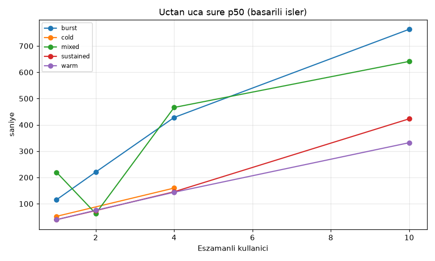

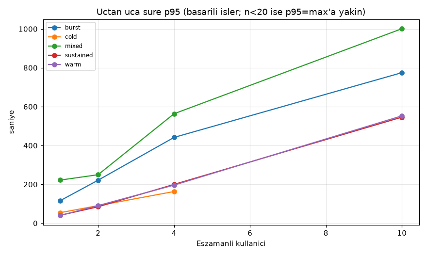

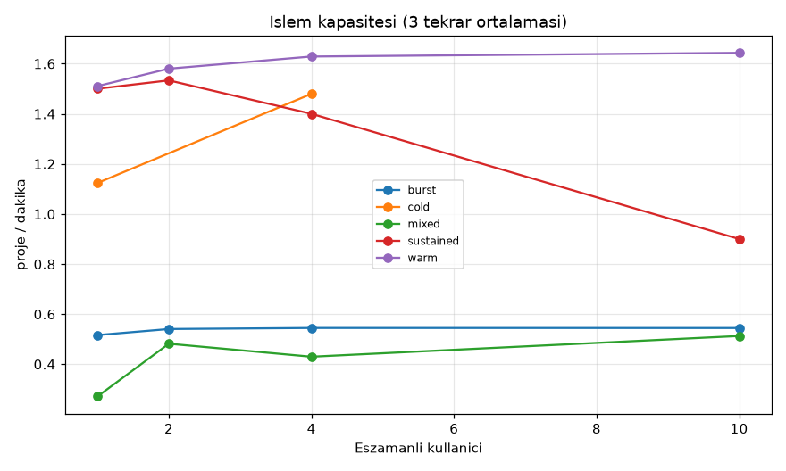

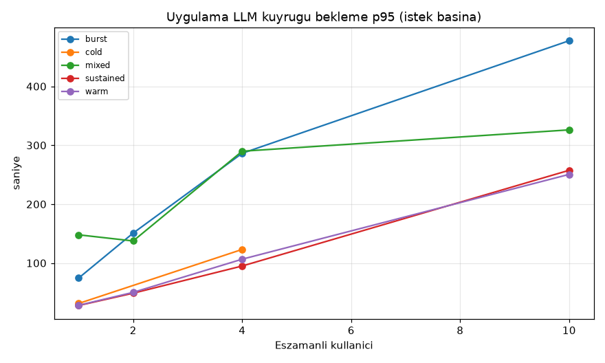

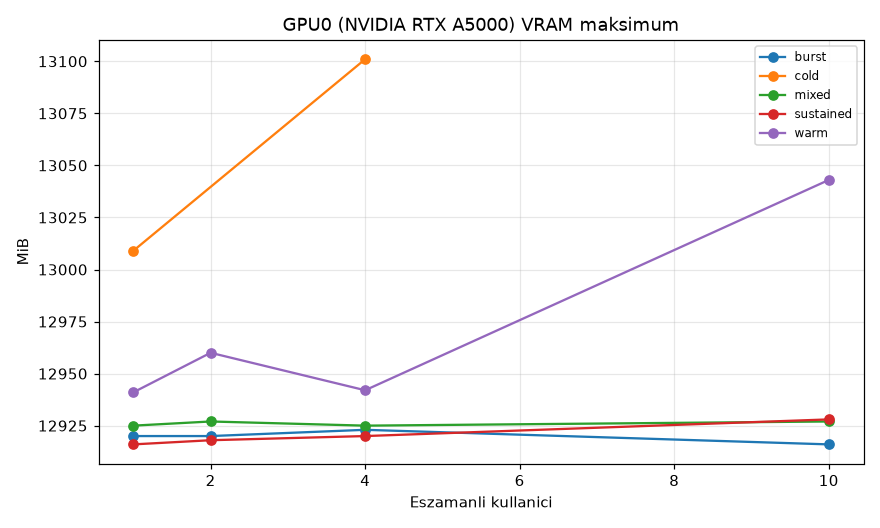

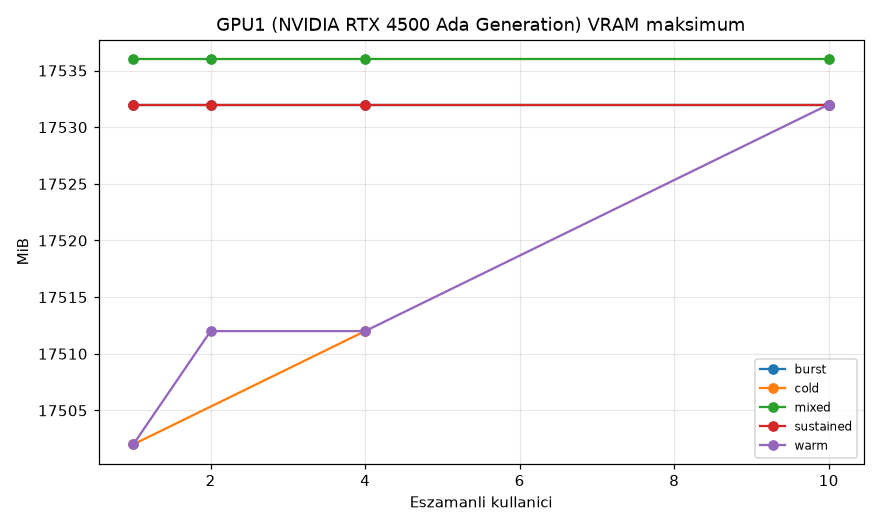

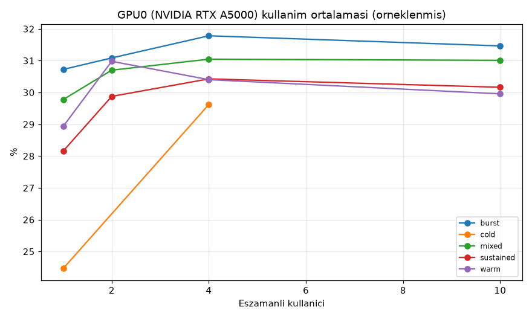

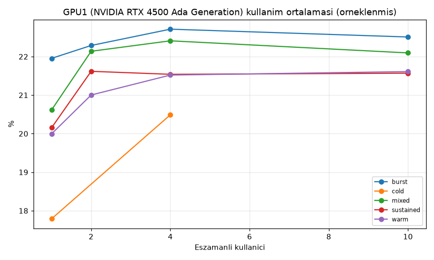

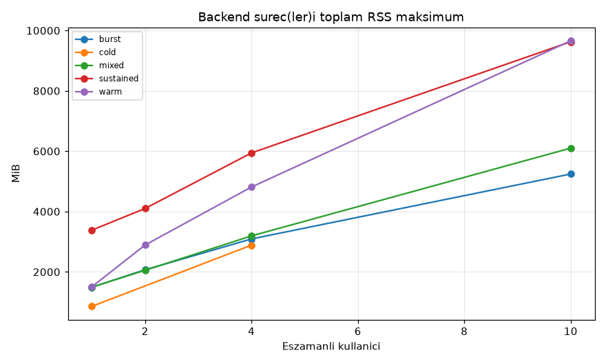

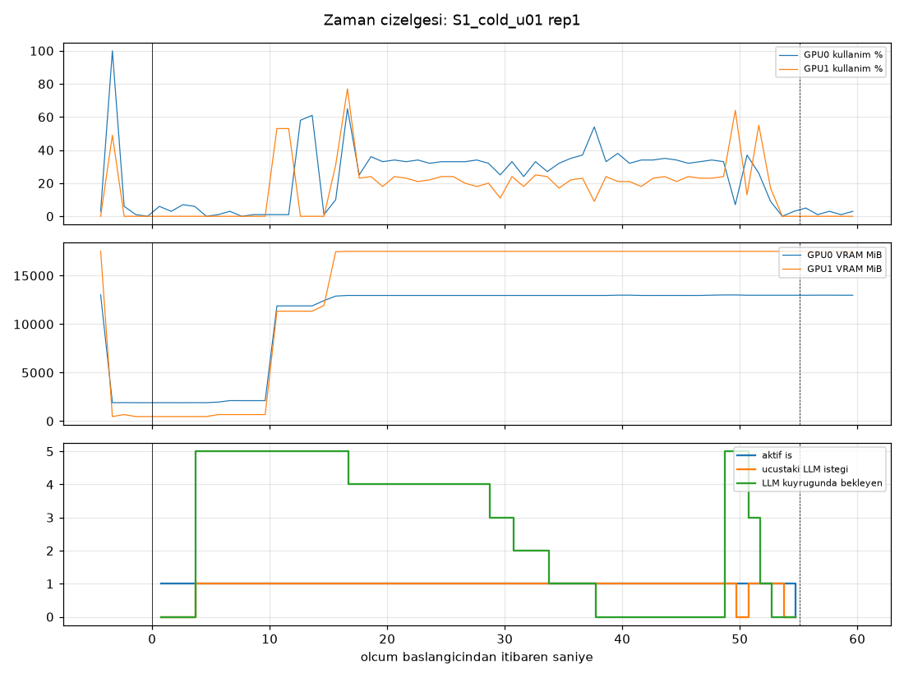

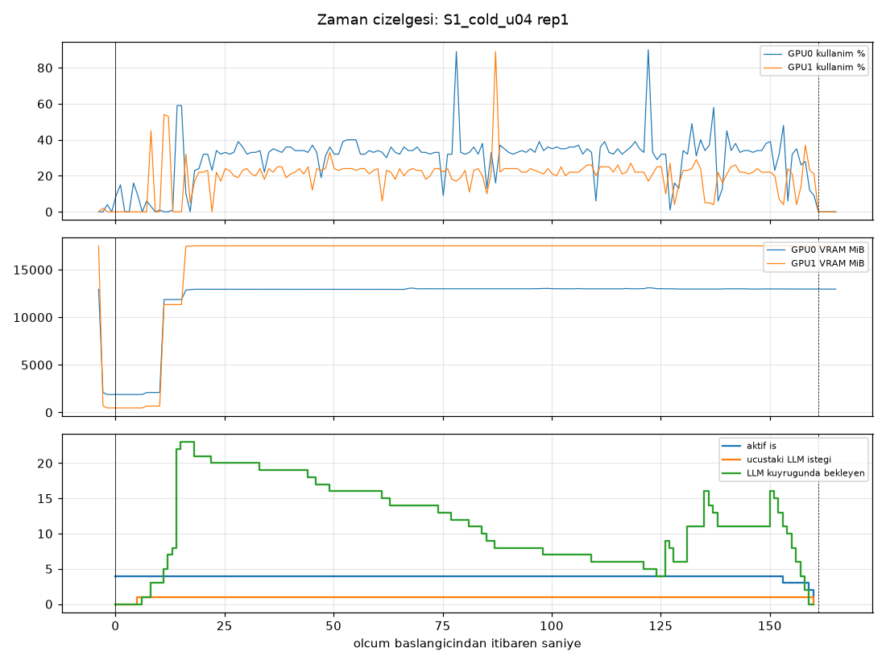

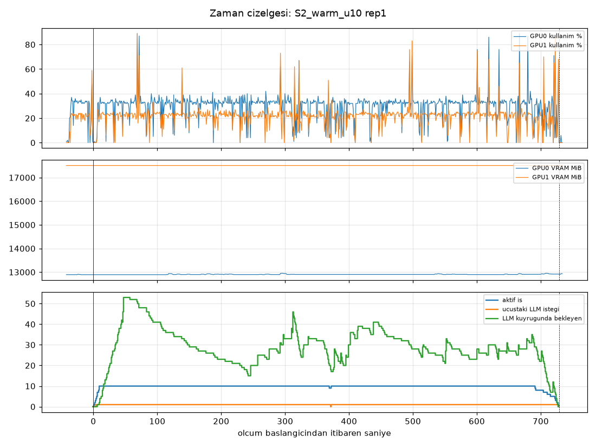

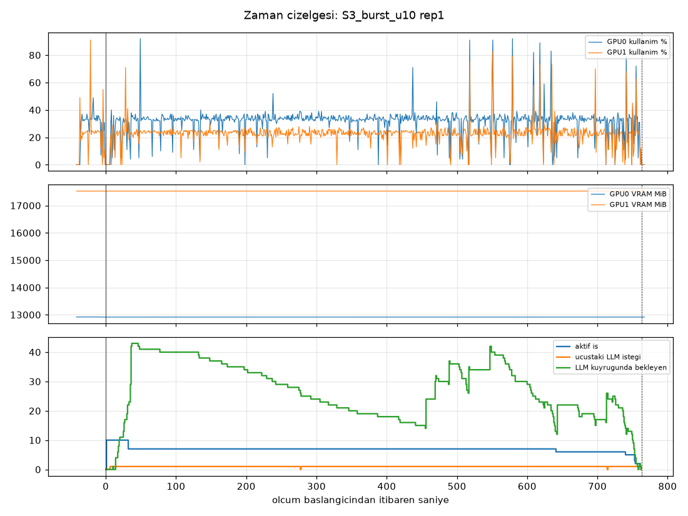

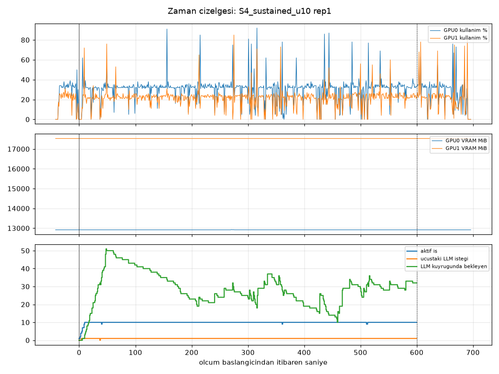

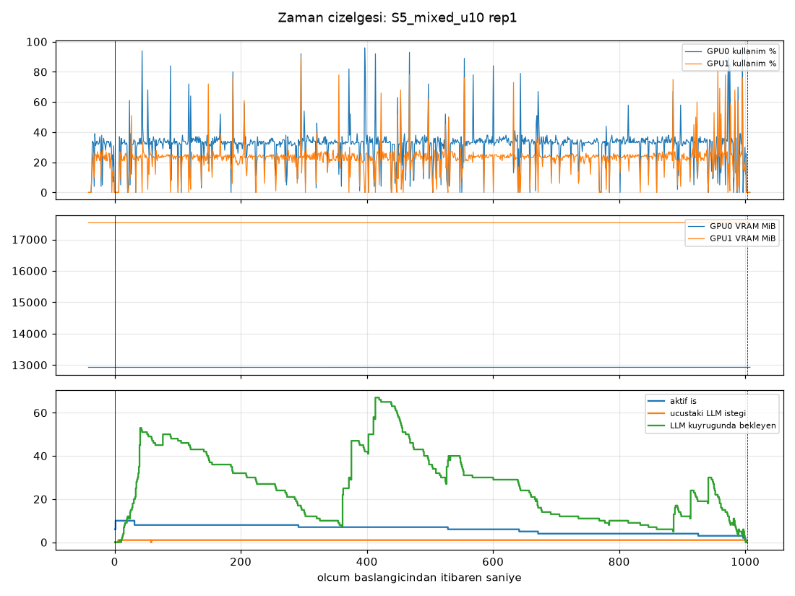

## 4. Worker ve concurrency testi

Her koşul: kullanıcı başına 1 küçük proje, bariyerle aynı anda gönderim, 3 tekrar. Aşama A backend süreç sayısını, B uygulamanın toplam LLM eşzamanlılık sınırını, C iş başına dosya işleme paralelliğini (`VLLM_FILE_BATCH_SIZE`) değiştirir; diğer iki ayar .env değerinde sabittir. Model sunucusu (Ollama/llama-server) ayarlarına dokunulmadı; sunucu tek slot (`-np 1`) ve tek model kopyasıyla çalıştı. Backend worker > 1: iş durumu süreç belleğinde tutulduğu için (`export_jobs.registry`) `uvicorn --workers N` ile yoklama başka sürece düşüp 404 alır; bu yüzden N ayrı backend süreci ayrı portlarda başlatıldı ve her sanal kullanıcı bir sürece yapıştırıldı (aynı DB, aynı LLM kapasite kilidi).

| aşama | backend worker | dosya worker | toplam LLM concurrency | kullanıcı | tamamlanan/gönderilen | proje/dk (ort.) | uçtan uca p95 (sn) | LLM kuyruk p95 (sn) | CPU ort.% / backend RSS maks MiB / RAM maks GiB | GPU0 kull./VRAM | GPU1 kull./VRAM | ölçülen eşzamanlı LLM (uygulama / sunucu slotu) | hata / timeout | durum |
|---|---|---|---|---|---|---|---|---|---|---|---|---|---|---|
| WA | 1 | 8 | 1 | 1 | 3/3 | 1.49 | 40.6† | 28.8 | 24 / 1493 / 22.8 | 27% / p95 37% / 12.6 GiB | 19% / p95 27% / 17.1 GiB | 1 / 1.0 | 0 / 0 | OK |
| WA | 1 | 8 | 1 | 2 | 6/6 | 1.58 | 76.2† | 47.9 | 25 / 2064 / 19.5 | 28% / p95 40% / 12.6 GiB | 20% / p95 29% / 17.1 GiB | 1 / 1.0 | 0 / 0 | OK |
| WA | 1 | 8 | 1 | 4 | 12/12 | 1.63 | 148.6† | 102.4 | 26 / 2973 / 18.6 | 30% / p95 39% / 12.6 GiB | 22% / p95 30% / 17.1 GiB | 1 / 1.0 | 0 / 0 | OK |
| WA | 1 | 8 | 1 | 8 | 24/24 | 1.65 | 290.5 | 220.2 | 26 / 5701 / 21.1 | 30% / p95 40% / 12.6 GiB | 21% / p95 27% / 17.1 GiB | 1 / 1.0 | 0 / 0 | OK |
| WA | 2 | 8 | 1 | 1 | 3/3 | 1.51 | 39.4† | 27.6 | 24 / 2350 / 17.6 | 27% / p95 42% / 12.6 GiB | 20% / p95 27% / 17.1 GiB | 1 / 1.0 | 0 / 0 | OK |
| WA | 2 | 8 | 1 | 2 | 6/6 | 1.58 | 75.9† | 50.3 | 25 / 2539 / 17.6 | 29% / p95 39% / 12.6 GiB | 22% / p95 41% / 17.1 GiB | 2 / 1.0 | 0 / 0 | OK |
| WA | 2 | 8 | 1 | 4 | 12/12 | 1.65 | 145.2† | 96.5 | 26 / 3652 / 18.7 | 31% / p95 45% / 12.6 GiB | 21% / p95 29% / 17.1 GiB | 2 / 1.0 | 0 / 0 | OK |
| WA | 2 | 8 | 1 | 8 | 24/24 | 1.69 | 284.4 | 215.4 | 27 / 5936 / 21.4 | 31% / p95 38% / 12.6 GiB | 22% / p95 28% / 17.1 GiB | 2 / 1.0 | 0 / 0 | OK |
| WA | 4 | 8 | 1 | 1 | 3/3 | 1.49 | 40.0† | 27.9 | 23 / 4065 / 19.0 | 28% / p95 45% / 12.6 GiB | 21% / p95 28% / 17.1 GiB | 1 / 1.0 | 0 / 0 | OK |
| WA | 4 | 8 | 1 | 2 | 6/6 | 1.62 | 73.9† | 50.6 | 25 / 4213 / 19.4 | 30% / p95 38% / 12.6 GiB | 21% / p95 29% / 17.1 GiB | 2 / 1.0 | 0 / 0 | OK |
| WA | 4 | 8 | 1 | 4 | 12/12 | 1.68 | 143.1† | 111.1 | 26 / 4291 / 19.9 | 30% / p95 38% / 12.6 GiB | 22% / p95 27% / 17.1 GiB | 2 / 1.0 | 0 / 0 | OK |
| WA | 4 | 8 | 1 | 8 | 24/24 | 1.69 | 283.3 | 219.5 | 27 / 6467 / 21.8 | 31% / p95 43% / 12.6 GiB | 22% / p95 34% / 17.1 GiB | 3 / 1.0 | 0 / 0 | OK |
| WB | 1 | 8 | 2 | 1 | 3/3 | 1.52 | 38.9† | 15.9 | 24 / 1493 / 17.2 | 28% / p95 39% / 12.6 GiB | 20% / p95 27% / 17.1 GiB | 2 / 1.0 | 0 / 0 | OK |
| WB | 1 | 8 | 2 | 2 | 6/6 | 1.63 | 74.3† | 46.6 | 25 / 1657 / 17.3 | 30% / p95 69% / 12.6 GiB | 21% / p95 28% / 17.1 GiB | 2 / 1.0 | 0 / 0 | OK |
| WB | 1 | 8 | 2 | 4 | 12/12 | 1.66 | 145.6† | 98.1 | 26 / 2995 / 18.7 | 31% / p95 54% / 12.6 GiB | 22% / p95 27% / 17.1 GiB | 2 / 1.0 | 0 / 0 | OK |
| WB | 1 | 8 | 2 | 8 | 24/24 | 1.67 | 288.2 | 207.1 | 27 / 5705 / 21.4 | 30% / p95 39% / 12.6 GiB | 22% / p95 35% / 17.1 GiB | 2 / 1.0 | 0 / 0 | OK |
| WB | 1 | 8 | 4 | 1 | 3/3 | 1.54 | 38.5† | 3.1 | 24 / 1493 / 16.8 | 29% / p95 90% / 12.6 GiB | 22% / p95 77% / 17.1 GiB | 4 / 1.0 | 0 / 0 | OK |
| WB | 1 | 8 | 4 | 2 | 6/6 | 1.61 | 75.3† | 31.3 | 25 / 1838 / 17.6 | 29% / p95 52% / 12.6 GiB | 22% / p95 69% / 17.1 GiB | 4 / 1.0 | 0 / 0 | OK |
| WB | 1 | 8 | 4 | 4 | 12/12 | 1.67 | 143.9† | 94.4 | 26 / 2988 / 18.7 | 30% / p95 48% / 12.6 GiB | 23% / p95 63% / 17.1 GiB | 4 / 1.0 | 0 / 0 | OK |
| WB | 1 | 8 | 4 | 8 | 24/24 | 1.69 | 286.3 | 204.3 | 27 / 5704 / 21.4 | 30% / p95 38% / 12.6 GiB | 22% / p95 30% / 17.1 GiB | 4 / 1.0 | 0 / 0 | OK |
| WC | 1 | 1 | 1 | 1 | 3/3 | 1.36 | 43.8† | 1.4 | 23 / 1456 / 16.9 | 27% / p95 82% / 12.6 GiB | 17% / p95 27% / 17.1 GiB | 1 / 1.0 | 0 / 0 | OK |
| WC | 1 | 1 | 1 | 2 | 6/6 | 1.56 | 76.8† | 15.3 | 25 / 1704 / 17.3 | 29% / p95 58% / 12.6 GiB | 22% / p95 46% / 17.1 GiB | 1 / 1.0 | 0 / 0 | OK |
| WC | 1 | 1 | 1 | 4 | 12/12 | 1.63 | 149.5† | 43.3 | 25 / 2890 / 18.5 | 28% / p95 37% / 12.6 GiB | 21% / p95 27% / 17.1 GiB | 1 / 1.0 | 0 / 0 | OK |
| WC | 1 | 1 | 1 | 8 | 24/24 | 1.63 | 297.1 | 89.9 | 26 / 5525 / 21.4 | 30% / p95 39% / 12.6 GiB | 21% / p95 28% / 17.1 GiB | 1 / 1.0 | 0 / 0 | OK |
| WC | 1 | 2 | 1 | 1 | 3/3 | 1.45 | 41.1† | 23.7 | 24 / 1468 / 17.2 | 27% / p95 47% / 12.6 GiB | 19% / p95 30% / 17.1 GiB | 1 / 1.0 | 0 / 0 | OK |
| WC | 1 | 2 | 1 | 2 | 6/6 | 1.57 | 76.3† | 34.7 | 24 / 1668 / 17.4 | 28% / p95 36% / 12.6 GiB | 20% / p95 28% / 17.1 GiB | 1 / 1.0 | 0 / 0 | OK |
| WC | 1 | 2 | 1 | 4 | 12/12 | 1.63 | 148.1† | 62.8 | 26 / 2925 / 18.6 | 30% / p95 40% / 12.6 GiB | 22% / p95 29% / 17.1 GiB | 1 / 1.0 | 0 / 0 | OK |
| WC | 1 | 2 | 1 | 8 | 24/24 | 1.63 | 293.9 | 145.6 | 27 / 5566 / 21.2 | 29% / p95 38% / 12.6 GiB | 21% / p95 28% / 17.1 GiB | 1 / 1.0 | 0 / 0 | OK |
| WC | 1 | 4 | 1 | 1 | 3/3 | 1.47 | 40.5† | 23.7 | 24 / 1480 / 17.0 | 27% / p95 38% / 12.6 GiB | 21% / p95 57% / 17.1 GiB | 1 / 1.0 | 0 / 0 | OK |
| WC | 1 | 4 | 1 | 2 | 6/6 | 1.59 | 76.2† | 41.0 | 25 / 1676 / 17.3 | 29% / p95 38% / 12.6 GiB | 21% / p95 34% / 17.1 GiB | 1 / 1.0 | 0 / 0 | OK |
| WC | 1 | 4 | 1 | 4 | 12/12 | 1.65 | 146.2† | 77.8 | 26 / 2956 / 18.8 | 31% / p95 40% / 12.6 GiB | 22% / p95 30% / 17.1 GiB | 1 / 1.0 | 0 / 0 | OK |
| WC | 1 | 4 | 1 | 8 | 24/24 | 1.65 | 289.1 | 181.7 | 27 / 5637 / 21.5 | 30% / p95 38% / 12.6 GiB | 22% / p95 29% / 17.1 GiB | 1 / 1.0 | 0 / 0 | OK |

### Worker koşulları — LLM ve donanım ayrıntısı

| koşul | LLM isteği (toplam / kesilip bölünen / başarısız) | iş başına istek (ort.) | iş başına chunk det/audit (ort.) | istek/sn (ort.) | prompt tok p50 | çıktı tok p50/p95 | istek çıktı tok/s p50 (prefill dahil) | sunucu prefill ms p50/p95 | sunucu TPOT ms p50/p95 | sunucu decode tok/s p50 | sunucu toplam tok/s (ort.) | sunucu içi bekleme p95 (sn) | slot dolu oranı | maks. bağlam doluluğu | eşzamanlı LLM (ölçülen maks) |
|---|---|---|---|---|---|---|---|---|---|---|---|---|---|---|---|
| W_bw1_fb8_lc1_u01 | 36 / 0 / 0 | 12.0 | 6.0 / 6.0 | 0.297 | 1353 | 20 / 1350 | 35.7 | 360 / 456 | 10.1 / 11.8 | 99.1 | 213 | 0.36 | 84% | 3070 / 8192 | 1 (sunucu slotu 1.0) |
| W_bw1_fb8_lc1_u02 | 72 / 0 / 0 | 12.0 | 6.0 / 6.0 | 0.315 | 1353 | 20 / 1350 | 37.2 | 362 / 448 | 10.3 / 11.9 | 97.3 | 220 | 0.18 | 90% | 3070 / 8192 | 1 (sunucu slotu 1.0) |
| W_bw1_fb8_lc1_u04 | 144 / 0 / 0 | 12.0 | 6.0 / 6.0 | 0.325 | 1353 | 20 / 1350 | 39.3 | 317 / 425 | 10.3 / 11.7 | 97.3 | 225 | 0.34 | 93% | 3070 / 8192 | 1 (sunucu slotu 1.0) |
| W_bw1_fb8_lc1_u08 | 288 / 0 / 0 | 12.0 | 6.0 / 6.0 | 0.330 | 1353 | 20 / 1350 | 39.1 | 323 / 431 | 10.2 / 11.8 | 98.1 | 224 | 0.35 | 95% | 3070 / 8192 | 1 (sunucu slotu 1.0) |
| W_bw2_fb8_lc1_u01 | 36 / 0 / 0 | 12.0 | 6.0 / 6.0 | 0.302 | 1353 | 20 / 1350 | 39.1 | 308 / 408 | 10.1 / 11.4 | 98.7 | 226 | 0.33 | 87% | 3070 / 8192 | 1 (sunucu slotu 1.0) |
| W_bw2_fb8_lc1_u02 | 72 / 0 / 0 | 12.0 | 6.0 / 6.0 | 0.317 | 1353 | 20 / 1350 | 38.2 | 316 / 417 | 10.3 / 11.9 | 97.3 | 227 | 0.34 | 93% | 3070 / 8192 | 2 (sunucu slotu 1.0) |
| W_bw2_fb8_lc1_u04 | 144 / 0 / 0 | 12.0 | 6.0 / 6.0 | 0.331 | 1353 | 20 / 1350 | 38.6 | 325 / 411 | 10.3 / 11.7 | 97.2 | 235 | 0.32 | 94% | 3070 / 8192 | 2 (sunucu slotu 1.0) |
| W_bw2_fb8_lc1_u08 | 288 / 0 / 0 | 12.0 | 6.0 / 6.0 | 0.338 | 1353 | 20 / 1350 | 40.9 | 317 / 420 | 10.2 / 11.6 | 98.0 | 224 | 0.32 | 95% | 3070 / 8192 | 2 (sunucu slotu 1.0) |
| W_bw4_fb8_lc1_u01 | 36 / 0 / 0 | 12.0 | 6.0 / 6.0 | 0.297 | 1353 | 20 / 1350 | 39.3 | 319 / 427 | 10.1 / 11.7 | 98.6 | 226 | 0.36 | 83% | 3070 / 8192 | 1 (sunucu slotu 1.0) |
| W_bw4_fb8_lc1_u02 | 72 / 0 / 0 | 12.0 | 6.0 / 6.0 | 0.324 | 1353 | 20 / 1350 | 41.6 | 309 / 414 | 10.1 / 11.6 | 98.8 | 220 | 0.30 | 89% | 3070 / 8192 | 2 (sunucu slotu 1.0) |
| W_bw4_fb8_lc1_u04 | 144 / 0 / 0 | 12.0 | 6.0 / 6.0 | 0.336 | 1353 | 20 / 1350 | 40.7 | 310 / 416 | 10.1 / 11.5 | 99.0 | 226 | 0.33 | 95% | 3070 / 8192 | 2 (sunucu slotu 1.0) |
| W_bw4_fb8_lc1_u08 | 288 / 0 / 0 | 12.0 | 6.0 / 6.0 | 0.338 | 1353 | 20 / 1350 | 40.8 | 308 / 433 | 10.2 / 11.6 | 98.3 | 233 | 0.31 | 95% | 3070 / 8192 | 3 (sunucu slotu 1.0) |
| W_bw1_fb8_lc2_u01 | 36 / 0 / 0 | 12.0 | 6.0 / 6.0 | 0.305 | 1353 | 20 / 1350 | 20.9 | 308 / 390 | 10.1 / 11.4 | 99.3 | 225 | 11.46 | 85% | 3070 / 8192 | 2 (sunucu slotu 1.0) |
| W_bw1_fb8_lc2_u02 | 72 / 0 / 0 | 12.0 | 6.0 / 6.0 | 0.325 | 1353 | 20 / 1350 | 20.0 | 310 / 395 | 10.1 / 11.5 | 98.9 | 241 | 11.41 | 90% | 3070 / 8192 | 2 (sunucu slotu 1.0) |
| W_bw1_fb8_lc2_u04 | 144 / 0 / 0 | 12.0 | 6.0 / 6.0 | 0.331 | 1353 | 20 / 1350 | 20.4 | 319 / 430 | 10.2 / 11.5 | 97.7 | 234 | 11.62 | 94% | 3070 / 8192 | 2 (sunucu slotu 1.0) |
| W_bw1_fb8_lc2_u08 | 288 / 0 / 0 | 12.0 | 6.0 / 6.0 | 0.334 | 1353 | 20 / 1350 | 19.8 | 319 / 429 | 10.3 / 11.7 | 97.5 | 233 | 11.65 | 96% | 3070 / 8192 | 2 (sunucu slotu 1.0) |
| W_bw1_fb8_lc4_u01 | 36 / 0 / 0 | 12.0 | 6.0 / 6.0 | 0.307 | 1353 | 20 / 1350 | 12.9 | 304 / 393 | 10.1 / 11.4 | 98.8 | 222 | 25.67 | 85% | 3070 / 8192 | 4 (sunucu slotu 1.0) |
| W_bw1_fb8_lc4_u02 | 72 / 0 / 0 | 12.0 | 6.0 / 6.0 | 0.321 | 1353 | 20 / 1350 | 9.3 | 321 / 421 | 10.2 / 12.2 | 97.9 | 234 | 24.68 | 89% | 3070 / 8192 | 4 (sunucu slotu 1.0) |
| W_bw1_fb8_lc4_u04 | 144 / 0 / 0 | 12.0 | 6.0 / 6.0 | 0.334 | 1353 | 20 / 1350 | 10.1 | 306 / 404 | 10.2 / 11.6 | 98.2 | 238 | 23.04 | 94% | 3070 / 8192 | 4 (sunucu slotu 1.0) |
| W_bw1_fb8_lc4_u08 | 288 / 0 / 0 | 12.0 | 6.0 / 6.0 | 0.339 | 1353 | 20 / 1350 | 10.1 | 318 / 419 | 10.3 / 11.6 | 96.9 | 230 | 25.16 | 96% | 3070 / 8192 | 4 (sunucu slotu 1.0) |
| W_bw1_fb1_lc1_u01 | 36 / 0 / 0 | 12.0 | 6.0 / 6.0 | 0.272 | 1353 | 20 / 1350 | 26.1 | 320 / 387 | 10.2 / 11.6 | 98.4 | 210 | 0.35 | 84% | 3070 / 8192 | 1 (sunucu slotu 1.0) |
| W_bw1_fb1_lc1_u02 | 72 / 0 / 0 | 12.0 | 6.0 / 6.0 | 0.313 | 1353 | 20 / 1350 | 37.8 | 300 / 389 | 10.1 / 11.5 | 98.5 | 196 | 0.33 | 90% | 3070 / 8192 | 1 (sunucu slotu 1.0) |
| W_bw1_fb1_lc1_u04 | 144 / 0 / 0 | 12.0 | 6.0 / 6.0 | 0.326 | 1353 | 20 / 1350 | 53.2 | 292 / 409 | 10.1 / 11.5 | 98.7 | 184 | 0.33 | 91% | 3070 / 8192 | 1 (sunucu slotu 1.0) |
| W_bw1_fb1_lc1_u08 | 288 / 0 / 0 | 12.0 | 6.0 / 6.0 | 0.326 | 1353 | 20 / 1350 | 39.6 | 287 / 389 | 10.1 / 11.6 | 98.5 | 182 | 0.34 | 92% | 3070 / 8192 | 1 (sunucu slotu 1.0) |
| W_bw1_fb2_lc1_u01 | 36 / 0 / 0 | 12.0 | 6.0 / 6.0 | 0.290 | 1353 | 20 / 1350 | 37.3 | 312 / 401 | 10.2 / 11.7 | 98.4 | 193 | 0.40 | 84% | 3070 / 8192 | 1 (sunucu slotu 1.0) |
| W_bw1_fb2_lc1_u02 | 72 / 0 / 0 | 12.0 | 6.0 / 6.0 | 0.314 | 1353 | 20 / 1350 | 41.8 | 299 / 398 | 10.3 / 11.7 | 97.3 | 188 | 0.39 | 90% | 3070 / 8192 | 1 (sunucu slotu 1.0) |
| W_bw1_fb2_lc1_u04 | 144 / 0 / 0 | 12.0 | 6.0 / 6.0 | 0.325 | 1353 | 20 / 1350 | 38.4 | 309 / 406 | 10.2 / 11.6 | 98.0 | 223 | 0.34 | 95% | 3070 / 8192 | 1 (sunucu slotu 1.0) |
| W_bw1_fb2_lc1_u08 | 288 / 0 / 0 | 12.0 | 6.0 / 6.0 | 0.326 | 1353 | 20 / 1350 | 39.2 | 307 / 405 | 10.3 / 11.7 | 96.7 | 205 | 0.34 | 94% | 3070 / 8192 | 1 (sunucu slotu 1.0) |
| W_bw1_fb4_lc1_u01 | 36 / 0 / 0 | 12.0 | 6.0 / 6.0 | 0.295 | 1353 | 20 / 1350 | 39.2 | 323 / 413 | 10.1 / 11.7 | 98.7 | 208 | 0.35 | 82% | 3070 / 8192 | 1 (sunucu slotu 1.0) |
| W_bw1_fb4_lc1_u02 | 72 / 0 / 0 | 12.0 | 6.0 / 6.0 | 0.318 | 1353 | 20 / 1350 | 41.3 | 307 / 422 | 10.3 / 11.7 | 96.7 | 209 | 0.37 | 88% | 3070 / 8192 | 1 (sunucu slotu 1.0) |
| W_bw1_fb4_lc1_u04 | 144 / 0 / 0 | 12.0 | 6.0 / 6.0 | 0.329 | 1353 | 20 / 1350 | 40.3 | 309 / 413 | 10.2 / 11.6 | 97.9 | 218 | 0.32 | 92% | 3070 / 8192 | 1 (sunucu slotu 1.0) |
| W_bw1_fb4_lc1_u08 | 288 / 0 / 0 | 12.0 | 6.0 / 6.0 | 0.330 | 1353 | 20 / 1350 | 38.5 | 313 / 419 | 10.3 / 11.7 | 96.9 | 219 | 0.33 | 96% | 3070 / 8192 | 1 (sunucu slotu 1.0) |

| koşul | CPU ort. / maks % | sistem RAM maks (GiB) | swap maks (GiB) | backend RSS maks (MiB) | llama-server RSS maks (MiB) | disk yazma ort. (MB/s) | GPU0 sıcaklık maks / güç ort–maks / SM saat ort | GPU1 sıcaklık maks / güç ort–maks / SM saat ort | throttling nedenleri (örnek sayısı) |
|---|---|---|---|---|---|---|---|---|---|
| W_bw1_fb8_lc1_u01 | 24 / 32 | 22.8 | 3.71 | 1493 | 9349 | 1.04 | 75°C / 121–155 W / 1725 MHz | 63°C / 65–79 W / 2595 MHz | GPU0: sw_power_cap=3; GPU1: sw_power_cap=2 |
| W_bw1_fb8_lc1_u02 | 25 / 34 | 19.5 | 3.71 | 2064 | 5945 | 0.68 | 77°C / 125–156 W / 1724 MHz | 69°C / 66–82 W / 2591 MHz | GPU0: sw_power_cap=10; GPU1: sw_power_cap=2 |
| W_bw1_fb8_lc1_u04 | 26 / 38 | 18.6 | 3.70 | 2973 | 3898 | 0.80 | 78°C / 127–158 W / 1721 MHz | 71°C / 67–86 W / 2593 MHz | GPU0: sw_power_cap=19; GPU1: sw_power_cap=10 |
| W_bw1_fb8_lc1_u08 | 26 / 38 | 21.1 | 3.69 | 5701 | 3393 | 0.82 | 78°C / 128–159 W / 1723 MHz | 72°C / 67–91 W / 2595 MHz | GPU0: sw_power_cap=54; GPU1: sw_power_cap=13 |
| W_bw2_fb8_lc1_u01 | 24 / 32 | 17.6 | 3.69 | 2350 | 3323 | 1.25 | 77°C / 126–158 W / 1729 MHz | 70°C / 66–83 W / 2602 MHz | GPU0: sw_power_cap=6; GPU1: sw_power_cap=4 |
| W_bw2_fb8_lc1_u02 | 25 / 35 | 17.6 | 3.69 | 2539 | 3221 | 0.74 | 77°C / 126–157 W / 1721 MHz | 70°C / 67–84 W / 2593 MHz | GPU0: sw_power_cap=15; GPU1: sw_power_cap=3 |
| W_bw2_fb8_lc1_u04 | 26 / 38 | 18.7 | 3.69 | 3652 | 3423 | 0.76 | 78°C / 129–158 W / 1721 MHz | 71°C / 67–84 W / 2597 MHz | GPU0: sw_power_cap=25; GPU1: sw_power_cap=7 |
| W_bw2_fb8_lc1_u08 | 27 / 39 | 21.4 | 3.69 | 5936 | 3361 | 0.78 | 78°C / 130–160 W / 1720 MHz | 71°C / 68–84 W / 2594 MHz | GPU0: sw_power_cap=52; GPU1: sw_power_cap=19 |
| W_bw4_fb8_lc1_u01 | 23 / 34 | 19.0 | 3.69 | 4065 | 3228 | 0.72 | 78°C / 126–160 W / 1731 MHz | 70°C / 66–83 W / 2597 MHz | GPU0: sw_power_cap=11; GPU1: sw_power_cap=4 |
| W_bw4_fb8_lc1_u02 | 25 / 36 | 19.4 | 3.68 | 4213 | 3395 | 1.07 | 78°C / 129–160 W / 1724 MHz | 69°C / 67–84 W / 2594 MHz | GPU0: sw_power_cap=22; GPU1: sw_power_cap=4 |
| W_bw4_fb8_lc1_u04 | 26 / 37 | 19.9 | 3.68 | 4291 | 3550 | 1.06 | 78°C / 130–160 W / 1721 MHz | 72°C / 68–85 W / 2595 MHz | GPU0: sw_power_cap=40; GPU1: sw_power_cap=8 |
| W_bw4_fb8_lc1_u08 | 27 / 39 | 21.8 | 3.68 | 6467 | 3294 | 0.73 | 79°C / 131–159 W / 1723 MHz | 71°C / 68–83 W / 2593 MHz | GPU0: sw_power_cap=80; GPU1: sw_power_cap=16 |
| W_bw1_fb8_lc2_u01 | 24 / 35 | 17.2 | 3.67 | 1493 | 3487 | 0.57 | 77°C / 126–158 W / 1733 MHz | 64°C / 66–84 W / 2598 MHz | GPU0: sw_power_cap=11; GPU1: sw_power_cap=2 |
| W_bw1_fb8_lc2_u02 | 25 / 37 | 17.3 | 3.66 | 1657 | 3357 | 0.64 | 78°C / 129–158 W / 1727 MHz | 71°C / 68–88 W / 2604 MHz | GPU0: sw_power_cap=28; GPU1: sw_power_cap=2 |
| W_bw1_fb8_lc2_u04 | 26 / 38 | 18.7 | 3.66 | 2995 | 3574 | 0.62 | 78°C / 129–159 W / 1724 MHz | 70°C / 68–85 W / 2598 MHz | GPU0: sw_power_cap=37; GPU1: sw_power_cap=9 |
| W_bw1_fb8_lc2_u08 | 27 / 41 | 21.4 | 3.66 | 5705 | 3486 | 0.64 | 79°C / 130–161 W / 1726 MHz | 72°C / 68–86 W / 2593 MHz | GPU0: sw_power_cap=69; GPU1: sw_power_cap=22 |
| W_bw1_fb8_lc4_u01 | 24 / 34 | 16.8 | 3.66 | 1493 | 3352 | 0.76 | 76°C / 126–158 W / 1725 MHz | 70°C / 66–85 W / 2602 MHz | GPU0: sw_power_cap=9; GPU1: sw_power_cap=4 |
| W_bw1_fb8_lc4_u02 | 25 / 34 | 17.6 | 3.66 | 1838 | 3579 | 0.78 | 77°C / 126–158 W / 1725 MHz | 70°C / 67–84 W / 2597 MHz | GPU0: sw_power_cap=15; GPU1: sw_power_cap=7 |
| W_bw1_fb8_lc4_u04 | 26 / 41 | 18.7 | 3.66 | 2988 | 3361 | 0.63 | 78°C / 129–158 W / 1722 MHz | 70°C / 68–90 W / 2596 MHz | GPU0: sw_power_cap=19; GPU1: sw_power_cap=14 |
| W_bw1_fb8_lc4_u08 | 27 / 39 | 21.4 | 3.66 | 5704 | 3423 | 0.69 | 78°C / 130–159 W / 1722 MHz | 71°C / 68–87 W / 2597 MHz | GPU0: sw_power_cap=80; GPU1: sw_power_cap=19 |
| W_bw1_fb1_lc1_u01 | 23 / 32 | 16.9 | 3.66 | 1456 | 3417 | 0.68 | 75°C / 121–157 W / 1736 MHz | 66°C / 64–77 W / 2607 MHz | GPU0: sw_power_cap=14; GPU1: yok |
| W_bw1_fb1_lc1_u02 | 25 / 38 | 17.3 | 3.66 | 1704 | 3295 | 0.79 | 77°C / 125–159 W / 1724 MHz | 70°C / 66–81 W / 2592 MHz | GPU0: sw_power_cap=15; GPU1: sw_power_cap=9 |
| W_bw1_fb1_lc1_u04 | 25 / 37 | 18.5 | 3.66 | 2890 | 3347 | 0.85 | 78°C / 126–160 W / 1721 MHz | 70°C / 66–80 W / 2595 MHz | GPU0: sw_power_cap=21; GPU1: sw_power_cap=8 |
| W_bw1_fb1_lc1_u08 | 26 / 41 | 21.4 | 3.66 | 5525 | 3628 | 0.78 | 78°C / 125–160 W / 1721 MHz | 70°C / 66–84 W / 2590 MHz | GPU0: sw_power_cap=59; GPU1: sw_power_cap=7 |
| W_bw1_fb2_lc1_u01 | 24 / 39 | 17.2 | 3.66 | 1468 | 3578 | 0.79 | 75°C / 121–155 W / 1726 MHz | 68°C / 64–78 W / 2593 MHz | GPU0: sw_power_cap=10; GPU1: sw_power_cap=2 |
| W_bw1_fb2_lc1_u02 | 24 / 36 | 17.4 | 3.66 | 1668 | 3513 | 0.64 | 76°C / 123–155 W / 1720 MHz | 69°C / 65–81 W / 2594 MHz | GPU0: sw_power_cap=14; GPU1: sw_power_cap=1 |
| W_bw1_fb2_lc1_u04 | 26 / 40 | 18.6 | 3.66 | 2925 | 3515 | 0.81 | 77°C / 127–158 W / 1729 MHz | 70°C / 67–82 W / 2597 MHz | GPU0: sw_power_cap=37; GPU1: sw_power_cap=8 |
| W_bw1_fb2_lc1_u08 | 27 / 40 | 21.2 | 3.66 | 5566 | 3486 | 0.86 | 78°C / 126–156 W / 1721 MHz | 70°C / 67–85 W / 2596 MHz | GPU0: sw_power_cap=77; GPU1: sw_power_cap=22 |
| W_bw1_fb4_lc1_u01 | 24 / 33 | 17.0 | 3.66 | 1480 | 3640 | 0.90 | 75°C / 121–156 W / 1732 MHz | 68°C / 65–87 W / 2596 MHz | GPU0: sw_power_cap=8; GPU1: sw_power_cap=5 |
| W_bw1_fb4_lc1_u02 | 25 / 38 | 17.3 | 3.66 | 1676 | 3552 | 0.74 | 76°C / 124–157 W / 1725 MHz | 70°C / 66–80 W / 2594 MHz | GPU0: sw_power_cap=19; GPU1: sw_power_cap=3 |
| W_bw1_fb4_lc1_u04 | 26 / 37 | 18.8 | 3.66 | 2956 | 3694 | 0.86 | 78°C / 127–157 W / 1723 MHz | 69°C / 67–86 W / 2597 MHz | GPU0: sw_power_cap=43; GPU1: sw_power_cap=10 |
| W_bw1_fb4_lc1_u08 | 27 / 41 | 21.5 | 3.66 | 5637 | 3575 | 0.91 | 78°C / 127–158 W / 1725 MHz | 71°C / 68–85 W / 2594 MHz | GPU0: sw_power_cap=63; GPU1: sw_power_cap=21 |

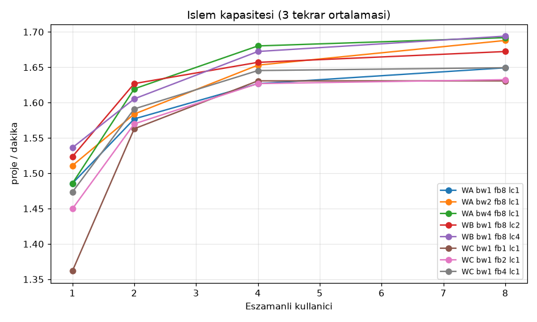

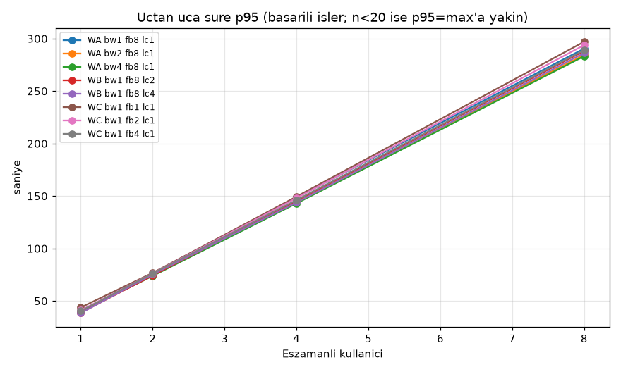

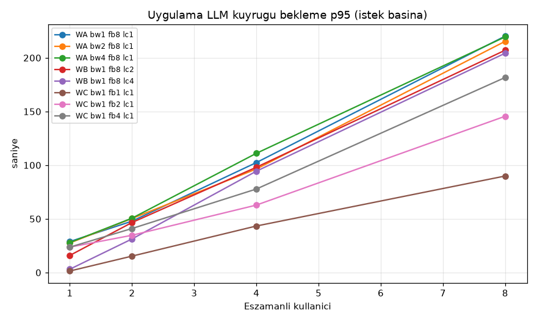

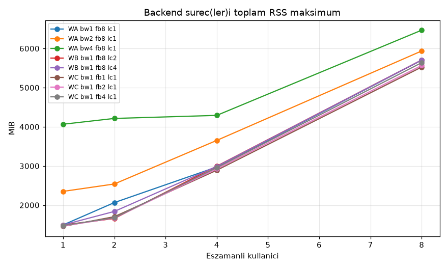

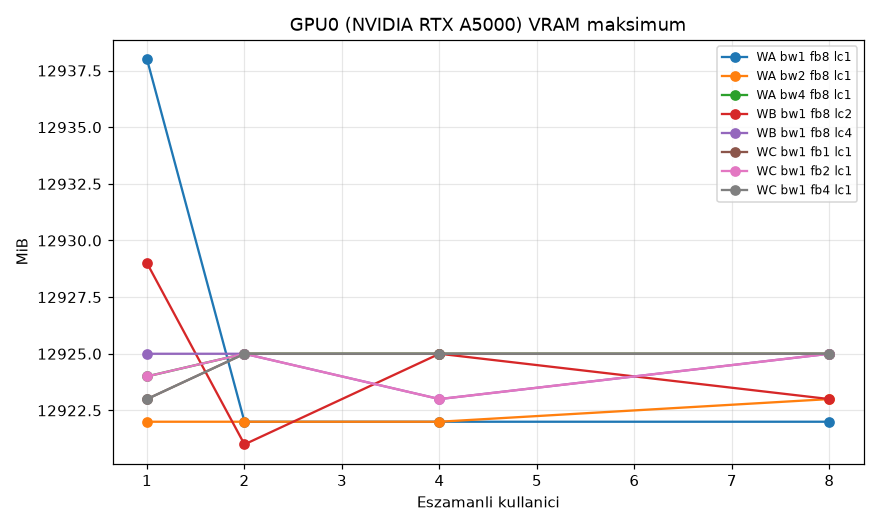

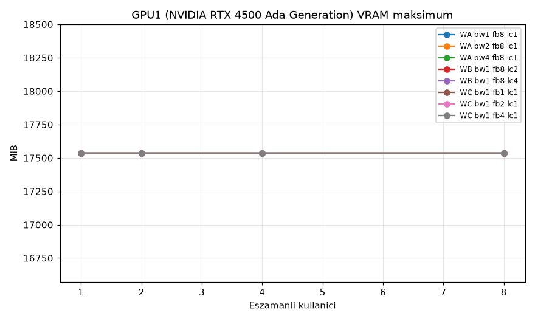

## 5. Kayıt yalıtımı doğrulaması

Her tekrar sonunda test DB kopyasında, her iş için: run kaydının proje/sicil/branch'i işi gönderen kullanıcıyla aynı mı; run'a ait değer eşlemeleri yalnız o bağlamda mı; denetim kaydındaki dosya yolları yalnız o projenin dosyaları mı; indirilen paketin bütünlük manifestindeki job_id run_id ile aynı mı; run_id ve çıktı tokenı işler arasında tekil mi kontrol edildi.

Sonuç: 50/50 koşulda tüm kontroller geçti.

## 6. Ölçülemeyen / sınırlı metrikler

- **TTFT (ilk tokena kadar süre): ölçülemedi.** Uygulama `/v1/chat/completions`'a streaming olmadan istek atıyor; toplam süreden tahmin yapılmadı. Yerine llama-server'ın kendi ölçtüğü **prefill (prompt eval) süresi** verildi; bu TTFT değildir (sunucu kuyruğu ve ağ hariç).
- **Tokenlar arası süre**: llama-server'ın `eval time ... ms per token` değeri (sunucu ölçümü). MTP spekülatif çözümleme açık olduğundan (`--spec-type draft-mtp`) bu, kabul edilen taslak tokenlar dahil ortalamadır.
- **Sunucu kuyruğunda bekleme**: Ollama kendi kuyruğu için metrik sunmuyor. Tabloda verilen 'sunucu içi bekleme', Ollama GIN günlüğündeki istek süresinden geriye hesaplanan varış anı ile llama-server'ın görevi başlattığı an arasındaki farktır (iki sunucu zaman damgası; np=1 olduğundan görevler sırayla eşlenir). Uygulama kuyruğu ayrıca verildi.
- **KV cache kullanımı**: llama-server `--metrics` olmadan başlatıldığı için `/metrics` kapalı (501). Yerine slot bağlam doluluğu (görev sonundaki `n_tokens` / 8192) verildi. **Preemption sayısı: ölçülemedi** (llama.cpp tek slotta preemption yapmaz; kesme yerine `truncated` sayacı raporlandı).
- **Sunucunun eşzamanlı çalışan istek sayısı**: `/slots` her saniye yoklandı (yoğun decode sırasında yanıt gecikirse örnek 'ulaşılamadı' sayıldı).
- İstek bazında çıktı token/s, istemci tarafında `completion_tokens / HTTP süresi` ile hesaplandı; prefill ve Ollama içi bekleme dahildir, saf decode hızı değildir (saf decode için sunucu sütunu).
- Diğer istemcilerin (kullanıcının canlı backend'i) aynı Ollama'ya istek atıp atmadığı GIN günlüğü ile testin kendi isteklerinin farkından izlendi: tahmini yabancı istek toplamı 0.

## 7. Ham veriler ve tekrar çalıştırma

Ham dosyalar (her koşul/tekrar klasöründe):

- `jobs.jsonl` — istemci tarafı iş kayıtları (her iş: kullanıcı, proje, job_id, run_id, monotonic zaman damgaları, durum, karantina sayıları)
- `server_events_<port>.jsonl` — sunucu olayları (iş/dosya/LLM isteği bazında monotonic başlangıç-bitiş, kuyruk, HTTP, token; saniyelik sayaçlar)
- `hw/gpu.csv`, `hw/sys.csv`, `hw/proc.csv`, `hw/slots.csv`, `hw/ollama_ps.csv` — saniyelik, zaman damgalı (wall + monotonic) donanım/sunucu ölçümleri; `hw/gpu_info.json` GPU adı/UUID
- `ollama_journal.log` — test penceresine ait Ollama/llama-server günlük satırları (prefill/decode süreleri)
- `rep.json` — koşul ayarları, ölçüm penceresi, kuyruk boşaltma, backend çıkış kodları, yalıtım doğrulaması
- Kampanya kökünde: `environment.json`, `summary_conditions.csv/json`, `summary_reps.csv`, `jobs_all.csv`, `llm_requests_all.csv`, `files_all.csv`, `server_tasks_all.csv`, `hw_summary.csv`, `charts/`

Komutlar (`masking_system/` dizininden):

```bash
python3 -m venv loadtest/.venv && loadtest/.venv/bin/pip install psutil nvidia-ml-py matplotlib httpx
loadtest/.venv/bin/python -m loadtest.datasets                      # veri setleri (bayt-bayt aynı)
export LOADTEST_WORK=/tmp/masking-loadtest-work                     # geçici DB kopyaları/çıktılar
loadtest/.venv/bin/python -m loadtest.runner --plan main    --campaign loadtest/results/main
loadtest/.venv/bin/python -m loadtest.runner --plan workers --campaign loadtest/results/workers
loadtest/.venv/bin/python -m loadtest.analyze loadtest/results/main loadtest/results/workers
loadtest/.venv/bin/python -m loadtest.report --main loadtest/results/main --workers loadtest/results/workers --out loadtest/results/RAPOR.md
# tek koşul: --only S3_burst_u10   tekrar sayısı: --reps 1   (DONE olan tekrarlar atlanır)
```
