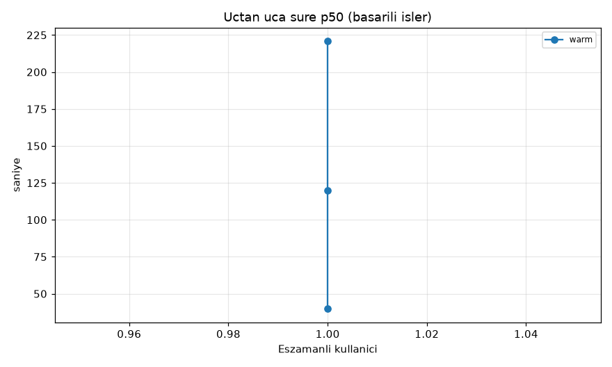
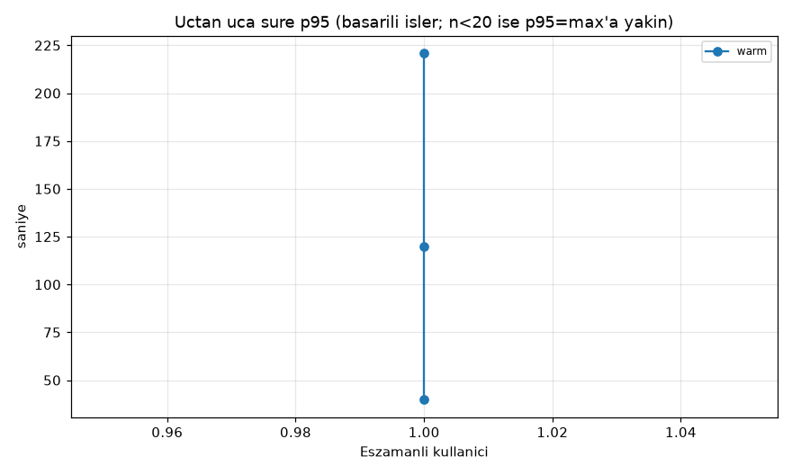
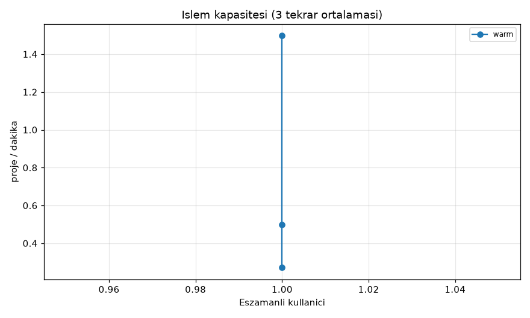
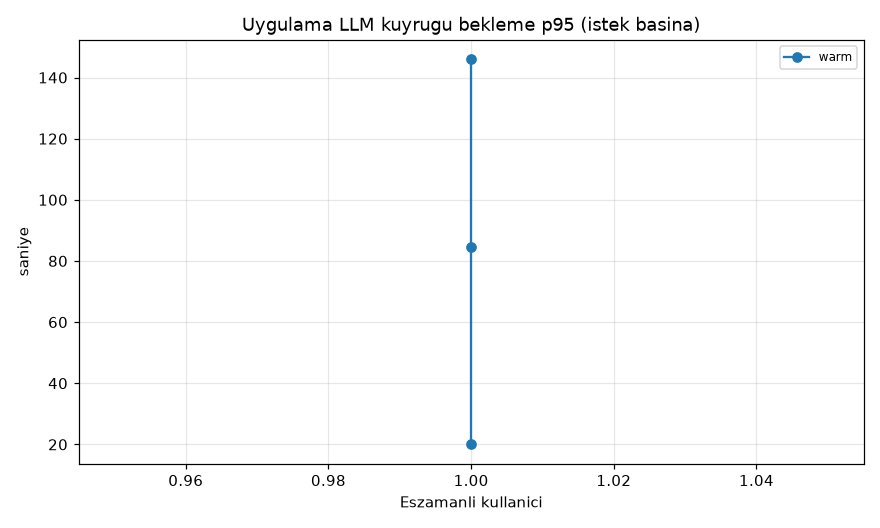
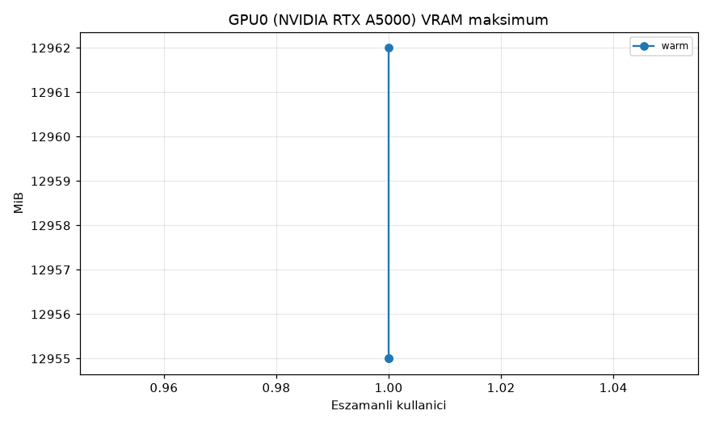
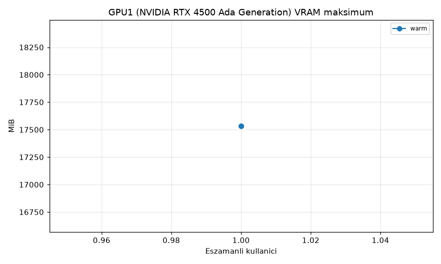
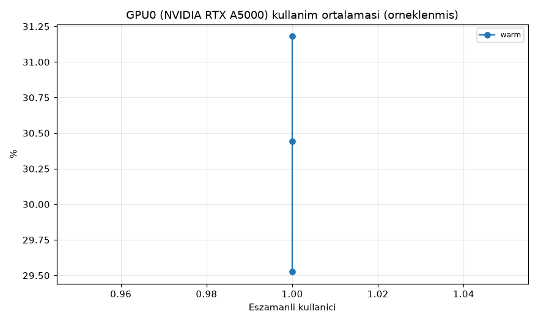
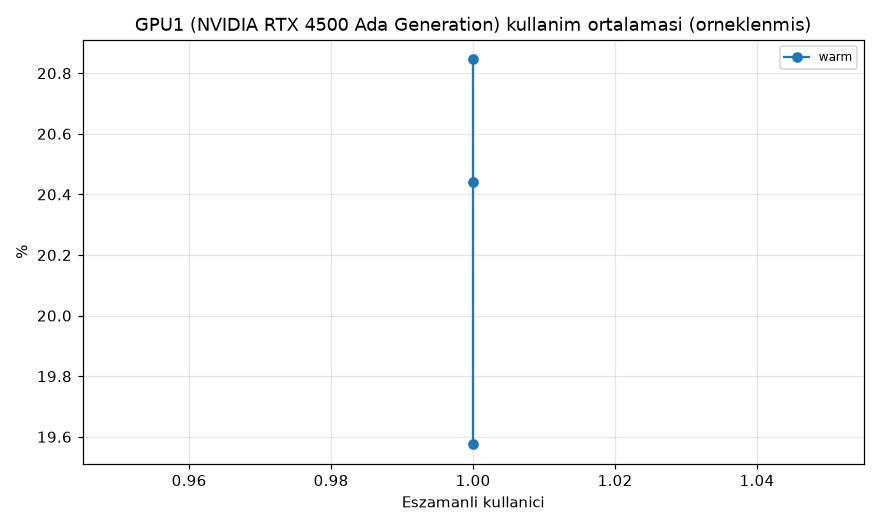
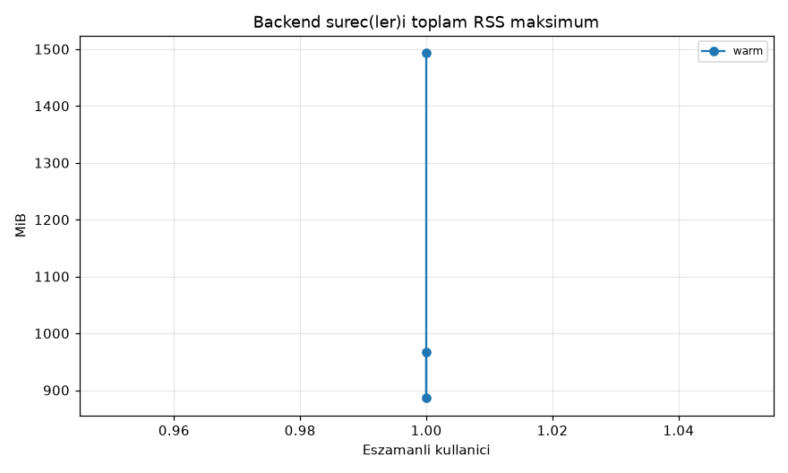
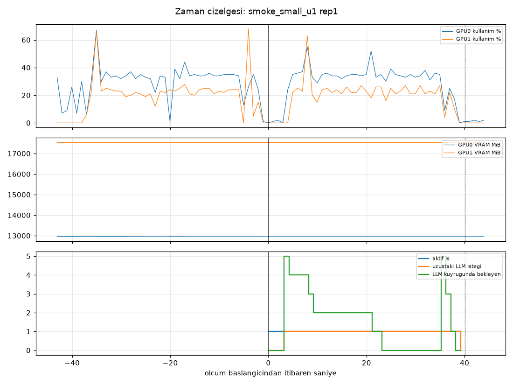

# Maskeleme Sistemi — Çok Kullanıcılı Yük Testi Raporu

## 1. Test ortamı ve mevcut ayarlar

- Makine: `aipc-HP-Z8-G4`, çekirdek `7.0.0-34-generic`, RAM 63 GiB
- CPU:
```
CPU(s):                                  64
Model name:                              Intel(R) Xeon(R) Gold 6226R CPU @ 2.90GHz
Thread(s) per core:                      2
Socket(s):                               2
CPU(s) scaling MHz:                      31%
```
- GPU'lar:
```
index, name, uuid, memory.total [MiB], driver_version, power.limit [W]
0, NVIDIA RTX A5000, GPU-30667114-4567-bc4a-029b-3375d117048e, 24564 MiB, 610.57.04, 230.00 W
1, NVIDIA RTX 4500 Ada Generation, GPU-fbe2dd5d-3644-5c37-3179-8ad50079b7d4, 24570 MiB, 610.57.04, 210.00 W
```
- Git commit: `77e845776c2255e7c505c5a6b0277ab337e58157` (çalışma ağacı: değişiklik var — yalnız loadtest/ eklendi)
- Uygulama Python: Python 3.14.5
- LLM sunucusu: Ollama `ollama version is 0.35.1`; systemd ortamı: `Environment=PATH=/home/aipc/miniconda3/bin:/home/aipc/miniconda3/condabin:/usr/local/cuda-12.8/bin:/home/aipc/.local/bin:/usr/local/sbin:/usr/local/bin:/usr/sbin:/usr/bin:/sbin:/bin:/usr/games:/usr/local/games:/snap/bin:/snap/bin OLLAMA_NUM_PARALLEL=4 OLLAMA_CONTEXT_LENGTH=8192 OLLAMA_FLASH_ATTENTION=0`
- Ollama'nın başlattığı llama-server komut satırı (test başında):
```
/usr/local/lib/ollama/llama-server --model /usr/share/ollama/.ollama/models/blobs/sha256-d372de8e934898a59e6ccfabc3368474711384d8f1fd4d22d87a3f0a45400cdc --port 40045 --host 127.0.0.1 --no-webui --offline -c 8192 -np 1 --log-verbosity 4 --no-log-prefix --no-log-timestamps --no-jinja --chat-template chatml --mmproj /usr/share/ollama/.ollama/models/blobs/sha256-a62390d25b4b4a2d8afd7cc3c90021c11935c1fdd48d7cb0723ab71cd02a598e --spec-type draft-mtp --spec-draft-n-max 2 --spec-draft-backend-sampling --flash-attn off -b 512 -ub 512 --context-shift --keep 4
```
- Uygulama backend'i: `start.py` uvicorn'u `--workers` vermeden başlatır → **1 süreç**. Her export işi ayrı bir daemon thread'de, kendi asyncio event loop'unda çalışır; uygulamada iş kuyruğu/iş sınırı yoktur.
- Dosya işleme: bir iş içinde `VLLM_FILE_BATCH_SIZE` dosya aynı anda hazırlanır/taranır (asyncio semaforu); Presidio/spaCy analizi `asyncio.to_thread` ile ayrı thread'de ama **detector örneği başına kilitli** (seri) çalışır. spaCy modeli her işte yeniden yüklenir (`build_orchestrator`).
- LLM eşzamanlılık sınırı `VLLM_MAX_CONCURRENT_REQUESTS`: işletim sistemi dosya kilitleriyle (VLLM_ADMISSION_DIR) **host genelinde** uygulanır — thread, event loop ve backend süreçleri arasında ortaktır; worker başına değildir. HTTP timeout kuyruktan sonra başlar.

| ayar | değer (.env, test boyunca değiştirilmedi) |
|---|---|
| `VLLM_ENABLED` | `true` |
| `VLLM_HOST` | `http://localhost:11434` |
| `VLLM_MODEL` | `qwen3.6:35b` |
| `VLLM_PROFILE` | `ollama-dev` |
| `VLLM_MAX_CONCURRENT_REQUESTS` | `1` |
| `VLLM_FILE_BATCH_SIZE` | `8` |
| `VLLM_MAX_FILE_CHARS` | `6000` |
| `VLLM_CHUNK_OVERLAP_CHARS` | `500` |
| `VLLM_MAX_TOKENS` | `2048` |
| `VLLM_TIMEOUT_SECONDS` | `200` |
| `VLLM_TRANSIENT_RETRIES` | `1` |
| `VLLM_DISABLE_THINKING` | `true` |
| `VLLM_REASONING_EFFORT` | `none` |
| `VLLM_PRESENCE_PENALTY` | `0` |
| `VLLM_REDACT_KNOWN_FINDINGS` | `true` |
| `VLLM_AUDIT_UNCHANGED_FILES` | `true` |
| `VLLM_AUTO_MASK_MIN_CONFIDENCE` | `orta` |
| `VLLM_LOW_CONFIDENCE_ACTION` | `ignore` |
| `SCAN_MAX_FILE_MB` | `50` |
| `SCAN_ENCODED_BLOB_MIN_CHARS` | `512` |
| `WEB_API_REQUEST_TIMEOUT_SECONDS` | `3600` |
| `PRESIDIO_SPACY_MODEL` | `en_core_web_lg` |

## 2. Veri grupları (sabit, tekrar üretilebilir)

Üretici: `loadtest/datasets.py` (tohum 20261006). Tüm değerler sentetiktir (RFC 5737 IP'ler, `.ornek.local` alan adları, rastgele ad-soyad).

| grup | dosya sayısı | toplam bayt | 6000 karakteri aşan dosya | veri seti sha256 | iş başına LLM chunk (detection / audit, ölçülen ort.) | iş başına LLM isteği (ölçülen ort.) |
|---|---|---|---|---|---|---|
| küçük | 6 | 7918 | 0 | `37d8f635e33f87f1` | 6.0 / 6.0 | 12.0 |
| orta | 10 | 18484 | 0 | `9469b5273fb96151` | 10.0 / 10.0 | 22.0 |
| büyük | 20 | 54193 | 2 | `a83cf3e563312567` | 22.0 / 23.0 | 49.0 |

Chunk = uygulamanın LLM'e gönderdiği parça (`chunk_text`); max_tokens'ta kesilen parça ikiye bölünüp yeniden gönderildiği için istek sayısı chunk sayısından büyük olabilir.

## 3. Senaryo sonuçları

Sütun notları: `†` = örnek sayısı yüzdelik için yetersiz (p95 için n<20, p99 için n<100); bu durumda değer pratikte maksimuma eşittir ve istatistiksel olarak güvenilmezdir. Uçtan uca = istemcinin yüklemeye başlamasından zip indirmesi bitene kadar (monotonic saat). LLM istek p95 = başarılı isteğin kuyruk+HTTP toplamı. LLM kuyruk = uygulamanın host-genel LLM kapasite kilidinde bekleme. GPU kullanım % NVML'in örneklenmiş değeridir (1 sn aralık). Karantina = güvenlik karantinası (SECURITY_QUARANTINE) dosya sayısı; teknik blok = LLM/tespit hatası nedeniyle bloklanan dosya; ikisi de iş başarısından ayrı raporlanır.

### Isınmış sistem

| kullanıcı | proje boyutu | tamamlanan / gönderilen | uçtan uca p50 / p95 (sn) | LLM istek p95 (sn) | LLM kuyruk p95 (sn) | proje/dk (ort. [min–maks]) | GPU0 kull. ort/p95 / VRAM maks | GPU1 kull. ort/p95 / VRAM maks | hata / timeout / karantina |
|---|---|---|---|---|---|---|---|---|---|
| 1 | küçük | 1 / 1 | 39.7 / 39.7† | 31.6† | 20.0† | 1.50 [1.50–1.50] | 30% / p95 39% / 12.7 GiB | 20% / p95 27% / 17.1 GiB | iş hata 0, HTTP 0, timeout 0 · LLM timeout 0, LLM HTTP 0 · karantina 0, teknik blok 0, inceleme 0 |
| 1 | orta | 1 / 1 | 119.9 / 119.9† | 85.8 | 84.5 | 0.50 [0.50–0.50] | 30% / p95 37% / 12.7 GiB | 20% / p95 25% / 17.1 GiB | iş hata 0, HTTP 0, timeout 0 · LLM timeout 0, LLM HTTP 0 · karantina 0, teknik blok 1, inceleme 0 |
| 1 | büyük | 1 / 1 | 220.8 / 220.8† | 154.7 | 146.0 | 0.27 [0.27–0.27] | 31% / p95 50% / 12.7 GiB | 21% / p95 26% / 17.1 GiB | iş hata 0, HTTP 0, timeout 0 · LLM timeout 0, LLM HTTP 0 · karantina 0, teknik blok 0, inceleme 0 |

> p95 uyarısı: smoke_small_u1 (n=1), smoke_medium_u1 (n=1), smoke_large_u1 (n=1) — başarılı iş sayısı p95 için yeterli değil.

### Soğuk başlangıç etkisi: ilk istek

| koşul | sunucuda model yükleme, sn (n / ort. / maks) | ilk LLM isteği HTTP süresi, sn (tekrar ort. / maks) | ilk işin uçtan uca süresi, sn (tekrar ort. / maks) | LLM isteği HTTP p50 (tüm istekler) |
|---|---|---|---|---|
| smoke_small_u1 | 0 / – / – | 0.9 / 0.9 | 39.7 / 39.7 | 0.70 |
| smoke_medium_u1 | 0 / – / – | 1.9 / 1.9 | 119.9 / 119.9 | 1.29 |
| smoke_large_u1 | 0 / – / – | 2.4 / 2.4 | 220.8 / 220.8 | 1.30 |

Soğuk koşulda model her tekrar öncesi Ollama'dan boşaltıldı (`keep_alive=0`) ve backend yeni süreçle başlatıldı; ısınma işi yapılmadı. Isınmış koşulda her backend sürecinde bir küçük ısınma işi çalıştı ve istatistikten çıkarıldı.

### Aşama süreleri (her koşul, 3 tekrar havuzlanmış)

İş başına aşama süresi, o aşamaya ait aralıkların birleşiminin uzunluğudur (paralel dosyalar toplanmaz). Aşamalar boru hattında üst üste bindiği için satırlar toplanarak uçtan uca süre elde edilemez.

**smoke_small_u1** (1 kullanıcı, küçük, 1 tekrar)

| aşama (saniye) | n | ort. | p50 | p95 | p99 | maks |
|---|---|---|---|---|---|---|
| Yükleme (POST, istemci) | 1 | 0.05 | 0.05 | 0.05† | 0.05† | 0.05 |
| Uygulama iş kuyruğu (kayıt→iş thread'i) | 1 | 0.00 | 0.00 | 0.00† | 0.00† | 0.00 |
| Detection, iş başına duvar saati | 1 | 32.73 | 32.73 | 32.73† | 32.73† | 32.73 |
|   · dosya başına detection | 6 | 14.18 | 6.73 | 32.45† | 32.45† | 32.45 |
|   · dosya başına Presidio | 6 | 0.72 | 0.72 | 0.79† | 0.79† | 0.79 |
|   · Presidio kilit beklemesi (analiz başına) | 6 | 0.53 | 0.60 | 0.69† | 0.69† | 0.69 |
| LLM isteği toplam (başarılı; kuyruk+HTTP) | 12 | 7.74 | 3.00 | 31.64† | 31.64† | 31.64 |
|   · LLM HTTP süresi (başarılı) | 12 | 2.94 | 0.70 | 11.64† | 11.64† | 11.64 |
|   · uygulama LLM kuyruğu (tüm istekler) | 12 | 4.80 | 1.82 | 20.00† | 20.00† | 20.00 |
|   · LLM isteği toplam (max_tokens'ta kesilip bölünen) | 0 | – | – | – | – | – |
|   · LLM isteği toplam (başarısız) | 0 | – | – | – | – | – |
| Maskeleme, iş başına duvar saati | 1 | 0.12 | 0.12 | 0.12† | 0.12† | 0.12 |
|   · dosya başına maskeleme | 6 | 0.02 | 0.01 | 0.03† | 0.03† | 0.03 |
| Audit (LLM denetimi), iş başına duvar saati | 1 | 3.60 | 3.60 | 3.60† | 3.60† | 3.60 |
|   · dosya başına LLM denetimi | 6 | 2.12 | 1.81 | 3.60† | 3.60† | 3.60 |
| Sonlandırma (Faz D), iş başına duvar saati | 1 | 1.04 | 1.04 | 1.04† | 1.04† | 1.04 |
| Export (tutarlılık+manifest+yayın) | 1 | 0.11 | 0.11 | 0.11† | 0.11† | 0.11 |
| İndirme (GET zip, istemci) | 1 | 0.01 | 0.01 | 0.01† | 0.01† | 0.01 |
| Tamamlanma bildirim gecikmesi (yoklama) | 1 | 0.16 | 0.16 | 0.16† | 0.16† | 0.16 |
| spaCy/Presidio kurulumu (iş başına) | 1 | 1.60 | 1.60 | 1.60† | 1.60† | 1.60 |
| SQLite yazma kilidi bekleme (iş başına toplam) | 1 | 0.00 | 0.00 | 0.00† | 0.00† | 0.00 |
| Sunucuda iş süresi (başarılı) | 1 | 39.52 | 39.52 | 39.52† | 39.52† | 39.52 |
| **Uçtan uca (başarılı)** | 1 | 39.74 | 39.74 | 39.74† | 39.74† | 39.74 |
| Uçtan uca (başarısız/timeout) | 0 | – | – | – | – | – |

**smoke_medium_u1** (1 kullanıcı, orta, 1 tekrar)

| aşama (saniye) | n | ort. | p50 | p95 | p99 | maks |
|---|---|---|---|---|---|---|
| Yükleme (POST, istemci) | 1 | 0.07 | 0.07 | 0.07† | 0.07† | 0.07 |
| Uygulama iş kuyruğu (kayıt→iş thread'i) | 1 | 0.00 | 0.00 | 0.00† | 0.00† | 0.00 |
| Detection, iş başına duvar saati | 1 | 114.57 | 114.57 | 114.57† | 114.57† | 114.57 |
|   · dosya başına detection | 10 | 51.50 | 29.44 | 94.58† | 94.58† | 94.58 |
|   · dosya başına Presidio | 10 | 0.73 | 0.81 | 0.99† | 0.99† | 0.99 |
|   · Presidio kilit beklemesi (analiz başına) | 10 | 0.54 | 0.68 | 0.83† | 0.83† | 0.83 |
| LLM isteği toplam (başarılı; kuyruk+HTTP) | 20 | 24.31 | 9.87 | 85.78 | 93.60† | 93.60 |
|   · LLM HTTP süresi (başarılı) | 20 | 3.88 | 1.29 | 13.16 | 14.46† | 14.46 |
|   · uygulama LLM kuyruğu (tüm istekler) | 22 | 19.87 | 3.05 | 84.50 | 85.65† | 85.65 |
|   · LLM isteği toplam (max_tokens'ta kesilip bölünen) | 2 | 32.32 | 17.73 | 46.91† | 46.91† | 46.91 |
|   · LLM isteği toplam (başarısız) | 0 | – | – | – | – | – |
| Maskeleme, iş başına duvar saati | 1 | 0.26 | 0.26 | 0.26† | 0.26† | 0.26 |
|   · dosya başına maskeleme | 10 | 0.03 | 0.02 | 0.06† | 0.06† | 0.06 |
| Audit (LLM denetimi), iş başına duvar saati | 1 | 12.81 | 12.81 | 12.81† | 12.81† | 12.81 |
|   · dosya başına LLM denetimi | 10 | 4.69 | 2.69 | 10.81† | 10.81† | 10.81 |
| Sonlandırma (Faz D), iş başına duvar saati | 1 | 1.58 | 1.58 | 1.58† | 1.58† | 1.58 |
| Export (tutarlılık+manifest+yayın) | 1 | 0.24 | 0.24 | 0.24† | 0.24† | 0.24 |
| İndirme (GET zip, istemci) | 1 | 0.01 | 0.01 | 0.01† | 0.01† | 0.01 |
| Tamamlanma bildirim gecikmesi (yoklama) | 1 | 0.10 | 0.10 | 0.10† | 0.10† | 0.10 |
| spaCy/Presidio kurulumu (iş başına) | 1 | 1.89 | 1.89 | 1.89† | 1.89† | 1.89 |
| SQLite yazma kilidi bekleme (iş başına toplam) | 1 | 0.00 | 0.00 | 0.00† | 0.00† | 0.00 |
| Sunucuda iş süresi (başarılı) | 1 | 119.75 | 119.75 | 119.75† | 119.75† | 119.75 |
| **Uçtan uca (başarılı)** | 1 | 119.92 | 119.92 | 119.92† | 119.92† | 119.92 |
| Uçtan uca (başarısız/timeout) | 0 | – | – | – | – | – |

**smoke_large_u1** (1 kullanıcı, büyük, 1 tekrar)

| aşama (saniye) | n | ort. | p50 | p95 | p99 | maks |
|---|---|---|---|---|---|---|
| Yükleme (POST, istemci) | 1 | 0.05 | 0.05 | 0.05† | 0.05† | 0.05 |
| Uygulama iş kuyruğu (kayıt→iş thread'i) | 1 | 0.00 | 0.00 | 0.00† | 0.00† | 0.00 |
| Detection, iş başına duvar saati | 1 | 212.64 | 212.64 | 212.64† | 212.64† | 212.64 |
|   · dosya başına detection | 20 | 39.03 | 11.36 | 156.14 | 164.10† | 164.10 |
|   · dosya başına Presidio | 20 | 1.04 | 1.14 | 1.50 | 1.56† | 1.56 |
|   · Presidio kilit beklemesi (analiz başına) | 20 | 0.77 | 0.91 | 1.22 | 1.39† | 1.39 |
| LLM isteği toplam (başarılı; kuyruk+HTTP) | 47 | 25.61 | 12.19 | 154.68 | 162.74† | 162.74 |
|   · LLM HTTP süresi (başarılı) | 47 | 3.69 | 1.30 | 14.80 | 17.29† | 17.29 |
|   · uygulama LLM kuyruğu (tüm istekler) | 49 | 22.39 | 9.41 | 145.98 | 161.25† | 161.25 |
|   · LLM isteği toplam (max_tokens'ta kesilip bölünen) | 2 | 51.62 | 18.03 | 85.21† | 85.21† | 85.21 |
|   · LLM isteği toplam (başarısız) | 0 | – | – | – | – | – |
| Maskeleme, iş başına duvar saati | 1 | 0.62 | 0.62 | 0.62† | 0.62† | 0.62 |
|   · dosya başına maskeleme | 20 | 0.03 | 0.02 | 0.06 | 0.13† | 0.13 |
| Audit (LLM denetimi), iş başına duvar saati | 1 | 169.67 | 169.67 | 169.67† | 169.67† | 169.67 |
|   · dosya başına LLM denetimi | 21 | 17.67 | 12.70 | 37.30 | 147.44† | 147.44 |
| Sonlandırma (Faz D), iş başına duvar saati | 1 | 4.64 | 4.64 | 4.64† | 4.64† | 4.64 |
| Export (tutarlılık+manifest+yayın) | 1 | 0.33 | 0.33 | 0.33† | 0.33† | 0.33 |
| İndirme (GET zip, istemci) | 1 | 0.02 | 0.02 | 0.02† | 0.02† | 0.02 |
| Tamamlanma bildirim gecikmesi (yoklama) | 1 | 0.48 | 0.48 | 0.48† | 0.48† | 0.48 |
| spaCy/Presidio kurulumu (iş başına) | 1 | 1.88 | 1.88 | 1.88† | 1.88† | 1.88 |
| SQLite yazma kilidi bekleme (iş başına toplam) | 1 | 0.01 | 0.01 | 0.01† | 0.01† | 0.01 |
| Sunucuda iş süresi (başarılı) | 1 | 220.29 | 220.29 | 220.29† | 220.29† | 220.29 |
| **Uçtan uca (başarılı)** | 1 | 220.84 | 220.84 | 220.84† | 220.84† | 220.84 |
| Uçtan uca (başarısız/timeout) | 0 | – | – | – | – | – |

### LLM metrikleri

| koşul | LLM isteği (toplam / kesilip bölünen / başarısız) | iş başına istek (ort.) | iş başına chunk det/audit (ort.) | istek/sn (ort.) | prompt tok p50 | çıktı tok p50/p95 | istek çıktı tok/s p50 (prefill dahil) | sunucu prefill ms p50/p95 | sunucu TPOT ms p50/p95 | sunucu decode tok/s p50 | sunucu toplam tok/s (ort.) | sunucu içi bekleme p95 (sn) | slot dolu oranı | maks. bağlam doluluğu | eşzamanlı LLM (ölçülen maks) |
|---|---|---|---|---|---|---|---|---|---|---|---|---|---|---|---|
| smoke_small_u1 | 12 / 0 / 0 | 12.0 | 6.0 / 6.0 | 0.300 | 1353 | 20 / 1350† | 37.6 | 339 / 439† | 10.2 / 11.7† | 97.1 | 231 | 0.32† | 85% | 3070 / 8192 | 1 (sunucu slotu 1.0) |
| smoke_medium_u1 | 22 / 2 / 0 | 22.0 | 10.0 / 10.0 | 0.183 | 1636 | 77 / 1489 | 59.9 | 444 / 617 | 9.1 / 10.5 | 103.5 | 222 | 0.50 | 92% | 4450 / 8192 | 1 (sunucu slotu 1.0) |
| smoke_large_u1 | 49 / 2 / 0 | 49.0 | 22.0 / 23.0 | 0.221 | 1764 | 20 / 1699 | 32.5 | 478 / 945 | 10.1 / 11.6 | 99.0 | 280 | 0.42 | 94% | 4773 / 8192 | 1 (sunucu slotu 1.0) |

### Donanım

| koşul | CPU ort. / maks % | sistem RAM maks (GiB) | swap maks (GiB) | backend RSS maks (MiB) | llama-server RSS maks (MiB) | disk yazma ort. (MB/s) | GPU0 sıcaklık maks / güç ort–maks / SM saat ort | GPU1 sıcaklık maks / güç ort–maks / SM saat ort | throttling nedenleri (örnek sayısı) |
|---|---|---|---|---|---|---|---|---|---|
| smoke_small_u1 | 24 / 31 | 23.0 | 3.10 | 1493 | 9093 | 3.92 | 73°C / 123–153 W / 1739 MHz | 60°C / 64–78 W / 2607 MHz | GPU0: sw_power_cap=3; GPU1: sw_power_cap=1 |
| smoke_medium_u1 | 25 / 35 | 22.2 | 3.36 | 886 | 9150 | 4.24 | 79°C / 129–159 W / 1715 MHz | 69°C / 67–89 W / 2602 MHz | GPU0: sw_power_cap=11; GPU1: sw_power_cap=1 |
| smoke_large_u1 | 25 / 35 | 22.6 | 3.68 | 967 | 9316 | 4.75 | 81°C / 130–162 W / 1719 MHz | 72°C / 68–106 W / 2605 MHz | GPU0: sw_power_cap=24; GPU1: sw_power_cap=6 |

### Grafikler





















## 5. Kayıt yalıtımı doğrulaması

Her tekrar sonunda test DB kopyasında, her iş için: run kaydının proje/sicil/branch'i işi gönderen kullanıcıyla aynı mı; run'a ait değer eşlemeleri yalnız o bağlamda mı; denetim kaydındaki dosya yolları yalnız o projenin dosyaları mı; indirilen paketin bütünlük manifestindeki job_id run_id ile aynı mı; run_id ve çıktı tokenı işler arasında tekil mi kontrol edildi.

Sonuç: 3/3 koşulda tüm kontroller geçti.

## 6. Ölçülemeyen / sınırlı metrikler

- **TTFT (ilk tokena kadar süre): ölçülemedi.** Uygulama `/v1/chat/completions`'a streaming olmadan istek atıyor; toplam süreden tahmin yapılmadı. Yerine llama-server'ın kendi ölçtüğü **prefill (prompt eval) süresi** verildi; bu TTFT değildir (sunucu kuyruğu ve ağ hariç).
- **Tokenlar arası süre**: llama-server'ın `eval time ... ms per token` değeri (sunucu ölçümü). MTP spekülatif çözümleme açık olduğundan (`--spec-type draft-mtp`) bu, kabul edilen taslak tokenlar dahil ortalamadır.
- **Sunucu kuyruğunda bekleme**: Ollama kendi kuyruğu için metrik sunmuyor. Tabloda verilen 'sunucu içi bekleme', Ollama GIN günlüğündeki istek süresinden geriye hesaplanan varış anı ile llama-server'ın görevi başlattığı an arasındaki farktır (iki sunucu zaman damgası; np=1 olduğundan görevler sırayla eşlenir). Uygulama kuyruğu ayrıca verildi.
- **KV cache kullanımı**: llama-server `--metrics` olmadan başlatıldığı için `/metrics` kapalı (501). Yerine slot bağlam doluluğu (görev sonundaki `n_tokens` / 8192) verildi. **Preemption sayısı: ölçülemedi** (llama.cpp tek slotta preemption yapmaz; kesme yerine `truncated` sayacı raporlandı).
- **Sunucunun eşzamanlı çalışan istek sayısı**: `/slots` her saniye yoklandı (yoğun decode sırasında yanıt gecikirse örnek 'ulaşılamadı' sayıldı).
- İstek bazında çıktı token/s, istemci tarafında `completion_tokens / HTTP süresi` ile hesaplandı; prefill ve Ollama içi bekleme dahildir, saf decode hızı değildir (saf decode için sunucu sütunu).
- Diğer istemcilerin (kullanıcının canlı backend'i) aynı Ollama'ya istek atıp atmadığı GIN günlüğü ile testin kendi isteklerinin farkından izlendi: tahmini yabancı istek toplamı 0.

## 7. Ham veriler ve tekrar çalıştırma

Ham dosyalar (her koşul/tekrar klasöründe):

- `jobs.jsonl` — istemci tarafı iş kayıtları (her iş: kullanıcı, proje, job_id, run_id, monotonic zaman damgaları, durum, karantina sayıları)
- `server_events_<port>.jsonl` — sunucu olayları (iş/dosya/LLM isteği bazında monotonic başlangıç-bitiş, kuyruk, HTTP, token; saniyelik sayaçlar)
- `hw/gpu.csv`, `hw/sys.csv`, `hw/proc.csv`, `hw/slots.csv`, `hw/ollama_ps.csv` — saniyelik, zaman damgalı (wall + monotonic) donanım/sunucu ölçümleri; `hw/gpu_info.json` GPU adı/UUID
- `ollama_journal.log` — test penceresine ait Ollama/llama-server günlük satırları (prefill/decode süreleri)
- `rep.json` — koşul ayarları, ölçüm penceresi, kuyruk boşaltma, backend çıkış kodları, yalıtım doğrulaması
- Kampanya kökünde: `environment.json`, `summary_conditions.csv/json`, `summary_reps.csv`, `jobs_all.csv`, `llm_requests_all.csv`, `files_all.csv`, `server_tasks_all.csv`, `hw_summary.csv`, `charts/`

Komutlar (`masking_system/` dizininden):

```bash
python3 -m venv loadtest/.venv && loadtest/.venv/bin/pip install psutil nvidia-ml-py matplotlib httpx
loadtest/.venv/bin/python -m loadtest.datasets                      # veri setleri (bayt-bayt aynı)
export LOADTEST_WORK=/tmp/masking-loadtest-work                     # geçici DB kopyaları/çıktılar
loadtest/.venv/bin/python -m loadtest.runner --plan main    --campaign loadtest/results/main
loadtest/.venv/bin/python -m loadtest.runner --plan workers --campaign loadtest/results/workers
loadtest/.venv/bin/python -m loadtest.analyze loadtest/results/main loadtest/results/workers
loadtest/.venv/bin/python -m loadtest.report --main loadtest/results/main --workers loadtest/results/workers --out loadtest/results/RAPOR.md
# tek koşul: --only S3_burst_u10   tekrar sayısı: --reps 1   (DONE olan tekrarlar atlanır)
```
